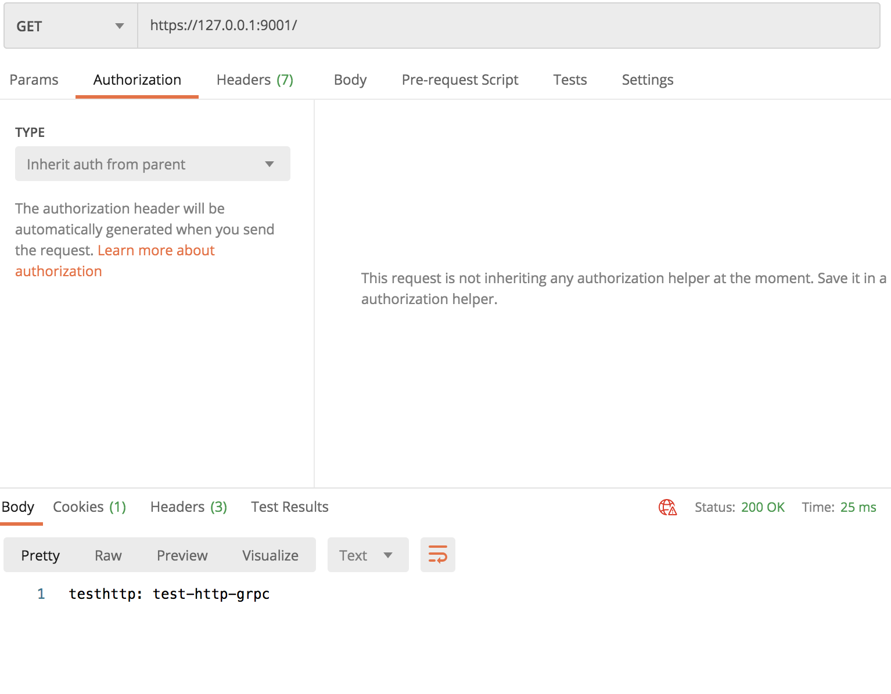
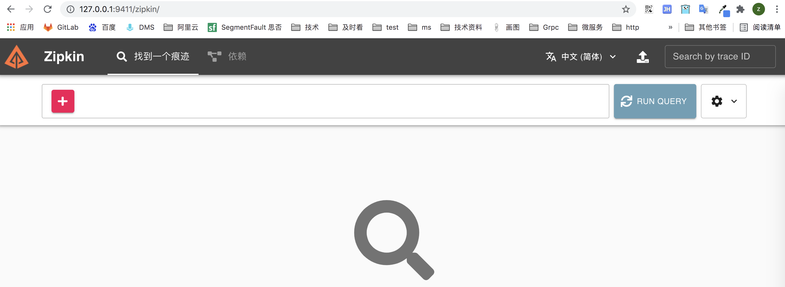
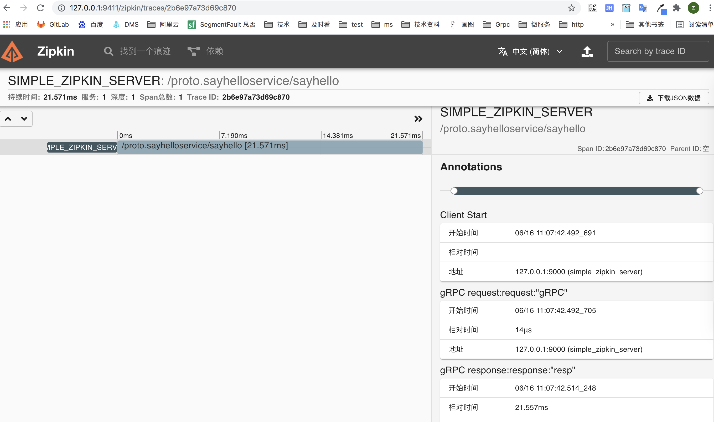

https://www.jianshu.com/p/73c9ed3a4877


# 1、什么是RPC

RPC 代指远程过程调用（Remote Procedure Call），它的调用包含了传输协议和编码（对象序列号）协议等等。允许运行于一台计算机的程序调用另一台计算机的子程序，而开发人员无需额外地为这个交互作用编程


# protobuf基础

[文章](https://mp.weixin.qq.com/s/kYpyr1SvGMRI3DR7b0WiNg)

# 2、Protobuf


Protocol Buffers 是一种与语言、平台无关，可扩展的序列化结构化数据的方法，常用于通信协议，数据存储等等。相较于 JSON、XML，它更小、更快、更简单

## 1、语法

```go
syntax ="proto3";
service SearchService{
    rpc Search(SearchRequest) returns (SearchResponse);
}
message SearchRequest{
string query =1;
  int32 page_number =2;
  int32 result_per_page =3;
}
message SearchResponse{
...
}
```

1. 文件的第一行指定您正在使用`proto3`语法：如果不这样做，则协议缓冲区编译器将假定您正在使用[proto2](https://developers.google.com/protocol-buffers/docs/proto)。这必须是文件的第一行非空，非注释行。

2. 分配的字段编号用于标识消息的二进制格式，分配了最好不要修改，如果修改要及时通知使用者
3. 范围1-15的字段编号需要一个字节来编码，包括字段编码和字段类型，16-2047的字段编号需要占用两个字节
4. 最小是1 最大2^29 -1 ，保留字段不能使用 19000-19999

### <font color=red size=5x>分配字段编号</font>

1. 单数，proto3的默认规则
2. repeated 可以重复任意次


### <font color=red size=5x>注释</font>

支持单行注释//

多行注释/**/


### <font color=red size=5x>保留字段reserved</font>

当定义好字段后, 在后续开发中发现某个字段根本没用.

例如 `string userName = 2;` 字段, 这个时候最好不要进行注释或删除.

有可能以后加载相同的旧版本, 这可能会导致数据损坏, 隐私错误等. 确保不会发生这种情况的一种方法是指定要删除的字段为保留字段.

```
message SubscribeReq {
  
  reserved 2;
  
  int32 subReqID = 1;
  string userName = 2;
  string productName = 3;
  string address = 4;
}

或者
message Foo {
  reserved 2, 15, 9 to 11;
  reserved "foo", "bar";
}
```

顾名思义, 就是此字段会被保留可能在以后会使用此字段. 使用关键字 `reserved` 表示要保留字段编号为 `2`.


### <font color=red size=5x>基本类型对照表</font>

| .proto Type | Notes | C++ Type | Java/Kotlin Type[1] | Python Type[3] | Go Type | Ruby Type                      | C# Type    | PHP Type          | Dart Type |
| :---------- | :---- | :------- | :------------------ | :------------- | ------- | :----------------------------- | :--------- | :---------------- | :-------- |
| double      |       | double   | double              | float          | float64 | Float                          | double     | float             | double    |
| float       |       | float    | float               | float          | float32 | Float                          | float      | float             | double    |
| int32       |       | int32    | int                 | int            | int32   | Fixnum or Bignum (as required) | int        | integer           | int       |
| int64       |       | int64    | long                | int/long[4]    | int64   | Bignum                         | long       | integer/string[6] | Int64     |
| uint32      |       | uint32   | int[2]              | int/long[4]    | uint32  | Fixnum or Bignum (as required) | uint       | integer           | int       |
| uint64      |       | uint64   | long[2]             | int/long[4]    | uint64  | Bignum                         | ulong      | integer/string[6] | Int64     |
| sint32      |       | int32    | int                 | int            | int32   | Fixnum or Bignum (as required) | int        | integer           | int       |
| sint64      |       | int64    | long                | int/long[4]    | int64   | Bignum                         | long       | integer/string[6] | Int64     |
| fixed32     |       |          | int[2]              | int/long[4]    | uint32  | Fixnum or Bignum (as required) | uint       | integer           | int       |
| fixed64     |       | uint64   | long[2]             | int/long[4]    | uint64  | Bignum                         | ulong      | integer/string[6] | Int64     |
| sfixed32    |       | int32    | int                 | int            | int32   | Fixnum or Bignum (as required) | int        | integer           | int       |
| sfixed64    |       | int64    | long                | int/long[4]    | int64   | Bignum                         | long       | integer/string[6] | Int64     |
| bool        |       | bool     | boolean             | bool           | bool    | TrueClass/FalseClass           | bool       | boolean           | bool      |
| string      |       |          | String              | str/unicode[5] | string  | String (UTF-8)                 | string     | string            | String    |
| bytes       |       | string   | ByteString          | str            | []byte  | String (ASCII-8BIT)            | ByteString | string            | List      |


### <font color=red size=5x>自定义类型</font>

```go
message SearchResponse {
  repeated Result results = 1;
}

message Result {
  string url = 1;
  string title = 2;
  repeated string snippets = 3;
}
```

Result 为自定义的类型

### <font color=red size=5x>嵌套类型</font>

```go
message SearchResponse {
  message Result {
    string url = 1;
    string title = 2;
    repeated string snippets = 3;
  }
  repeated Result results = 1;
}
```

在其他地方调用

```go
message SomeOtherMessage {
  SearchResponse.Result result = 1;
}
```

深度嵌套

```go
message Outer {                  // Level 0
  message MiddleAA {  // Level 1
    message Inner {   // Level 2
      int64 ival = 1;
      bool  booly = 2;
    }
  }
  message MiddleBB {  // Level 1
    message Inner {   // Level 2
      int32 ival = 1;
      bool  booly = 2;
    }
  }
}
```


### <font color=red size=5x>Any类型</font>

该`Any`消息类型，可以使用邮件作为嵌入式类型，而不必自己.proto定义。一个`Any`含有任意的序列化消息`bytes`，以充当一个全局唯一标识符和解析为消息的类型的URL一起。要使用该`Any`类型，您需要[导入](https://developers.google.com/protocol-buffers/docs/proto3#other) `google/protobuf/any.proto`

```go
import "google/protobuf/any.proto";

message ErrorStatus {
  string message = 1;
  repeated google.protobuf.Any details = 2; //只能使用repeated
}
```

给定消息类型的默认类型URL是`type.googleapis.com/_packagename_._messagename_`。

引入的时候回报错

解决方法：

https://www.cnblogs.com/x-poior/p/9266087.html

直接在当前目录建立层次目录 引入文件内容


https://www.cnblogs.com/ExMan/p/13892736.html

生成pb.go文件


### <font color=red size=5x>enum类型</font>

```go
message SearchRequest {
  string query = 1;
  int32 page_number = 2;
  int32 result_per_page = 3;
  enum Corpus {
    UNIVERSAL = 0;
    WEB = 1;
    IMAGES = 2;
    LOCAL = 3;
    NEWS = 4;
    PRODUCTS = 5;
    VIDEO = 6;
  }
  Corpus corpus = 4;
}
```

`Corpus`枚举的第一个常量映射为零：每个枚举定义**必须**包含一个映射为零的常量作为其第一个元素。这是因为：

- 必须有一个零值，以便我们可以使用0作为数字[默认值](https://developers.google.com/protocol-buffers/docs/proto3#default)。
- 零值必须是第一个元素，以便与[proto2](https://developers.google.com/protocol-buffers/docs/proto)语义兼容，其中第一个枚举值始终是默认值。
- 枚举器常量必须在32位整数范围内。由于`enum`值在电线上使用[varint编码](https://developers.google.com/protocol-buffers/docs/encoding)，因此负值效率不高，因此不建议使用


###  <font color=red size=5x>map类型</font>

```go
message OneOf {
  uint64 Id = 1 ;
  string Title = 2;
  string Content = 3;
}
message Maps {
  map<string,string> dir = 1;
  map<int64,int32> dir2 = 2;
  map<int64,OneOf> dir3 = 3;

}
```

### ==相较 Protobuf，为什么不使用 XML？==

- 更简单
- 数据描述文件只需原来的 1/10 至 1/3
- 解析速度是原来的 20 倍至 100 倍
- 减少了二义性
- 生成了更易使用的数据访问类

# 3、定义服务

```go
service SearchService {
  rpc Search(SearchRequest) returns (SearchResponse);
}
```


# ==-------------------------------==

# 4、安装protoc

### gRPC

生成pb.go的时候需要指定grpc的插件

```
go get -u google.golang.org/grpc
```


### 安装

```
go get -u github.com/golang/protobuf/protoc-gen-go
```

将`Protoc Plugin`的可执行文件从$GOPATH中移动到$GOBIN下

```
mv /usr/local/go/path/bin/protoc-gen-go /usr/local/go/bin/
```


## Protocol Buffers v3

### 安装

```
wget https://github.com/google/protobuf/releases/download/v3.5.1/protobuf-all-3.5.1.zip
unzip protobuf-all-3.5.1.zip
cd protobuf-3.5.1/
./configure
make
make install
```

检查是否安装成功

```
protoc --version
```

如果出现报错

```
protoc: error while loading shared libraries: libprotobuf.so.15: cannot open shared object file: No such file or directory
```

则执行`ldconfig`后，再次运行即可成功

#### 为什么要执行`ldconfig`

我们通过控制台输出的信息可以知道，`Protocol Buffers Libraries`的默认安装路径在`/usr/local/lib`

```
Libraries have been installed in:
   /usr/local/lib

If you ever happen to want to link against installed libraries
in a given directory, LIBDIR, you must either use libtool, and
specify the full pathname of the library, or use the `-LLIBDIR'
flag during linking and do at least one of the following:
   - add LIBDIR to the `LD_LIBRARY_PATH' environment variable
     during execution
   - add LIBDIR to the `LD_RUN_PATH' environment variable
     during linking
   - use the `-Wl,-rpath -Wl,LIBDIR' linker flag
   - have your system administrator add LIBDIR to `/etc/ld.so.conf'

See any operating system documentation about shared libraries for
more information, such as the ld(1) and ld.so(8) manual pages.
```

而我们安装了一个新的动态链接库，`ldconfig`一般在系统启动时运行，所以现在会找不到这个`lib`，因此我们要手动执行`ldconfig`，**让动态链接库为系统所共享，它是一个动态链接库管理命令**，这就是`ldconfig`命令的作用

**问题二**

```
o: module github.com/golang/protobuf is deprecated: Use the "google.golang.org/protobuf" module instead.
go get: installing executables with 'go get' in module mode is deprecated.
        Use 'go install pkg@version' instead.
        For more information, see https://golang.org/doc/go-get-install-deprecation
        or run 'go help get' or 'go help install'.
```

报了两个错误

现在想要拉取protoc-gen-go需要去google.golang.org/protobuf拉取，原来的路径已经废弃了。
我使用的go版本是1.17。而Go1.17版使用go install安装依赖。所以应该按照它下面的格式go install pkg@version进行拉取。

切换拉取路径

```
go install google.golang.org/protobuf/cmd/protoc-gen-go@latest
```

```
whereis protoc-gen-go                                                                  
protoc-gen-go: /Users/zhangqiuli24/go/bin/protoc-gen-go
```

然后在mv

**问题三**

```
protoc --go_out=plugins=grpc:.  ./huawei-aaa.proto
protoc-gen-go: unable to determine Go import path for "huawei-aaa.proto"

Please specify either:
	• a "go_package" option in the .proto source file, or
	• a "M" argument on the command line.

See https://protobuf.dev/reference/go/go-generated#package for more information.

--go_out: protoc-gen-go: Plugin failed with status code 1.
```

源文件

```
syntax = "proto3";

package ipc;

// 长连接Token验证请求
message GameAuthReq {
    string authToken = 1;   // Token
    string serverId = 2;    // 登录服务器ID
}

...
```

编译命令为：

```
protoc --go_out=. proto/ipc.proto
```

原因是protoc-gen-go版本过高，对源proto文件需要添加包名。在proto文件中添加option go_package = "/ipc";就可以解决了。

```
syntax = "proto3";

package ipc;
option go_package = "/ipc";

// 长连接Token验证请求
message GameAuthReq {
    string authToken = 1;   // Token
    string serverId = 2;    // 登录服务器ID
}

...
```

还有一种解决办法就是把protoc-gen-go版本退回到1.3.2及以下也可以解决。


***问题四*

```
protoc --go_out=plugins=grpc:.  ./huawei-arp.proto
--go_out: protoc-gen-go: plugins are not supported; use 'protoc --go-grpc_out=...' to generate gRPC

See https://grpc.io/docs/languages/go/quickstart/#regenerate-grpc-code for more information.
```

换成

```
protoc --go-grpc_out=plugins=grpc:.  ./huawei-arp.proto
```

问题五

```
protoc --go-grpc_out=plugins=grpc:.  ./huawei-arp.proto
protoc-gen-go-grpc: program not found or is not executable
Please specify a program using absolute path or make sure the program is available in your PATH system variable
--go-grpc_out: protoc-gen-go-grpc: Plugin failed with status code 1.
```

切换命令

```
protoc --go-grpc_out=plugins=grpc:.  ./huawei-arp.proto

protoc --go_out=. --go_opt=paths=source_relative  --go-grpc_out=. --go-grpc_opt=paths=source_relative huawei-arp.proto

```

[参考](https://grpc.io/docs/languages/go/quickstart/#regenerate-grpc-code)


### protoc使用

我们按照惯例执行`protoc --help`（查看帮助文档），我们抽出几个常用的命令进行讲解

1、`-IPATH, --proto_path=PATH`：指定`import`搜索的目录，可指定多个，如果不指定则默认当前工作目录

2、`--go_out`：生成`golang`源文件

#### 参数

若要将额外的参数传递给插件，可使用从输出目录中分离出来的逗号分隔的参数列表:

```
protoc --go_out=plugins=grpc,import_path=mypackage:. *.proto
```

- `import_prefix=xxx`：将指定前缀添加到所有`import`路径的开头
- `import_path=foo/bar`：如果文件没有声明`go_package`，则用作包。如果它包含斜杠，那么最右边的斜杠将被忽略。
- `plugins=plugin1+plugin2`：指定要加载的子插件列表（我们所下载的repo中唯一的插件是grpc）
- `Mfoo/bar.proto=quux/shme`： `M`参数，指定`.proto`文件编译后的包名（`foo/bar.proto`编译后为包名为`quux/shme`）

#### Grpc支持

如果`proto`文件指定了`RPC`服务，`protoc-gen-go`可以生成与`grpc`相兼容的代码，我们仅需要将`plugins=grpc`参数传递给`--go_out`，就可以达到这个目的

```
protoc --go_out=plugins=grpc:. *.proto
```


# 4、client and server

## server

```go
/**
 * @Author: zhangSan
 * @Description:
 * @File:  serve
 * @Version: 1.0.0
 * @Date: 2021/5/25 上午11:13
 */

package main

import (
	"context"
	"google.golang.org/grpc"
	v11 "grpc/test/src/proto"
	"log"
	"net"
	"os"
)

func main(){
	RunServer(context.Background(),"9001")
}

func RunServer(ctx context.Context, port string) error {
	listen, err := net.Listen("tcp", ":"+port)
	if nil != err {
		return err
	}

	/*
	var (
		opts []grpc.ServerOption
	)

	注册日志，各种时间因素
	opts = append(opts, gRpcServices.RegisterLogInject(logLayout, constant.GRpcLoginInsKey))
	opts = append(opts, grpc.KeepaliveParams(keepalive.ServerParameters{
		MaxConnectionIdle: 15 * time.Second, //client空闲超过该时间，发送一个GOAWAY
		//MaxConnectionAge:      time.Duration(math.MaxInt64), //client最大存活时间
		MaxConnectionAge:      5 * time.Second, //client最大存活时间
		MaxConnectionAgeGrace: 5 * time.Second, //强制关闭连接前缓冲时间，用以完成pending的请求
		Time:                  5 * time.Second, //client空闲该时间侯，发送一个ping
		Timeout:               3 * time.Second, //如果ping该时间内未收到pong，认为连接已断开
	}))
	opts = append(opts, grpc.KeepaliveEnforcementPolicy(keepalive.EnforcementPolicy{
		MinTime:             3 * time.Second, //client两次ping最小间隔，小于该时间中止连接
		PermitWithoutStream: true,            //即使没有活动的stream，也允许keepalive的ping
	}))

	 */
	//sv = grpc.NewServer(opts...)


	server := grpc.NewServer()
	v11.RegisterSayHelloServiceServer(server, NewSayHelloResponseService())
  reflection.Register(server)//注册反射服务
	c := make(chan os.Signal, 1)
	go func() {
		for range c {
			log.Println("shutting down GRPC server...")
			server.GracefulStop()//平滑关闭服务
			<-ctx.Done()
		}
	}()
	log.Println("start gRPC server...,port " + port)
	return server.Serve(listen)

}


type Services struct {

}

func NewSayHelloResponseService()*Services{
	return &Services{}
}


func(s *Services) SayHello(ctx context.Context,req *v11.SayHelloRequest)(resp *v11.SayHelloResponse,err error){
	return &v11.SayHelloResponse{
		Response:             "resp",
	}, err
}
```


实体服务类

```go
package services

import (
	"context"
	v11 "grpc/test/src/proto"
)

type Services struct {

}

func NewSayHelloResponseService()*Services{
	return &Services{}
}


func(s *Services) SayHello(ctx context.Context,req *v11.SayHelloRequest)(resp *v11.SayHelloResponse,err error){
	return &v11.SayHelloResponse{}, err
}
```


## 验证

### 启动 Server

```
go run src/server/serve.go
2021/05/25 16:45:56 start gRPC server...,port 9001
```

### 启动 Client

```
go run src/client/client.go
2021/05/25 16:45:59 resp: resp
```


# 5、stream server client

流式grpc 

- Server-side streaming RPC：服务器端流式 RPC
- Client-side streaming RPC：客户端流式 RPC
- Bidirectional streaming RPC：双向流式 RPC

## 1、proto

```go
syntax = "proto3";
package stream;

service StreamService {
  rpc Eat(EatRequest) returns (stream EatResponse) {} //服务端流式
  rpc Work(stream EatRequest) returns (EatResponse) {}//客户端流式
  rpc Sleep(stream EatRequest) returns (stream EatResponse) {}//双向流

}

message Item{
  string value = 1;
  string value2 = 2;
}

message EatRequest{
  Item req = 1;
}

message EatResponse{
    Item resp = 1;
}

```

## 

## 2、服务端流式

### 客户端代码

```go
/**
 * @Author: zhangsan
 * @Description:
 * @File:  main
 * @Version: 1.0.0
 * @Date: 2021/5/26 下午5:48
 */

package main

import (
	"context"
	"fmt"
	"google.golang.org/grpc"
	pb "grpc/test/src/proto"
	"io"
	"log"
)
const (
	PORT = "9002"
)
func main() {
	conn, err := grpc.Dial(":"+PORT, grpc.WithInsecure())
	if err != nil {
		log.Fatalf("grpc.Dial err: %v", err)
	}
	defer conn.Close()
	client := pb.NewStreamServiceClient(conn)

	err = printEats(client, &pb.PublicRequest{
		Req:                  &pb.Item{
			Value:                "value",
			Value2:               "value1",

		},
	})
	if err != nil {
		log.Fatalf("printEats.err: %v", err)
	}

}

//服务端流式
func printEats(client pb.StreamServiceClient, r *pb.PublicRequest) error {
	var c context.Context

	c = context.WithValue(context.TODO(),"a","b")

	stream,err := client.Eat(c,r)
	if err != nil{
		return err
	}
	//接收server的header信息
	fmt.Println(stream.Header())//map[cc:[dd] content-type:[application/grpc]]

	for {
		resp ,err := stream.Recv()
		if err == io.EOF{
			break
		}
		if err != nil{
			return err
		}
		log.Printf("resp: value1 %s, value1 %s",resp.Resp.Value,resp.Resp.Value2)
	}
	//在一元rpc中header和trailer是一起到达的，在流式中是在接受消息后到达的
	fmt.Println(stream.Trailer())//map[cc1:[dd1]]

	return nil
}
```


### 服务端代码

```go
/**
 * @Author: zhangsan
 * @Description:
 * @File:  main
 * @Version: 1.0.0
 * @Date: 2021/5/26 下午5:32
 */

package main

import (
	"fmt"
	"google.golang.org/grpc"
	"google.golang.org/grpc/metadata"
	pb "grpc/test/src/proto"
	"log"
	"net"
	"time"
)
type StreamService struct{}

const (
	PORT = "9002"
)
func main() {
	server := grpc.NewServer()
	pb.RegisterStreamServiceServer(server, &StreamService{})
	lis, err := net.Listen("tcp", ":"+PORT)
	if err != nil {
		log.Fatalf("net.Listen err: %v", err)
	}
	server.Serve(lis)
}
//服务端流式
func (s *StreamService) Eat(r *pb.PublicRequest, stream pb.StreamService_EatServer) error {
	//设置header信息 sendHeader不可同时用，否则SendHeader会覆盖前一个
	if err := stream.SetHeader(metadata.MD{"cc2":[]string{"dd2"}});nil != err{
		return err
	}
	//设置header信息
	//if err := stream.SendHeader(metadata.MD{"cc":[]string{"dd"}});err != nil{
	//	return err
	//}


	//设置metadata，注意一元和流式的区别
	stream.SetTrailer(metadata.MD{"cc1":[]string{"dd1"}})

	a := stream.Context().Value("a")
	fmt.Println(a)

	for i := 0; i < 10;i++{
		time.Sleep(1 *time.Second)
		err := stream.Send(&pb.PublicResponse{
			Resp:                 &pb.Item{
				Value:                "eat",
				Value2:               "服务端流式",

			},
		})

		if err != nil{
			return err
		}


	}

	return nil
}

func (s *StreamService) Work(stream pb.StreamService_WorkServer) error {
	return nil
}
func (s *StreamService) Sleep(stream pb.StreamService_SleepServer) error {
	return nil
}

```


### 验证

```
 go run src/client/stream_client/main.go
map[cc2:[dd2] content-type:[application/grpc]] <nil>
2021/05/27 10:05:08 resp: value1 eat, value1 服务端流式
2021/05/27 10:05:09 resp: value1 eat, value1 服务端流式
2021/05/27 10:05:10 resp: value1 eat, value1 服务端流式
2021/05/27 10:05:11 resp: value1 eat, value1 服务端流式
2021/05/27 10:05:12 resp: value1 eat, value1 服务端流式
2021/05/27 10:05:13 resp: value1 eat, value1 服务端流式
2021/05/27 10:05:14 resp: value1 eat, value1 服务端流式
2021/05/27 10:05:15 resp: value1 eat, value1 服务端流式
2021/05/27 10:05:16 resp: value1 eat, value1 服务端流式
```

```go
go run src/server/stream_server/main.go
```

### 分析


server

Stream.Send 追后也是调用的SendMsg方法

- 消息体（对象）序列化
- 压缩序列化后的消息体
- 对正在传输的消息体增加5个字节的header
- 判断压缩+序列化后的消息体总字节是否大雨预设的maxSendMessageSize（math。MaxInt32），超出报错
- 写入给流的数据集

```go
//设置header信息 sendHeader不可同时用，否则SendHeader会覆盖前一个
	if err := stream.SetHeader(metadata.MD{"cc2":[]string{"dd2"}});nil != err{
		return err
	}
	//设置header信息
	//if err := stream.SendHeader(metadata.MD{"cc":[]string{"dd"}});err != nil{
	//	return err
	//}


	//设置metadata，注意一元和流式的区别
	stream.SetTrailer(metadata.MD{"cc1":[]string{"dd1"}})
```

1. SetHeader 和 SendHeader ，SendHeader会覆盖之前的setheader信息，尽量只使用一个

2. SetTrailer 和 SetHeader 区别，SetTrailer在一元的时候会和SetHeader一起返回，在流式rpc的时候会在send 和rev之后才会被发送和接收

   

   [setTrailer和setheader区别](https://blog.csdn.net/luo1324574369/article/details/115221853)

   

Client

RecvMsg 会从流中读取完整的 gRPC 消息体，另外通过阅读源码可得知：

（1）RecvMsg 是阻塞等待的

（2）RecvMsg 当流成功/结束（调用了 Close）时，会返回 `io.EOF`

（3）RecvMsg 当流出现任何错误时，流会被中止，错误信息会包含 RPC 错误码。而在 RecvMsg 中可能出现如下错误：

- io.EOF
- io.ErrUnexpectedEOF
- transport.ConnectionError
- google.golang.org/grpc/codes

同时需要注意，默认的 MaxReceiveMessageSize 值为 1024 * 1024 * 4，建议不要超出 4M

1. 在ServerBuilder中，通过SetMaxReceiveMessageSize(int)设置这个最大允许字节长度，因为这里的参数为Int型，所以其最大的字节允许长度也就是*INT_MAX=2147483647* （2G）。
2. 流式的grpc传输4M的大小是可以的，流式传输哈


Server

`SendMsg` 方法，该方法涉及以下过程:

- 消息体（对象）序列化
- 压缩序列化后的消息体
- 对正在传输的消息体增加 5 个字节的 header
- 判断压缩+序列化后的消息体总字节长度是否大于预设的 maxSendMessageSize（预设值为 `math.MaxInt32`），若超出则提示错误
- 写入给流的数据集


## 3、客户端流式

### 客户端代码

```go
package main

import (
	"context"
	"fmt"
	"google.golang.org/grpc"
	pb "grpc/test/src/proto"
	"io"
	"log"
)
const (
	PORT = "9002"
)
func main() {
	conn, err := grpc.Dial(":"+PORT, grpc.WithInsecure())
	if err != nil {
		log.Fatalf("grpc.Dial err: %v", err)
	}
	defer conn.Close()
	client := pb.NewStreamServiceClient(conn)

	err = printWork(client, &pb.PublicRequest{
		Req: &pb.Item{
			Value:                "valueWork",
			Value2:               "value1Work",

		},
	})
	if err != nil {
		log.Fatalf("printWork.err: %v", err)
	}
}

func printWork(client pb.StreamServiceClient, r *pb.PublicRequest) error {
	stream,err := client.Work(context.Background())
	if err != nil{
		return err
	}

	for i := 0 ;i < 6;i++{
		fmt.Println(r)
		err := stream.Send(r)
		if err == io.EOF{
			break
		}
		if err != nil{
			return err
		}
	}

	//注意这个header是设置不了的
	//fmt.Println(stream.Header())

	resp ,err := stream.CloseAndRecv()
	if err != nil{
		return err
	}

	log.Printf("resp: value1 %s, value1 %s",resp.Resp.Value,resp.Resp.Value2)

	//在一元rpc中header和trailer是一起到达的，在流式中是在接受消息后到达的
	fmt.Println(stream.Trailer())//map[cc1:[dd1]]
	return nil
}

```


### 服务端代码

```go
package main

import (
	"fmt"
	"google.golang.org/grpc"
	"google.golang.org/grpc/metadata"
	pb "grpc/test/src/proto"
	"io"
	"log"
	"net"
)
type StreamService struct{}

const (
	PORT = "9002"
)
func main() {

	//设置客户端最大接收值
	//opt := grpc.MaxRecvMsgSize()

	server := grpc.NewServer()
	pb.RegisterStreamServiceServer(server, &StreamService{})
	lis, err := net.Listen("tcp", ":"+PORT)
	if err != nil {
		log.Fatalf("net.Listen err: %v", err)
	}
	server.Serve(lis)
}
//客户端流事rpc
func (s *StreamService) Work(stream pb.StreamService_WorkServer) error {

	//设置header信息 sendHeader不可同时用，否则SendHeader会覆盖前一个
	if err := stream.SetHeader(metadata.MD{"cc2":[]string{"dd2"}});nil != err{
		return err
	}
	//设置header信息
	//if err := stream.SendHeader(metadata.MD{"cc":[]string{"dd"}});err != nil{
	//	return err
	//}


	//设置metadata，注意一元和流式的区别
	stream.SetTrailer(metadata.MD{"cc1":[]string{"dd1"}})

	a := stream.Context().Value("a")
	fmt.Println(a)
	for {
		r ,err := stream.Recv()
		if err == io.EOF{
			return stream.SendAndClose(&pb.PublicResponse{
				Resp:                &pb.Item{
					Value:                "client-stream-server",
					Value2:               "client-stream-server-v2",
				} ,
			})
		}
		if err != nil{
			return err
		}
		log.Printf("stream.Recv value: %s,value2: %s", r.Req.Value, r.Req.Value2)
	}
}

//服务端流式
func (s *StreamService) Eat(r *pb.PublicRequest, stream pb.StreamService_EatServer) error {

	return nil
}

func (s *StreamService) Sleep(stream pb.StreamService_SleepServer) error {
	return nil
}
```


### 验证

```go
-> % go run src/client/client-stream-client/main.go
req:<value:"valueWork" value2:"value1Work" > 
req:<value:"valueWork" value2:"value1Work" > 
req:<value:"valueWork" value2:"value1Work" > 
req:<value:"valueWork" value2:"value1Work" > 
req:<value:"valueWork" value2:"value1Work" > 
req:<value:"valueWork" value2:"value1Work" > 
2021/06/02 13:51:54 resp: value1 client-stream-server, value1 client-stream-server-v2
map[cc1:[dd1]]

-> % go run src/server/client-stream_server/mian.go
<nil>
2021/06/02 13:51:54 stream.Recv value: valueWork,value2: value1Work
2021/06/02 13:51:54 stream.Recv value: valueWork,value2: value1Work
2021/06/02 13:51:54 stream.Recv value: valueWork,value2: value1Work
2021/06/02 13:51:54 stream.Recv value: valueWork,value2: value1Work
2021/06/02 13:51:54 stream.Recv value: valueWork,value2: value1Work
2021/06/02 13:51:54 stream.Recv value: valueWork,value2: value1Work
```


### 分析

客户端流式 RPC，单向流，客户端通过流式发起**多次** RPC 请求给服务端，服务端发起**一次**响应给客户端


1. 服务端是可以设置grpc.MaxRecvMsgSize()的接收大小的 默认是1024*1024*4= 4m大小
   还可以设置grpc.MaxSendMsgSize() 发送的大小，默认是int32，超出会报错
2. stream.SendAndClose 当发现client的流关闭之后，需要将最终的结果响应给客户端，同时关闭在另一侧的recv
3. stream.CloseAndRecv 就是和上面的一起使用的


## 4、客户端、服务端流式

### 客户端

```go
package main

import (
	"context"
	"google.golang.org/grpc"
	pb "grpc/test/src/proto"
	"io"
	"log"
)
const (
	PORT = "9002"
)
func main() {
	conn, err := grpc.Dial(":"+PORT, grpc.WithInsecure())
	if err != nil {
		log.Fatalf("grpc.Dial err: %v", err)
	}
	defer conn.Close()
	client := pb.NewStreamServiceClient(conn)

	err = printSleep(client, &pb.PublicRequest{
		Req: &pb.Item{
			Value:                "valueSleep",
			Value2:               "value1Sleep",
		},
	})
	if err != nil {
		log.Fatalf("printSleep.err: %v", err)
	}
}

//双向流
func printSleep(client pb.StreamServiceClient, r *pb.PublicRequest) error {
	stream, err := client.Sleep(context.Background())
	if err != nil {
		return err
	}
	for n := 0; n <= 6; n++ {
		err = stream.Send(r)
		if err != nil {
			return err
		}
		resp, err := stream.Recv()
		if err == io.EOF {
			break
		}
		if err != nil {
			return err
		}
		log.Printf("resp: value1: %s, value2: %s", resp.Resp.Value, resp.Resp.Value2)
	}
	if err = stream.CloseSend();nil != err{
		log.Println(err)
	}
	return nil
}
```


### 服务端

```go
package main

import (
	"google.golang.org/grpc"
	pb "grpc/test/src/proto"
	"io"
	"log"
	"net"
)
type StreamService struct{}

const (
	PORT = "9002"
)
func main() {

	//设置客户端最大接收值
	//opt := grpc.MaxRecvMsgSize()
	//grpc.MaxSendMsgSize()

	server := grpc.NewServer()
	pb.RegisterStreamServiceServer(server, &StreamService{})
	lis, err := net.Listen("tcp", ":"+PORT)
	if err != nil {
		log.Fatalf("net.Listen err: %v", err)
	}
	server.Serve(lis)
}
//客户端流事rpc
func (s *StreamService) Work(stream pb.StreamService_WorkServer) error {
	return nil
}

//服务端流式
func (s *StreamService) Eat(r *pb.PublicRequest, stream pb.StreamService_EatServer) error {

	return nil
}

//双向流
func (s *StreamService) Sleep(stream pb.StreamService_SleepServer) error {
	n := 0
	for {
		err := stream.Send(&pb.PublicResponse{
			Resp: &pb.Item{
				Value:  "gPRC Stream Client: Sleep",
				Value2: "双向stream-value2",
			},
		})
		if err != nil {
			return err
		}
		r, err := stream.Recv()
		if err == io.EOF {
			return nil
		}
		if err != nil {
			return err
		}
		n++
		log.Printf("stream.Recv req.value: %s, pt.value2: %s", r.Req.Value, r.Req.Value2)
	}

}
```


### 验证

```go
-> % go run src/client/clientServer-stream_client/main.go
2021/06/02 14:11:55 resp: value1: gPRC Stream Client: Sleep, value2: 双向stream-value2
2021/06/02 14:11:55 resp: value1: gPRC Stream Client: Sleep, value2: 双向stream-value2
2021/06/02 14:11:55 resp: value1: gPRC Stream Client: Sleep, value2: 双向stream-value2
2021/06/02 14:11:55 resp: value1: gPRC Stream Client: Sleep, value2: 双向stream-value2
2021/06/02 14:11:55 resp: value1: gPRC Stream Client: Sleep, value2: 双向stream-value2
2021/06/02 14:11:55 resp: value1: gPRC Stream Client: Sleep, value2: 双向stream-value2
2021/06/02 14:11:55 resp: value1: gPRC Stream Client: Sleep, value2: 双向stream-value2

-> % go run src/server/clientServer-stream_server/main.go 
2021/06/02 14:11:39 stream.Recv req.value: valueSleep, pt.value2: value1Sleep
2021/06/02 14:11:39 stream.Recv req.value: valueSleep, pt.value2: value1Sleep
2021/06/02 14:11:39 stream.Recv req.value: valueSleep, pt.value2: value1Sleep
2021/06/02 14:11:39 stream.Recv req.value: valueSleep, pt.value2: value1Sleep
2021/06/02 14:11:39 stream.Recv req.value: valueSleep, pt.value2: value1Sleep
2021/06/02 14:11:39 stream.Recv req.value: valueSleep, pt.value2: value1Sleep
2021/06/02 14:11:39 stream.Recv req.value: valueSleep, pt.value2: value1Sleep
2021/06/02 14:11:55 stream.Recv req.value: valueSleep, pt.value2: value1Sleep
2021/06/02 14:11:55 stream.Recv req.value: valueSleep, pt.value2: value1Sleep
2021/06/02 14:11:55 stream.Recv req.value: valueSleep, pt.value2: value1Sleep
2021/06/02 14:11:55 stream.Recv req.value: valueSleep, pt.value2: value1Sleep
2021/06/02 14:11:55 stream.Recv req.value: valueSleep, pt.value2: value1Sleep
2021/06/02 14:11:55 stream.Recv req.value: valueSleep, pt.value2: value1Sleep
2021/06/02 14:11:55 stream.Recv req.value: valueSleep, pt.value2: value1Sleep
```

简单的介绍了几种rpc的流的使用，大家根据需求，合理使用


# 6、Tls证书认证

## 安装证书

私钥

```go
openssl ecparam -genkey -name secp384r1 -out server.key
```

- `openssl genrsa`：生成`RSA`私钥，命令的最后一个参数，将指定生成密钥的位数，如果没有指定，默认512
- `openssl ecparam`：生成`ECC`私钥，命令为椭圆曲线密钥参数生成及操作，本文中`ECC`曲线选择的是`secp384r1`


自签名公钥

```go
openssl req -new -x509 -sha256 -key server.key -out server.pem -days 3650
```

- `openssl req`：生成自签名证书，`-new`指生成证书请求、`-sha256`指使用`sha256`加密、`-key`指定私钥文件、`-x509`指输出证书、`-days 3650`为有效期，此后则输入证书拥有者信息

```go
-> % openssl req -new -x509 -sha256 -key server.key -out server.pem -days 3650
You are about to be asked to enter information that will be incorporated
into your certificate request.
What you are about to enter is what is called a Distinguished Name or a DN.
There are quite a few fields but you can leave some blank
For some fields there will be a default value,
If you enter '.', the field will be left blank.
-----
Country Name (2 letter code) []:
State or Province Name (full name) []:
Locality Name (eg, city) []:
Organization Name (eg, company) []:
Organizational Unit Name (eg, section) []:
Common Name (eg, fully qualified host name) []:test-grpc
Email Address []:
```

## 客户端代码

```go
package main
import (
	"context"
	"fmt"
	"io"
	"log"
	"google.golang.org/grpc"
	"google.golang.org/grpc/credentials"
	pb "grpc/test/src/proto"
)
const PORT = "9002"
func main() {
	c, err := credentials.NewClientTLSFromFile("/Users/zhangsan/Documents/GitHub/grpc-01/code/conf/server.pem", "test-grpc")
	if err != nil {
		log.Fatalf("credentials.NewClientTLSFromFile err: %v", err)
	}
	conn, err := grpc.Dial(":"+PORT, grpc.WithTransportCredentials(c))
	if err != nil {
		log.Fatalf("grpc.Dial err: %v", err)
	}
	defer conn.Close()
	client := pb.NewStreamServiceClient(conn)
	err = printWork(client, &pb.PublicRequest{
		Req: &pb.Item{
			Value:                "valueWork",
			Value2:               "value1Work",

		},
	})
	if err != nil {
		log.Fatalf("printWork.err: %v", err)
	}
}

func printWork(client pb.StreamServiceClient, r *pb.PublicRequest) error {
	stream,err := client.Work(context.Background())
	if err != nil{
		return err
	}

	for i := 0 ;i < 6;i++{
		fmt.Println(r)
		err := stream.Send(r)
		if err == io.EOF{
			break
		}
		if err != nil{
			return err
		}
	}

	//注意这个header是设置不了的
	//fmt.Println(stream.Header())

	resp ,err := stream.CloseAndRecv()
	if err != nil{
		return err
	}

	log.Printf("resp: value1 %s, value1 %s",resp.Resp.Value,resp.Resp.Value2)

	//在一元rpc中header和trailer是一起到达的，在流式中是在接受消息后到达的
	fmt.Println(stream.Trailer())//map[cc1:[dd1]]
	return nil
}
```


## 服务端代码

```go
package main
import (
	"fmt"
	"google.golang.org/grpc/metadata"
	"io"
	"log"
	"net"
	"google.golang.org/grpc"
	"google.golang.org/grpc/credentials"
	pb "grpc/test/src/proto"
)
type StreamService struct{}

const PORT = "9002"
func main() {
	c, err := credentials.NewServerTLSFromFile("/Users/zhangsan/Documents/GitHub/grpc-01/code/conf/server.pem", "/Users/zhangsan/Documents/GitHub/grpc-01/code/conf/server.key")
	if err != nil {
		log.Fatalf("credentials.NewServerTLSFromFile err: %v", err)
	}
	server := grpc.NewServer(grpc.Creds(c))
	pb.RegisterStreamServiceServer(server, &StreamService{})
	lis, err := net.Listen("tcp", ":"+PORT)
	if err != nil {
		log.Fatalf("net.Listen err: %v", err)
	}
	server.Serve(lis)
}

//客户端流rpc
func (s *StreamService) Work(stream pb.StreamService_WorkServer) error {

	//设置header信息 sendHeader不可同时用，否则SendHeader会覆盖前一个
	if err := stream.SetHeader(metadata.MD{"cc2":[]string{"dd2"}});nil != err{
		return err
	}
	//设置header信息
	//if err := stream.SendHeader(metadata.MD{"cc":[]string{"dd"}});err != nil{
	//	return err
	//}


	//设置metadata，注意一元和流式的区别
	stream.SetTrailer(metadata.MD{"cc1":[]string{"dd1"}})

	a := stream.Context().Value("a")
	fmt.Println(a)
	for {
		r ,err := stream.Recv()
		if err == io.EOF{
			return stream.SendAndClose(&pb.PublicResponse{
				Resp:                &pb.Item{
					Value:                "client-stream-server",
					Value2:               "client-stream-server-v2",
				} ,
			})
		}
		if err != nil{
			return err
		}
		log.Printf("stream.Recv value: %s,value2: %s", r.Req.Value, r.Req.Value2)
	}
}

//服务端流式
func (s *StreamService) Eat(r *pb.PublicRequest, stream pb.StreamService_EatServer) error {

	return nil
}

func (s *StreamService) Sleep(stream pb.StreamService_SleepServer) error {
	return nil
}
```


```go
go run src/server/tls-server/main.go
<nil>
2021/06/02 16:06:49 stream.Recv value: valueWork,value2: value1Work
2021/06/02 16:06:49 stream.Recv value: valueWork,value2: value1Work
2021/06/02 16:06:49 stream.Recv value: valueWork,value2: value1Work
2021/06/02 16:06:49 stream.Recv value: valueWork,value2: value1Work
2021/06/02 16:06:49 stream.Recv value: valueWork,value2: value1Work
2021/06/02 16:06:49 stream.Recv value: valueWork,value2: value1Work


-> % go run src/client/tls-client/main.go
req:<value:"valueWork" value2:"value1Work" > 
req:<value:"valueWork" value2:"value1Work" > 
req:<value:"valueWork" value2:"value1Work" > 
req:<value:"valueWork" value2:"value1Work" > 
req:<value:"valueWork" value2:"value1Work" > 
req:<value:"valueWork" value2:"value1Work" > 
2021/06/02 16:08:24 resp: value1 client-stream-server, value1 client-stream-server-v2
map[cc1:[dd1]]
```


# 7、基于CA的TLS认证

## 证书的生成CA

为了保证证书的可靠性和有效性，在这里可引入 CA 颁发的根证书的概念。其遵守 X.509 标准

### 根证书

根证书（root certificate）是属于根证书颁发机构（CA）的公钥证书。我们可以通过验证 CA 的签名从而信任 CA ，任何人都可以得到 CA 的证书（含公钥），用以验证它所签发的证书（客户端、服务端）

它包含的文件如下：

- 公钥
- 密钥

### 生成 Key

```
openssl genrsa -out ca.key 2048
```

### 生成密钥

```
openssl req -new -x509 -days 7200 -key ca.key -out ca.pem
```

#### 填写信息

```
You are about to be asked to enter information that will be incorporated
into your certificate request.
What you are about to enter is what is called a Distinguished Name or a DN.
There are quite a few fields but you can leave some blank
For some fields there will be a default value,
If you enter '.', the field will be left blank.
-----
Country Name (2 letter code) []:
State or Province Name (full name) []:
Locality Name (eg, city) []:
Organization Name (eg, company) []:
Organizational Unit Name (eg, section) []:
Common Name (eg, fully qualified host name) []:test-grpc
Email Address []:
```

### Server

#### 生成 CSR

```
openssl req -new -key server.key -out server.csr
```

##### 填写信息

```
You are about to be asked to enter information that will be incorporated
into your certificate request.
What you are about to enter is what is called a Distinguished Name or a DN.
There are quite a few fields but you can leave some blank
For some fields there will be a default value,
If you enter '.', the field will be left blank.
-----
Country Name (2 letter code) []:
State or Province Name (full name) []:
Locality Name (eg, city) []:
Organization Name (eg, company) []:
Organizational Unit Name (eg, section) []:
Common Name (eg, fully qualified host name) []:test-grpc
Email Address []:

Please enter the following 'extra' attributes
to be sent with your certificate request
A challenge password []:
```

CSR 是 Cerificate Signing Request 的英文缩写，为证书请求文件。主要作用是 CA 会利用 CSR 文件进行签名使得攻击者无法伪装或篡改原有证书

#### 基于 CA 签发

```
openssl x509 -req -sha256 -CA ca.pem -CAkey ca.key -CAcreateserial -days 3650 -in server.csr -out server.pem
```

### Client

### 生成 Key

```
openssl ecparam -genkey -name secp384r1 -out client.key
```

### 生成 CSR

```
openssl req -new -key client.key -out client.csr
```

填写信息

```go
You are about to be asked to enter information that will be incorporated
into your certificate request.
What you are about to enter is what is called a Distinguished Name or a DN.
There are quite a few fields but you can leave some blank
For some fields there will be a default value,
If you enter '.', the field will be left blank.
-----
Country Name (2 letter code) []:
State or Province Name (full name) []:
Locality Name (eg, city) []:
Organization Name (eg, company) []:
Organizational Unit Name (eg, section) []:
Common Name (eg, fully qualified host name) []:test-grpc
Email Address []:

Please enter the following 'extra' attributes
to be sent with your certificate request
A challenge password []:
```


#### 基于 CA 签发

```
openssl x509 -req -sha256 -CA ca.pem -CAkey ca.key -CAcreateserial -days 3650 -in client.csr -out client.pem
```

### 整理目录

至此我们生成了一堆文件，请按照以下目录结构存放：

```
-> % tree
.
├── ca.key
├── ca.pem
├── ca.srl
├── client
│   ├── client.csr
│   ├── client.key
│   └── client.pem
└── server
    ├── server.csr
    ├── server.key
    └── server.pem

2 directories, 9 files
```

另外有一些文件是不应该出现在仓库内，应当保密或删除的。

## 服务端代码

```go
package main
import (
	"crypto/tls"
	"crypto/x509"
	"fmt"
	"google.golang.org/grpc/credentials"
	"google.golang.org/grpc/metadata"
	"io"
	"io/ioutil"
	"log"
	"net"
	"google.golang.org/grpc"
	pb "grpc/test/src/proto"
)
type StreamService struct{}

const PORT = "9002"
func main() {
	cert, err := tls.LoadX509KeyPair("/Users/zhangsan/Documents/GitHub/grpc-01/code/conf/server/server.pem", "/Users/zhangsan/Documents/GitHub/grpc-01/code/conf/server/server.key")
	if err != nil {
		log.Fatalf("credentials.NewServerTLSFromFile err: %v", err)
	}

	certPool := x509.NewCertPool()
	ca, err := ioutil.ReadFile("/Users/zhangsan/Documents/GitHub/grpc-01/code/conf/ca.pem")
	if err != nil {
		log.Fatalf("ioutil.ReadFile err: %v", err)
	}
	if ok := certPool.AppendCertsFromPEM(ca); !ok {
		log.Fatalf("certPool.AppendCertsFromPEM err")
	}
	c := credentials.NewTLS(&tls.Config{
		Certificates: []tls.Certificate{cert},
		ClientAuth:   tls.RequireAndVerifyClientCert,
		ClientCAs:    certPool,
	})

	server := grpc.NewServer(grpc.Creds(c))
	pb.RegisterStreamServiceServer(server, &StreamService{})
	lis, err := net.Listen("tcp", ":"+PORT)
	if err != nil {
		log.Fatalf("net.Listen err: %v", err)
	}
	server.Serve(lis)
}

//客户端流rpc
func (s *StreamService) Work(stream pb.StreamService_WorkServer) error {

	//设置header信息 sendHeader不可同时用，否则SendHeader会覆盖前一个
	if err := stream.SetHeader(metadata.MD{"cc2":[]string{"dd2"}});nil != err{
		return err
	}
	//设置header信息
	//if err := stream.SendHeader(metadata.MD{"cc":[]string{"dd"}});err != nil{
	//	return err
	//}


	//设置metadata，注意一元和流式的区别
	stream.SetTrailer(metadata.MD{"cc1":[]string{"dd1"}})

	a := stream.Context().Value("a")
	fmt.Println(a)
	for {
		r ,err := stream.Recv()
		if err == io.EOF{
			return stream.SendAndClose(&pb.PublicResponse{
				Resp:                &pb.Item{
					Value:                "client-stream-server",
					Value2:               "client-stream-server-v2",
				} ,
			})
		}
		if err != nil{
			return err
		}
		log.Printf("stream.Recv value: %s,value2: %s", r.Req.Value, r.Req.Value2)
	}
}

//服务端流式
func (s *StreamService) Eat(r *pb.PublicRequest, stream pb.StreamService_EatServer) error {

	return nil
}

func (s *StreamService) Sleep(stream pb.StreamService_SleepServer) error {
	return nil
}
```


## 客户端代码

```go
package main
import (
	"context"
	"crypto/tls"
	"crypto/x509"
	"fmt"
	"io"
	"io/ioutil"
	"log"
	"google.golang.org/grpc"
	"google.golang.org/grpc/credentials"
	pb "grpc/test/src/proto"
)
const PORT = "9002"
func main() {
	cert, err := tls.LoadX509KeyPair("/Users/zhangsan/Documents/GitHub/grpc-01/code/conf/client/client.pem", "/Users/zhangsan/Documents/GitHub/grpc-01/code/conf/client/client.key")
	if err != nil {
		log.Fatalf("tls.LoadX509KeyPair err: %v", err)
	}
	certPool := x509.NewCertPool()
	ca, err := ioutil.ReadFile("/Users/zhangsan/Documents/GitHub/grpc-01/code/conf/ca.pem")
	if err != nil {
		log.Fatalf("ioutil.ReadFile err: %v", err)
	}
	if ok := certPool.AppendCertsFromPEM(ca); !ok {
		log.Fatalf("certPool.AppendCertsFromPEM err")
	}
	c := credentials.NewTLS(&tls.Config{
		Certificates: []tls.Certificate{cert},
		ServerName:   "test-grpc",
		RootCAs:      certPool,
	})


	conn, err := grpc.Dial(":"+PORT, grpc.WithTransportCredentials(c))
	if err != nil {
		log.Fatalf("grpc.Dial err: %v", err)
	}
	defer conn.Close()
	client := pb.NewStreamServiceClient(conn)
	err = printWork(client, &pb.PublicRequest{
		Req: &pb.Item{
			Value:                "valueWork",
			Value2:               "value1Work",

		},
	})
	if err != nil {
		log.Fatalf("printWork.err: %v", err)
	}
}

func printWork(client pb.StreamServiceClient, r *pb.PublicRequest) error {
	stream,err := client.Work(context.Background())
	if err != nil{
		return err
	}

	for i := 0 ;i < 6;i++{
		fmt.Println(r)
		err := stream.Send(r)
		if err == io.EOF{
			break
		}
		if err != nil{
			return err
		}
	}

	//注意这个header是设置不了的
	//fmt.Println(stream.Header())

	resp ,err := stream.CloseAndRecv()
	if err != nil{
		return err
	}

	log.Printf("resp: value1 %s, value1 %s",resp.Resp.Value,resp.Resp.Value2)

	//在一元rpc中header和trailer是一起到达的，在流式中是在接受消息后到达的
	fmt.Println(stream.Trailer())//map[cc1:[dd1]]
	return nil
}
```

验证

```go
-> % go run src/client/CA-TLS_client/main.go 
req:<value:"valueWork" value2:"value1Work" > 
req:<value:"valueWork" value2:"value1Work" > 
req:<value:"valueWork" value2:"value1Work" > 
req:<value:"valueWork" value2:"value1Work" > 
req:<value:"valueWork" value2:"value1Work" > 
req:<value:"valueWork" value2:"value1Work" > 
2021/06/02 16:34:22 resp: value1 client-stream-server, value1 client-stream-server-v2
map[cc1:[dd1]]

-> % go run src/server/CA-TLS_server/main.go             
<nil>
2021/06/02 16:34:22 stream.Recv value: valueWork,value2: value1Work
2021/06/02 16:34:22 stream.Recv value: valueWork,value2: value1Work
2021/06/02 16:34:22 stream.Recv value: valueWork,value2: value1Work
2021/06/02 16:34:22 stream.Recv value: valueWork,value2: value1Work
2021/06/02 16:34:22 stream.Recv value: valueWork,value2: value1Work
2021/06/02 16:34:22 stream.Recv value: valueWork,value2: value1Work
```


# 8、拦截器

在 gRPC 中，大类可分为两种 RPC 方法，与拦截器的对应关系是：

- 普通方法：一元拦截器（grpc.UnaryInterceptor）
- 流方法：流拦截器（grpc.StreamInterceptor）


## 一元拦截器

```go
type UnaryServerInterceptor func(ctx context.Context, req interface{}, info *UnaryServerInfo, handler UnaryHandler) (resp interface{}, err error)
```


grpc.UnaryInterceptor

```go
func UnaryInterceptor(i UnaryServerInterceptor) ServerOption {
    return func(o *options) {
        if o.unaryInt != nil {
            panic("The unary server interceptor was already set and may not be reset.")
        }
        o.unaryInt = i
    }
}
```

要完成一个拦截器需要实现 `UnaryServerInterceptor` 方法。形参如下：

- ctx context.Context：请求上下文
- req interface{}：RPC 方法的请求参数
- info *UnaryServerInfo：RPC 方法的所有信息
- handler UnaryHandler：RPC 方法本身


## 流式拦截器

```go
type StreamServerInterceptor func(srv interface{}, ss ServerStream, info *StreamServerInfo, handler StreamHandler) error
```


### grpc.StreamInterceptor

```go
 复制代码func StreamInterceptor(i StreamServerInterceptor) ServerOption
```


### 如何实现多个拦截器

另外，可以发现 gRPC 本身居然只能设置一个拦截器，难道所有的逻辑都只能写在一起？

关于这一点，你可以放心。采用开源项目 [go-grpc-middleware](https://github.com/grpc-ecosystem/go-grpc-middleware) 就可以解决这个问题，本章也会使用它。

```
import "github.com/grpc-ecosystem/go-grpc-middleware"
myServer := grpc.NewServer(
    grpc.StreamInterceptor(grpc_middleware.ChainStreamServer(
        ...
    )),
    grpc.UnaryInterceptor(grpc_middleware.ChainUnaryServer(
       ...
    )),
)
```


## 流式拦截器代码

```go
package main

import (
	"crypto/tls"
	"crypto/x509"
	"fmt"
	"github.com/grpc-ecosystem/go-grpc-middleware"
	"google.golang.org/grpc"
	"google.golang.org/grpc/codes"
	"google.golang.org/grpc/credentials"
	"google.golang.org/grpc/metadata"
	"google.golang.org/grpc/status"
	pb "grpc/test/src/proto"
	"io"
	"io/ioutil"
	"log"
	"net"
	"runtime/debug"
)
type StreamService struct{}

const PORT = "9002"
func main() {
	cert, err := tls.LoadX509KeyPair("/Users/zhangsan/Documents/GitHub/grpc-01/code/conf/server/server.pem", "/Users/zhangsan/Documents/GitHub/grpc-01/code/conf/server/server.key")
	if err != nil {
		log.Fatalf("credentials.NewServerTLSFromFile err: %v", err)
	}

	certPool := x509.NewCertPool()
	ca, err := ioutil.ReadFile("/Users/zhangsan/Documents/GitHub/grpc-01/code/conf/ca.pem")
	if err != nil {
		log.Fatalf("ioutil.ReadFile err: %v", err)
	}
	if ok := certPool.AppendCertsFromPEM(ca); !ok {
		log.Fatalf("certPool.AppendCertsFromPEM err")
	}
	c := credentials.NewTLS(&tls.Config{
		Certificates: []tls.Certificate{cert},
		ClientAuth:   tls.RequireAndVerifyClientCert,
		ClientCAs:    certPool,
	})

	//拦截器
	opts := []grpc.ServerOption{
		grpc.Creds(c),
		grpc_middleware.WithStreamServerChain(
			RecoveryInterceptor,
			LoggingInterceptor,
		),
	}

	server := grpc.NewServer(opts...)
	pb.RegisterStreamServiceServer(server, &StreamService{})
	lis, err := net.Listen("tcp", ":"+PORT)
	if err != nil {
		log.Fatalf("net.Listen err: %v", err)
	}
	server.Serve(lis)
}

//客户端流rpc
func (s *StreamService) Work(stream pb.StreamService_WorkServer) error {
    panic("panic")
	//设置header信息 sendHeader不可同时用，否则SendHeader会覆盖前一个
	if err := stream.SetHeader(metadata.MD{"cc2":[]string{"dd2"}});nil != err{
		return err
	}
	//设置header信息
	//if err := stream.SendHeader(metadata.MD{"cc":[]string{"dd"}});err != nil{
	//	return err
	//}


	//设置metadata，注意一元和流式的区别
	stream.SetTrailer(metadata.MD{"cc1":[]string{"dd1"}})

	a := stream.Context().Value("a")
	fmt.Println(a)
	for {
		r ,err := stream.Recv()
		if err == io.EOF{
			return stream.SendAndClose(&pb.PublicResponse{
				Resp:                &pb.Item{
					Value:                "client-stream-server",
					Value2:               "client-stream-server-v2",
				} ,
			})
		}
		if err != nil{
			return err
		}
		log.Printf("stream.Recv value: %s,value2: %s", r.Req.Value, r.Req.Value2)
	}
}

//服务端流式
func (s *StreamService) Eat(r *pb.PublicRequest, stream pb.StreamService_EatServer) error {

	return nil
}

func (s *StreamService) Sleep(stream pb.StreamService_SleepServer) error {
	return nil
}


//拦截器实现
func LoggingInterceptor(srv interface{}, ss grpc.ServerStream, info *grpc.StreamServerInfo, handler grpc.StreamHandler) error {
	fmt.Println("srv",srv)
	fmt.Printf("%#v\n",ss)
	fmt.Printf("%#v\n",info)

	err := handler(srv,ss)
	fmt.Println(err)

	return err
}

func RecoveryInterceptor(srv interface{}, ss grpc.ServerStream, info *grpc.StreamServerInfo, handler grpc.StreamHandler) (err error) {
	defer func() {
		if e := recover(); e != nil {
			debug.PrintStack()
			err = status.Errorf(codes.Internal, "Panic err: %v", e)
		}
	}()
	return handler(srv, ss)
}
```


验证

```go
-> % go run src/server/lJq_server/main.go   
日记的拦截器
srv &{}
&grpc.serverStream{ctx:(*context.valueCtx)(0xc0001ba600), t:(*transport.http2Server)(0xc000082c00), s:(*transport.Stream)(0xc0000c0120), p:(*grpc.parser)(0xc00051f1c0), codec:proto.codec{}, cp:grpc.Compressor(nil), dc:grpc.Decompressor(nil), comp:encoding.Compressor(nil), decomp:encoding.Compressor(nil), maxReceiveMessageSize:4194304, maxSendMessageSize:2147483647, trInfo:(*grpc.traceInfo)(nil), statsHandler:stats.Handler(nil), binlog:(*binarylog.MethodLogger)(nil), serverHeaderBinlogged:false, mu:sync.Mutex{state:0, sema:0x0}}
&grpc.StreamServerInfo{FullMethod:"/proto.StreamService/Work", IsClientStream:true, IsServerStream:false}

panic的拦截器
goroutine 37 [running]:
runtime/debug.Stack(0x16, 0x8, 0x0)
        /usr/local/go/src/runtime/debug/stack.go:24 +0x9d
runtime/debug.PrintStack()
        /usr/local/go/src/runtime/debug/stack.go:16 +0x22
main.RecoveryInterceptor.func1(0xc00052fbf8)
        /Users/zhangsan/Documents/GitHub/grpc-01/code/src/server/lJq_server/main.go:124 +0x57
panic(0x1500080, 0x1684460)
        /usr/local/go/src/runtime/panic.go:969 +0x166
main.(*StreamService).Work(0x1a80f48, 0x169fa40, 0xc000098870, 0x1698260, 0x1a80f48)
        /Users/zhangsan/Documents/GitHub/grpc-01/code/src/server/lJq_server/main.go:63 +0x39
grpc/test/src/proto._StreamService_Work_Handler(0x153ff60, 0x1a80f48, 0x169ce00, 0xc0000f0240, 0xc00052fad0, 0x1)
        /Users/zhangsan/Documents/GitHub/grpc-01/code/src/proto/stream.pb.go:374 +0xad
main.LoggingInterceptor(0x153ff60, 0x1a80f48, 0x169ce00, 0xc0000f0240, 0xc00051f1e0, 0x15f9278, 0x20, 0x20)
        /Users/zhangsan/Documents/GitHub/grpc-01/code/src/server/lJq_server/main.go:115 +0x1f1
github.com/grpc-ecosystem/go-grpc-middleware.ChainStreamServer.func1.1.1(0x153ff60, 0x1a80f48, 0x169ce00, 0xc0000f0240, 0x3, 0xc00004fc38)
        /Users/zhangsan/Documents/GitHub/grpc-01/code/vendor/github.com/grpc-ecosystem/go-grpc-middleware/chain.go:49 +0x5f
main.RecoveryInterceptor(0x153ff60, 0x1a80f48, 0x169ce00, 0xc0000f0240, 0xc00051f1e0, 0xc00051f200, 0x0, 0x0)
        /Users/zhangsan/Documents/GitHub/grpc-01/code/src/server/lJq_server/main.go:128 +0x8b
github.com/grpc-ecosystem/go-grpc-middleware.ChainStreamServer.func1.1.1(0x153ff60, 0x1a80f48, 0x169ce00, 0xc0000f0240, 0xc00004fc68, 0x100e788)
        /Users/zhangsan/Documents/GitHub/grpc-01/code/vendor/github.com/grpc-ecosystem/go-grpc-middleware/chain.go:49 +0x5f
github.com/grpc-ecosystem/go-grpc-middleware.ChainStreamServer.func1(0x153ff60, 0x1a80f48, 0x169ce00, 0xc0000f0240, 0xc00051f1e0, 0x15f9278, 0x1699e60, 0xc0001ba600)
        /Users/zhangsan/Documents/GitHub/grpc-01/code/vendor/github.com/grpc-ecosystem/go-grpc-middleware/chain.go:58 +0xcf
google.golang.org/grpc.(*Server).processStreamingRPC(0xc0001816c0, 0x16a00a0, 0xc000082c00, 0xc0000c0120, 0xc0001bb230, 0x1a4ad20, 0x0, 0x0, 0x0)
        /Users/zhangsan/Documents/GitHub/grpc-01/code/vendor/google.golang.org/grpc/server.go:1540 +0x511
google.golang.org/grpc.(*Server).handleStream(0xc0001816c0, 0x16a00a0, 0xc000082c00, 0xc0000c0120, 0x0)
        /Users/zhangsan/Documents/GitHub/grpc-01/code/vendor/google.golang.org/grpc/server.go:1613 +0xc96
google.golang.org/grpc.(*Server).serveStreams.func1.2(0xc0000b6400, 0xc0001816c0, 0x16a00a0, 0xc000082c00, 0xc0000c0120)
        /Users/zhangsan/Documents/GitHub/grpc-01/code/vendor/google.golang.org/grpc/server.go:934 +0xa1
created by google.golang.org/grpc.(*Server).serveStreams.func1
        /Users/zhangsan/Documents/GitHub/grpc-01/code/vendor/google.golang.org/grpc/server.go:932 +0x204
```


## 一元拦截器代码

```go
package main

import (
	"context"
	grpc_middleware "github.com/grpc-ecosystem/go-grpc-middleware"
	"google.golang.org/grpc"
	"google.golang.org/grpc/codes"
	"google.golang.org/grpc/status"
	v11 "grpc/test/src/proto"
	"log"
	"net"
	"os"
	"runtime/debug"
)

func main(){
	RunServer(context.Background(),"9001")
}

func RunServer(ctx context.Context, port string) error {
	listen, err := net.Listen("tcp", ":"+port)
	if nil != err {
		return err
	}

	/*
	var (
		opts []grpc.ServerOption
	)

	注册日志，各种时间因素
	opts = append(opts, gRpcServices.RegisterLogInject(logLayout, constant.GRpcLoginInsKey))
	opts = append(opts, grpc.KeepaliveParams(keepalive.ServerParameters{
		MaxConnectionIdle: 15 * time.Second, //client空闲超过该时间，发送一个GOAWAY
		//MaxConnectionAge:      time.Duration(math.MaxInt64), //client最大存活时间
		MaxConnectionAge:      5 * time.Second, //client最大存活时间
		MaxConnectionAgeGrace: 5 * time.Second, //强制关闭连接前缓冲时间，用以完成pending的请求
		Time:                  5 * time.Second, //client空闲该时间侯，发送一个ping
		Timeout:               3 * time.Second, //如果ping该时间内未收到pong，认为连接已断开
	}))
	opts = append(opts, grpc.KeepaliveEnforcementPolicy(keepalive.EnforcementPolicy{
		MinTime:             3 * time.Second, //client两次ping最小间隔，小于该时间中止连接
		PermitWithoutStream: true,            //即使没有活动的stream，也允许keepalive的ping
	}))

	 */
	//sv = grpc.NewServer(opts...)

	opts := []grpc.ServerOption{
		grpc_middleware.WithUnaryServerChain(
			RecoveryInterceptor,
			LoggingInterceptor,
		),
	}


	server := grpc.NewServer(opts...)
	v11.RegisterSayHelloServiceServer(server, NewSayHelloResponseService())
	c := make(chan os.Signal, 1)
	go func() {
		for range c {
			log.Println("shutting down GRPC server...")
			server.GracefulStop()//平滑关闭服务
			<-ctx.Done()
		}
	}()
	log.Println("start gRPC server...,port " + port)
	return server.Serve(listen)

}


type Services struct {

}

func NewSayHelloResponseService()*Services{
	return &Services{}
}


func(s *Services) SayHello(ctx context.Context,req *v11.SayHelloRequest)(resp *v11.SayHelloResponse,err error){
	return &v11.SayHelloResponse{
		Response:             "resp",
	}, err
}

func LoggingInterceptor(ctx context.Context, req interface{}, info *grpc.UnaryServerInfo, handler grpc.UnaryHandler) (interface{}, error) {
	log.Printf("gRPC method: %s, %v", info.FullMethod, req)
	resp, err := handler(ctx, req)
	log.Printf("gRPC method: %s, %v", info.FullMethod, resp)
	return resp, err
}

func RecoveryInterceptor(ctx context.Context, req interface{}, info *grpc.UnaryServerInfo, handler grpc.UnaryHandler) (resp interface{}, err error) {
	defer func() {
		if e := recover(); e != nil {
			debug.PrintStack()
			err = status.Errorf(codes.Internal, "Panic err: %v", e)
		}
	}()
	return handler(ctx, req)
}
```


验证

```go
-> % go run src/server/simple_server/serve.go 
2021/06/03 09:49:00 start gRPC server...,port 9001
2021/06/03 09:49:10 gRPC method: /proto.SayHelloService/SayHello, request:"gRPC" 
2021/06/03 09:49:10 gRPC method: /proto.SayHelloService/SayHello, response:"resp" 
```


# 9、grpc提供http接口

```go
package main

import (
	"context"
	"fmt"
	grpc_middleware "github.com/grpc-ecosystem/go-grpc-middleware"
	"google.golang.org/grpc"
	"google.golang.org/grpc/codes"
	"google.golang.org/grpc/credentials"
	"google.golang.org/grpc/status"
	v11 "grpc/test/src/proto"
	"log"
	"net/http"
	"os"
	"runtime/debug"
	"strings"
)

func main(){
	RunServer(context.Background(),"9001")
}

func RunServer(ctx context.Context, port string) error {

	certFile := "/Users/zhangsan/Documents/GitHub/grpc-01/code/config/server.pem"
	keyFile := "/Users/zhangsan/Documents/GitHub/grpc-01/code/config/server.key"

	cTls := Tls()
	opts := []grpc.ServerOption{
		cTls,
		grpc_middleware.WithUnaryServerChain(
			RecoveryInterceptor,
			LoggingInterceptor,
		),
	}

	mux := GetHTTPServeMux()

	server := grpc.NewServer(opts...)
	v11.RegisterSayHelloServiceServer(server, NewSayHelloResponseService())
	http.ListenAndServeTLS(":"+port,
		certFile,
		keyFile,
		http.HandlerFunc(func(w http.ResponseWriter, r *http.Request) {
			if r.ProtoMajor == 2 && strings.Contains(r.Header.Get("Content-Type"), "application/grpc") {
				server.ServeHTTP(w, r)
			} else {
				mux.ServeHTTP(w, r)
			}
			return
		}),
	)

	return nil

}
func GetHTTPServeMux() *http.ServeMux {

	mux := http.NewServeMux()
	mux.HandleFunc("/", func(w http.ResponseWriter, r *http.Request) {
		w.Write([]byte("testhttp: test-http-grpc"))
	})
	return mux
}

type Services struct {

}

func NewSayHelloResponseService()*Services{
	return &Services{}
}


func(s *Services) SayHello(ctx context.Context,req *v11.SayHelloRequest)(resp *v11.SayHelloResponse,err error){
	return &v11.SayHelloResponse{
		Response:             "http resp",
	}, err
}

/**************************************** 获取证书 **********************************/
func Tls()(grpc.ServerOption){
	c, err := credentials.NewServerTLSFromFile("/Users/zhangsan/Documents/GitHub/grpc-01/code/config/server.pem", "/Users/zhangsan/Documents/GitHub/grpc-01/code/config/server.key")
	if err != nil {
		fmt.Println(err)
		os.Exit(3)
		return nil
	}
	return grpc.Creds(c)
}


/**************************************** 拦截器 **********************************/
func LoggingInterceptor(ctx context.Context, req interface{}, info *grpc.UnaryServerInfo, handler grpc.UnaryHandler) (interface{}, error) {
	log.Printf("gRPC method: %s, %v", info.FullMethod, req)
	resp, err := handler(ctx, req)
	log.Printf("gRPC method: %s, %v", info.FullMethod, resp)
	return resp, err
}

func RecoveryInterceptor(ctx context.Context, req interface{}, info *grpc.UnaryServerInfo, handler grpc.UnaryHandler) (resp interface{}, err error) {
	defer func() {
		if e := recover(); e != nil {
			debug.PrintStack()
			err = status.Errorf(codes.Internal, "Panic err: %v", e)
		}
	}()
	return handler(ctx, req)
}

```


```go
package main

import (
	"context"
	"fmt"
	"google.golang.org/grpc"
	"google.golang.org/grpc/credentials"
	v11 "grpc/test/src/proto"
	"log"
	"os"
)
const PORT = "9001"

func main(){

	c := Tls()
	conn, err := grpc.Dial(":"+PORT, grpc.WithTransportCredentials(c))
	if err != nil {
		log.Fatalf("grpc.Dial err: %v", err)
	}
	defer conn.Close()


	client := v11.NewSayHelloServiceClient(conn)
	resp, err := client.SayHello(context.Background(), &v11.SayHelloRequest{
		Request: "gRPC-http",
	})
	if err != nil {
		log.Fatalf("client.Search err: %v", err)
	}
	log.Printf("resp: %s", resp.GetResponse())
}


func Tls()(credentials.TransportCredentials){

	c, err := credentials.NewClientTLSFromFile("/Users/zhangsan/Documents/GitHub/grpc-01/code/config/server.pem", "test-http-grpc")
	if err != nil {
		fmt.Println(err)
		os.Exit(3)
		return nil
	}

	return c
}
```


验证

```go
-> % go run src/client/grpc-http_client/main.go                               
2021/06/03 11:08:06 resp: http resp

```


http 注意跳过https证书检查

```go
curl -v -X GET https://127.0.0.1:9001/testhttp 
* Connection state changed (MAX_CONCURRENT_STREAMS updated)!
< HTTP/2 200 
< content-type: text/plain; charset=utf-8
< content-length: 24
< date: Thu, 03 Jun 2021 03:25:57 GMT
< 
* Connection #0 to host 127.0.0.1 left intact
testhttp: test-http-grpc%          
```




## 分析

## 为什么可以同时提供 HTTP 接口

关键一点，gRPC 的协议是基于 HTTP/2 的，因此应用程序能够在单个 TCP 端口上提供 HTTP/1.1 和 gRPC 接口服务（两种不同的流量）

## 怎么同时提供 HTTP 接口

### 检测协议

```
if r.ProtoMajor == 2 && strings.Contains(r.Header.Get("Content-Type"), "application/grpc") {
    server.ServeHTTP(w, r)
} else {
    mux.ServeHTTP(w, r)
}
```

### 流程

1. 检测请求协议是否为 HTTP/2
2. 判断 Content-Type 是否为 application/grpc（gRPC 的默认标识位）
3. 根据协议的不同转发到不同的服务处理


- http.NewServeMux：创建一个新的 ServeMux，ServeMux 本质上是一个路由表。它默认实现了 ServeHTTP，因此返回 Handler 后可直接通过 HandleFunc 注册 pattern 和处理逻辑的方法
- http.ListenAndServeTLS：可简单的理解为提供监听 HTTPS 服务的方法，重点的协议判断转发.


# 10、RPC方法个性化自定义认证

```go
type PerRPCCredentials interface {
    GetRequestMetadata(ctx context.Context, uri ...string) (map[string]string, error)
    RequireTransportSecurity() bool
}
```


在 gRPC 中默认定义了 PerRPCCredentials，它就是本章节的主角，是 gRPC 默认提供用于自定义认证的接口，它的作用是将所需的安全认证信息添加到每个 RPC 方法的上下文中。其包含 2 个方法：

- GetRequestMetadata：获取当前请求认证所需的元数据（metadata）
- RequireTransportSecurity：是否需要基于 TLS 认证进行安全传输

## 客户端

```go
package main
import (
	"context"
	"fmt"
	"google.golang.org/grpc/credentials"
	"io"
	"log"
	"google.golang.org/grpc"
	pb "grpc/test/src/proto"
	v11 "grpc/test/src/proto"

)
const PORT = "9001"

type Auth struct {
	AppKey    string
	AppSecret string
}
func (a *Auth) GetRequestMetadata(ctx context.Context, uri ...string) (map[string]string, error) {
	return map[string]string{"app_key": a.AppKey, "app_secret": a.AppSecret}, nil
}
func (a *Auth) RequireTransportSecurity() bool {
	return true
}

func main() {
	c, err := credentials.NewClientTLSFromFile("/Users/zhangsan/Documents/GitHub/grpc-01/code/conf/server/server.pem", "test-grpc")
	if err != nil {
		log.Fatalf("credentials.NewClientTLSFromFile err: %v", err)
	}

	/*
	/////////////////////////////////////////////////////////
			认证模块
	/////////////////////////////////////////////////////////
	*/

	auth := Auth{
		AppKey:    "张三1",
		AppSecret: "2021000",
	}

	conn, err := grpc.Dial(":"+PORT,grpc.WithTransportCredentials(c),grpc.WithPerRPCCredentials(&auth))
	if err != nil {
		log.Fatalf("grpc.Dial err: %v", err)
	}
	defer conn.Close()

	client := v11.NewSayHelloServiceClient(conn)
	resp, err := client.SayHello(context.Background(), &v11.SayHelloRequest{
		Request: "gRPC",
	})
	if err != nil {
		log.Fatalf("client.Search err: %v", err)
	}
	log.Printf("resp: %s", resp.GetResponse())

	resp ,err = client.SayHello(context.Background(),&v11.SayHelloRequest{
		Request:              "hello",

	})
	fmt.Println(resp)
	fmt.Println(err)
}

func printWork(client pb.StreamServiceClient, r *pb.PublicRequest) error {
	stream,err := client.Work(context.Background())
	if err != nil{
		return err
	}

	for i := 0 ;i < 6;i++{
		fmt.Println(r)
		err := stream.Send(r)
		if err == io.EOF{
			break
		}
		if err != nil{
			return err
		}
	}

	//注意这个header是设置不了的
	//fmt.Println(stream.Header())

	resp ,err := stream.CloseAndRecv()
	if err != nil{
		return err
	}

	log.Printf("resp: value1 %s, value1 %s",resp.Resp.Value,resp.Resp.Value2)

	//在一元rpc中header和trailer是一起到达的，在流式中是在接受消息后到达的
	fmt.Println(stream.Trailer())//map[cc1:[dd1]]
	return nil
}

```


## 服务端

```go
package main

import (
	"context"
	"google.golang.org/grpc"
	"google.golang.org/grpc/codes"
	"google.golang.org/grpc/credentials"
	"google.golang.org/grpc/metadata"
	"google.golang.org/grpc/status"
	v11 "grpc/test/src/proto"
	"log"
	"net"
	"os"
)

const PORT = "9002"

func (a *Auth) Check(ctx context.Context) error {
	md, ok := metadata.FromIncomingContext(ctx)
	if !ok {
		return status.Errorf(codes.Unauthenticated, "自定义认证 Token 失败")
	}
	var (
		appKey    string
		appSecret string
	)
	if value, ok := md["app_key"]; ok {
		appKey = value[0]
	}
	if value, ok := md["app_secret"]; ok {
		appSecret = value[0]
	}
	if appKey != a.GetAppKey() || appSecret != a.GetAppSecret() {
		return status.Errorf(codes.Unauthenticated, "自定义认证 Token 无效")
	}
	return nil
}
func (a *Auth) GetAppKey() string {
	return "张三"
}
func (a *Auth) GetAppSecret() string {
	return "2021000"
}


func main(){
	RunServer(context.Background(),"9001")
}

func RunServer(ctx context.Context, port string) error {

	cs, err := credentials.NewServerTLSFromFile("/Users/zhangsan/Documents/GitHub/grpc-01/code/conf/server/server.pem", "/Users/zhangsan/Documents/GitHub/grpc-01/code/conf/server/server.key")
	if err != nil {
		log.Fatalf("credentials.NewServerTLSFromFile err: %v", err)
	}
	server := grpc.NewServer(grpc.Creds(cs))
	listen, err := net.Listen("tcp", ":"+port)
	if nil != err {
		return err
	}


	v11.RegisterSayHelloServiceServer(server, NewSayHelloResponseService())
	c := make(chan os.Signal, 1)
	go func() {
		for range c {
			log.Println("shutting down GRPC server...")
			server.GracefulStop()//平滑关闭服务
			<-ctx.Done()
		}
	}()
	log.Println("start gRPC server...,port " + port)
	return server.Serve(listen)

}

type Auth struct {
	appKey    string
	appSecret string
}

type Services struct {
	auth *Auth
}

func NewSayHelloResponseService()*Services{
	return &Services{}
}


func(s *Services) SayHello(ctx context.Context,req *v11.SayHelloRequest)(resp *v11.SayHelloResponse,err error){
	if err = s.auth.Check(ctx);nil != err{
		return nil, err
	}
	return &v11.SayHelloResponse{
		Response:             "resp",
	}, err
}
```


## 验证

```go
-> % go  run client/preRpc_client/main.go
2021/06/11 16:37:17 resp: resp
response:"resp" 
<nil>


-> % go  run client/preRpc_client/main.go
2021/06/11 16:37:42 client.Search err: rpc error: code = Unauthenticated desc = 自定义认证 Token 无效
exit status 1

```

如果对多个方法做验证，没必要写多个，我们可以在拦截器中对方法做过滤认证


# 11、分布式链路追踪

## Opentracing

### 是什么

OpenTracing 通过提供平台无关、厂商无关的API，使得开发人员能够方便的添加（或更换）追踪系统的实现

不过 OpenTracing 并不是标准。因为 CNCF 不是官方标准机构，但是它的目标是致力为分布式追踪创建更标准的 API 和工具

### 名词解释

#### Trace

一个 trace 代表了一个事务或者流程在（分布式）系统中的执行过程

#### Span

一个 span 代表在分布式系统中完成的单个工作单元。也包含其他 span 的 “引用”，这允许将多个 spans 组合成一个完整的 Trace

每个 span 根据 OpenTracing 规范封装以下内容：

- 操作名称
- 开始时间和结束时间
- key:value span Tags
- key:value span Logs
- SpanContext

#### Tags

Span tags（跨度标签）可以理解为用户自定义的 Span 注释。便于查询、过滤和理解跟踪数据

#### Logs

Span logs（跨度日志）可以记录 Span 内特定时间或事件的日志信息。主要用于捕获特定 Span 的日志信息以及应用程序本身的其他调试或信息输出

#### SpanContext

SpanContext 代表跨越进程边界，传递到子级 Span 的状态。常在追踪示意图中创建上下文时使用

#### Baggage Items

Baggage Items 可以理解为 trace 全局运行中额外传输的数据集合

### 一个案例


图中可以看到以下内容：

- 执行时间的上下文
- 服务间的层次关系
- 服务间串行或并行调用链

结合以上信息，在实际场景中我们可以通过整个系统的调用链的上下文、性能等指标信息，一下子就能够发现系统的痛点在哪儿

## 安装Zipkin

```go
docker run -d -p 9411:9411 openzipkin/zipkin
```

[其他安装方式](https://github.com/openzipkin/zipkin)



## 代码

```
$ go get -u github.com/openzipkin-contrib/zipkin-go-opentracing
$ go get -u github.com/grpc-ecosystem/grpc-opentracing/go/otgrpc
```


### 客户端

```go
package main

import (
	"context"
	"fmt"
	"github.com/grpc-ecosystem/grpc-opentracing/go/otgrpc"
	"github.com/opentracing/opentracing-go"
	zipkinot "github.com/openzipkin-contrib/zipkin-go-opentracing"
	"github.com/openzipkin/zipkin-go"
	zipkinhttp "github.com/openzipkin/zipkin-go/reporter/http"
	"google.golang.org/grpc"
	"google.golang.org/grpc/credentials"
	v11 "grpc/test/src/proto"
	"log"
)
const (
	PORT = "9001"
	SERVICE_NAME              = "simple_zipkin_server"
	ZIPKIN_HTTP_ENDPOINT      = "http://127.0.0.1:9411/api/v2/spans"
	ZIPKIN_RECORDER_HOST_PORT = "127.0.0.1:9000"
)


func main() {
	c, err := credentials.NewClientTLSFromFile("/Users/zhangsan/Documents/GitHub/grpc-01/code/conf/server/server.pem", "test-grpc")
	if err != nil {
		log.Fatalf("credentials.NewClientTLSFromFile err: %v", err)
	}

	//{
		// set up a span reporter
		reporter := zipkinhttp.NewReporter(ZIPKIN_HTTP_ENDPOINT)
		defer reporter.Close()

		// create our local service endpoint
		endpoint, err := zipkin.NewEndpoint(SERVICE_NAME, ZIPKIN_RECORDER_HOST_PORT)
		if err != nil {
			log.Fatalf("unable to create local endpoint: %+v\n", err)
		}

		// initialize our tracer
		nativeTracer, err := zipkin.NewTracer(reporter, zipkin.WithLocalEndpoint(endpoint))
		if err != nil {
			log.Fatalf("unable to create tracer: %+v\n", err)
		}

		// use zipkin-go-opentracing to wrap our tracer
		tracer := zipkinot.Wrap(nativeTracer)

		// optionally set as Global OpenTracing tracer instance
		opentracing.SetGlobalTracer(tracer)
	//}

	conn, err := grpc.Dial(":"+PORT,
		grpc.WithTransportCredentials(c),
		grpc.WithUnaryInterceptor(
			otgrpc.OpenTracingClientInterceptor(tracer, otgrpc.LogPayloads()),
		))
	if err != nil {
		log.Fatalf("grpc.Dial err: %v", err)
	}
	defer conn.Close()

	client := v11.NewSayHelloServiceClient(conn)
	resp, err := client.SayHello(context.Background(), &v11.SayHelloRequest{
		Request: "gRPC",
	})
	if err != nil {
		log.Fatalf("client.Search err: %v", err)
	}
	log.Printf("resp: %s", resp.GetResponse())

	resp ,err = client.SayHello(context.Background(),&v11.SayHelloRequest{
		Request:              "hello",

	})
	fmt.Println(resp)
	fmt.Println(err)
	//os.Exit(3)
}
```


### 服务端

```go
package main

import (
	"context"
	"google.golang.org/grpc"
	"google.golang.org/grpc/credentials"
	v11 "grpc/test/src/proto"
	zipkinhttp "github.com/openzipkin/zipkin-go/reporter/http"
	"github.com/opentracing/opentracing-go"
	"github.com/openzipkin/zipkin-go"
	zipkinot "github.com/openzipkin-contrib/zipkin-go-opentracing"
	"log"
	"net"
	"os"
)

const (
	SERVICE_NAME              = "simple_zipkin_server"
	ZIPKIN_HTTP_ENDPOINT      = "http://127.0.0.1:9411/api/v2/spans"
	ZIPKIN_RECORDER_HOST_PORT = "127.0.0.1:9000"
)


func main(){
	{
		// set up a span reporter
		reporter := zipkinhttp.NewReporter(ZIPKIN_HTTP_ENDPOINT)
		defer reporter.Close()

		// create our local service endpoint
		endpoint, err := zipkin.NewEndpoint(SERVICE_NAME, ZIPKIN_RECORDER_HOST_PORT)
		if err != nil {
			log.Fatalf("unable to create local endpoint: %+v\n", err)
		}

		// initialize our tracer
		nativeTracer, err := zipkin.NewTracer(reporter, zipkin.WithLocalEndpoint(endpoint))
		if err != nil {
			log.Fatalf("unable to create tracer: %+v\n", err)
		}

		// use zipkin-go-opentracing to wrap our tracer
		tracer := zipkinot.Wrap(nativeTracer)

		// optionally set as Global OpenTracing tracer instance
		opentracing.SetGlobalTracer(tracer)
	}

	RunServer(context.Background(),"9001")
}

func RunServer(ctx context.Context, port string) error {

	cs, err := credentials.NewServerTLSFromFile("/Users/zhangsan/Documents/GitHub/grpc-01/code/conf/server/server.pem", "/Users/zhangsan/Documents/GitHub/grpc-01/code/conf/server/server.key")
	if err != nil {
		log.Fatalf("credentials.NewServerTLSFromFile err: %v", err)
	}
	server := grpc.NewServer(grpc.Creds(cs))
	listen, err := net.Listen("tcp", ":"+port)
	if nil != err {
		return err
	}


	v11.RegisterSayHelloServiceServer(server, NewSayHelloResponseService())
	c := make(chan os.Signal, 1)
	go func() {
		for range c {
			log.Println("shutting down GRPC server...")
			server.GracefulStop()//平滑关闭服务
			<-ctx.Done()
		}
	}()
	log.Println("start gRPC server...,port " + port)
	return server.Serve(listen)

}

type Auth struct {
	appKey    string
	appSecret string
}

type Services struct {
}

func NewSayHelloResponseService()*Services{
	return &Services{}
}


func(s *Services) SayHello(ctx context.Context,req *v11.SayHelloRequest)(resp *v11.SayHelloResponse,err error){
	return &v11.SayHelloResponse{
		Response:             "resp",
	}, err
}
```


### 验证

启动客户端、服务端请求，然后 http://127.0.0.1:9411/zipkin/




# 12、客户端负载均衡

grpc.ClientConn 表示一个客户端实例与服务端之间的连接，主要包含如下数据结构：

##### grpc.connectivityStateManager(grpc.ClientConn.csMgr) 总体的连接状态

状态类型为 connectivity.State，有如下几种状态：

- Idle
- Connecting
- Ready
- TransientFailure
- Shutdown

grpc.ClientConn 包含了多个 grpc.addrConn（每个 grpc.addrConn 表示客户端到一个服务端的一条连接），每个 grpc.addrConn 也有自己的连接转态。

- 当至少有一个 grpc.addrConn.state = Ready，则 grpc.ClientConn.csMgr.state = Ready
- 当至少有一个 grpc.addrConn.state = Connecting，则 grpc.ClientConn.csMgr.state = Connecting
- 否则 grpc.ClientConn.csMgr.state = TransientFailure

> 默认实现下客户端与某一个服务端（host:port）只会建立一条连接，所有 RPC 执行都会复用这条连接。 关于为何只建立一条连接可以看下这个 issue：[Use multiple connections to avoid the server’s SETTINGS_MAX_CONCURRENT_STREAMS limit #11704](https://github.com/grpc/grpc/issues/11704) 不过如果使用 manual.Resolver，把同一个服务地址复制多遍，也能做到与一个服务端建立多个连接。

关于 grpc.addrConn.state 的转态切换可参考设计文档：[gRPC Connectivity Semantics and API](https://github.com/grpc/grpc/blob/master/doc/connectivity-semantics-and-api.md)

##### 


##### grpc.ccResolverWrapper 服务端地址解析模块的封装

grpc 内置的 resolver.Resolver 有：

- dns.dnsResolver：通过域名解析服务地址
- manual.Resolver：手动设置服务地址
- passthrough.passthroughResolver：将 grpc.Dial 参数中的地址作为服务地址，这也是默认的

##### grpc.ccBalancerWrapper 负载均衡模块的封装

grpc 内置的 balancer.Balancer 有：

- grpc.pickfirstBalancer：只使用一个服务地址
- roundrobin：在多个服务地址中轮转
- grpclb：使用一个单独的服务提供负载均衡信息（可用的服务地址列表）

可参考设计文档：[Load Balancing in gRPC](https://github.com/grpc/grpc/blob/master/doc/load-balancing.md)

##### 

# 13、健康重试

grpc 客户端的重试策略有2种实现，具体可参考涉及文档：[gRPC Retry Design](https://github.com/grpc/proposal/blob/master/A6-client-retries.md)：

- Retry policy：出错时立即重试
- Hedging policy：定时发送并发的多个请求，根据请求的响应情况决定是否发送下一个同样的请求，还是返回（该策略目前未实现）

> ==注意：==
>
> 客户端程序启动时，还需要设置环境变量：GRPC_GO_RETRY=on
>
> MaxAttempts = 2，即最多尝试2次，也就是最多重试1次
>
> RetryableStatusCodes 只设置了 UNAVAILABLE，也就是解决上面出现的错误：`rpc error: code = Unavailable desc = transport is closing`
>
> RetryableStatusCodes 中设置 DeadlineExceeded 和 Canceled 是没有作用的，因为在重试逻辑的代码里判断到 Context 超时或取消就会立即退出重试逻辑了。

##		客户端代码


```go
package main

import (
	"context"
	"google.golang.org/grpc"
	v11 "grpc/test/src/proto"
	"log"
	_ "google.golang.org/grpc/health"
	"time"
)
const PORT = "9001"

func main(){
	conn, err := grpc.Dial(":"+PORT, grpc.WithInsecure())
	if err != nil {
		log.Fatalf("grpc.Dial err: %v", err)
	}
	defer conn.Close()
	ctx, cancel := context.WithTimeout(context.Background(), time.Duration(1)*time.Second)
defer cancel()
	client := v11.NewSayHelloServiceClient(conn)
	resp, err := client.SayHello(ctx, &v11.SayHelloRequest{
		Request: "gRPC",
	})
	if err != nil {
		log.Fatalf("client.Search err: %v", err)
	}
	log.Printf("resp: %s", resp.GetResponse())
}


```


## 服务端代码

```go
package main

import (
	"context"
	grpc_middleware "github.com/grpc-ecosystem/go-grpc-middleware"
	"google.golang.org/grpc"
	"google.golang.org/grpc/codes"
	"google.golang.org/grpc/status"
	v11 "grpc/test/src/proto"
	"log"
	"net"
	"os"
	"runtime/debug"
	"google.golang.org/grpc/health/grpc_health_v1"
	"time"
)
var stuckDuration time.Duration
func main(){
	RunServer(context.Background(),"9001")
}

func RunServer(ctx context.Context, port string) error {
	listen, err := net.Listen("tcp", ":"+port)
	if nil != err {
		return err
	}

	opts := []grpc.ServerOption{
		grpc_middleware.WithUnaryServerChain(
			RecoveryInterceptor,
			LoggingInterceptor,
		),
	}


	server := grpc.NewServer(opts...)
	v11.RegisterSayHelloServiceServer(server, NewSayHelloResponseService())
	grpc_health_v1.RegisterHealthServer(server, &Services{})
	c := make(chan os.Signal, 1)
	go func() {
		for range c {
			log.Println("shutting down GRPC server...")
			server.GracefulStop()//平滑关闭服务
			<-ctx.Done()
		}
	}()
	log.Println("start gRPC server...,port " + port)
	return server.Serve(listen)

}


type Services struct {

}

func NewSayHelloResponseService()*Services{
	return &Services{}
}


func(s *Services) SayHello(ctx context.Context,req *v11.SayHelloRequest)(resp *v11.SayHelloResponse,err error){
	//time.Sleep(3 *time.Second)
	return &v11.SayHelloResponse{
		Response:             "resp",
	}, err
}

func (h *Services) Check(ctx context.Context, req *grpc_health_v1.HealthCheckRequest) (*grpc_health_v1.HealthCheckResponse, error) {
	log.Println("recv health check for service:", req.Service)
	if stuckDuration == time.Second {
		return &grpc_health_v1.HealthCheckResponse{Status: grpc_health_v1.HealthCheckResponse_NOT_SERVING}, nil
	}
	return &grpc_health_v1.HealthCheckResponse{Status: grpc_health_v1.HealthCheckResponse_SERVING}, nil
}

func (h *Services) Watch(req *grpc_health_v1.HealthCheckRequest, stream grpc_health_v1.Health_WatchServer) error {
	log.Println("recv health watch for service:", req.Service)
	resp := new(grpc_health_v1.HealthCheckResponse)
	if stuckDuration == time.Second {
		resp.Status = grpc_health_v1.HealthCheckResponse_NOT_SERVING
	} else {
		resp.Status = grpc_health_v1.HealthCheckResponse_SERVING
	}
	for range time.NewTicker(time.Second).C {
		err := stream.Send(resp)
		if err != nil {
			return status.Error(codes.Canceled, "Stream has ended.")
		}
	}
	return nil
}


func LoggingInterceptor(ctx context.Context, req interface{}, info *grpc.UnaryServerInfo, handler grpc.UnaryHandler) (interface{}, error) {
	log.Printf("gRPC method: %s, %v", info.FullMethod, req)
	resp, err := handler(ctx, req)
	log.Printf("gRPC method: %s, %v", info.FullMethod, resp)
	return resp, err
}

func RecoveryInterceptor(ctx context.Context, req interface{}, info *grpc.UnaryServerInfo, handler grpc.UnaryHandler) (resp interface{}, err error) {
	defer func() {
		if e := recover(); e != nil {
			debug.PrintStack()
			err = status.Errorf(codes.Internal, "Panic err: %v", e)
		}
	}()
	return handler(ctx, req)
}
```


客户端在超时或者收到unhealthy的回复时可以认为服务端异常。

客户端可以通过调用check方法（需要添加deadline）检查服务端的健康状况，建议servicename为package_names.ServiceName, 例如 grpc.health.v1.Health。watch方法用于流式健康检查，server会立即响应当前的服务状态，当server服务状态发生改变的时候也会发送消息过来。 


3个服务端实例，只向其中2个发送了请求，通过查看3个服务端日志，确认其中有一个会在健康检查接口中返回 HealthCheckResponse_NOT_SERVING。


#### 客户端负载均衡 VS 负载均衡代理

负载均衡代理：

- 好处：客户端实现简单
- 坏处：增加延迟，增加负载均衡代理的维护成本

客户端负载均衡：

- 好处：低延迟，不需要维护负载均衡代理
- 坏处：通常只能实现简单的负载均衡策略，但是可以借助 grpclb 实现负载的负载均衡策略

关于负载均衡可以看下 grpc 的分享：[gRPC Load Balancing on Kubernetes - Jan Tattermusch, Google (Intermediate Skill Level)](https://grpc.io/docs/talks/)

本文涉及的代码和 k8s yaml 的仓库：[go-grpc-client-side-lb-example](https://github.com/yangxikun/go-grpc-client-side-lb-example)


# 14、gRPC 长链接及保活配置

[文章](https://blog.csdn.net/qq_39787367/article/details/125995088?spm=1001.2014.3001.5502)


# 15、gRPC 健康检查&负载均衡

[文章](https://blog.csdn.net/qq_39787367/article/details/116131924?spm=1001.2014.3001.5502)


# 16、自定义proto插件

[read](https://mp.weixin.qq.com/s/kS2EJt1V6kStm8CgprslCg)
在使用protoc的时候，可以通过指定不同的插件来生成不同的代码，它的参数统一是xx_out结尾的，制定了插件参数，就会到path下搜索protoc-gen-xx的插件。比如 protoc 通过 --foo_out 搜索插件 可执行文件 protoc-gen-foo， 也可使用参数 protoc --plugin=protoc-gen-foo=/path/to/protoc-gen-foo 指定插件位置。

        protoc插件是一个独立的二进制程序，protoc进程通过fork生成子进程，并exec加载插件程序运行。父子进程间通过管道通信，并将管道的输入和输出重定向到标准输入和标准输出。
    
      protoc进程将proto文件的信息封装为CodeGeneratorRequest传递给插件子进程，插件子进程将根据CodeGeneratorRequest中的信息，将要生成的代码数据封装为CodeGeneratorResponse对象传递给protoc进程。
    
    插件进程从标准输入读取出CodeGeneratorRequest数据，将CodeGeneratorResponse数据写到标准输出。CodeGeneratorRequest和CodeGeneratorRequest两者也是使用proto定义的。于是一个protoc插件的开发可以简单分为三步：

从标准输入读取解析出CodeGeneratorRequest数据
利用读取的数据来生成对应的代码
将生成的结果封装为CodeGeneratorResponse写入标准输出
       编写protoc插件的模板代码如下：

```
package main
import (
  "flag"
  "fmt"

  "google.golang.org/protobuf/compiler/protogen"
)
func main() {
  // 用于接收命令行参数
  var (
    flags        flag.FlagSet
    plugins      = flags.String("plugins", "", "list of plugins to enable (supported values: grpc)")
    importPrefix = flags.String("import_prefix", "", "prefix to prepend to import paths")
  )
  importRewriteFunc := func(importPath protogen.GoImportPath) protogen.GoImportPath {
    switch importPath {
    case "context", "fmt", "math":
      return importPath
    }
    if *importPrefix != "" {
      return protogen.GoImportPath(*importPrefix) + importPath
    }
    return importPath
  }
  protogen.Options{
    ParamFunc:         flags.Set,
    ImportRewriteFunc: importRewriteFunc,
  }.Run(func(gen *protogen.Plugin) error {
    // ...
    for _, f := range gen.Files {
      // 根据proto文件信息来生成新文件
      fmt.Println(plugins, f)
    }
    return nil
  })
}
```

其中

```
protogen.Options{
    ParamFunc:         flags.Set,
    ImportRewriteFunc: importRewriteFunc,
  }
```

Options有两个字段：

ParamFunc：命令行中的插件参数会以--go_out=<param1>=<value1>,<param2>=<value2>:<output_directory>的形式输入并最总被解析为CodeGeneratorRequest字段，Run方法运行过程中会读取出键值对并调用ParamFunc函数，这样就可以将命令行参数绑定到flags对应的变量中了。
ImportRewriteFunc：生成的新文件中的每个包导入的路径可以使用此函数进行重写
        然后调用Run方法来进行相关代码的生成。下面我们实现一个简单的插件，实现解析消息体的字段名，并写文件。

```
package main

import (
  "strconv"
  "strings"

  "google.golang.org/protobuf/compiler/protogen"
)

func main() {
  protogen.Options{}.Run(func(p *protogen.Plugin) error {
    // 遍历proto文件
    for _, f := range p.Files {
      fname := f.GeneratedFilenamePrefix + ".txt"
      // 后续使用t来写入新文件
      t := p.NewGeneratedFile(fname, f.GoImportPath)

      for _, msg := range f.Messages {
        builder := strings.Builder{}
        for _, field := range msg.Fields {
          builder.WriteString(field.Desc.TextName() + ": " + strconv.Itoa(field.Desc.Index()) + "\n")
        }
        t.Write([]byte(builder.String()))
      }
    }
    return nil
  })
}
```

可以定义一个文件来测试下

```
syntax = "proto3";

package api;

option go_package = "api/v1;v1";

message HelloRequest {
    string msg = 1;
}

```

```
export PATH=$GOPATH/bin:$PATH
go build -o protoc-gen-test main.go
cp protoc-gen-test $GOPATH/bin
chmod +X $GOPATH/bin/proto-gen-test
```

然后就可以使用我们自定义的插件了

```
protoc --test_out=. test.proto
```

可以看到，生成了文件test.txt,内容是

```
msg: 0
```

至此一个简单的protoc插件开发完毕。


# 17、proto管理工具 buf

[read](https://mp.weixin.qq.com/s/L5haiVS8QLEtUrhfDKur3w)
	
buf之于proto，类似go mod之于golang，它通过buf.yaml来声明一个proto的module，作为管理的最小单元，方便其它proto库引用，也可以用来声明对其它库的依赖，包括从远程仓库BSR（全称 Buf Schema Registry）拉取依赖的proto库。它同时提供了代码生成管理工具buf.gen.yaml方便我们指定protoc插件，以及对这些protoc插件的安装和管理，我们不用本地配置protoc工具和各种protoc插件，大大提升了开发效率。

    buf是使用golang编写的，地址位于https://github.com/bufbuild/buf，所以安装方式除了使用brew，也可以使用go install

```
brew install bufbuild/buf/bufgo install github.com/bufbuild/buf/cmd/buf@v1.15.1
```

安装完成后检查下版本

```
buf --version1.15.1
```

     官方的BSR地址是https://buf.build/，我们可以https://buf.build/login页面进行注册登录。使用体验类似github


​	

    buf的使用可以参考官方文档https://docs.buf.build/tutorials/getting-started-with-buf-cli 和https://docs.buf.build/tutorials/getting-started-with-bsr，介绍得非常详尽，buf的核心功能如下，就不一一翻译了：

```
The ability to manage Protobuf assets on the Buf Schema Registry (BSR).A linter that enforces good API design choices and structure.A breaking change detector that enforces compatibility at the source code or wire level.A generator that invokes your plugins based on configurable templates.A formatter that formats your Protobuf files in accordance with industry standards.Integration with the Buf Schema Registry, including full dependency management.
```

下面我们就follow官方的文档来学习下buff的使用，首先下载官方的例子

```
git clone https://github.com/bufbuild/buf-tourcd buf-tour/start/getting-started-with-buf-cli
```

然后初始化一个module

```
cd protobuf mod init
```

可以看到，新生成了一个buf.yaml文件，也就是module的声明文件

```
version: v1breaking:  use:    - FILElint:  use:    - DEFAULT
```

我们可以通过buf build命令检查当前module声明的合法性

```
buf build echo$?0
```

buf.yaml 所在的位置代表了一个module的根目录，一个module是一系列关系密切的proto的集合。

    紧接着我们看下如何使用buf.gen.yaml来管理当前项目依赖的protoc插件来生成目标代码。

```
cd ..touch buf.gen.yaml
```

比如我们希望依赖protoc-gen-go（https://github.com/protocolbuffers/protobuf-go）插件来生成golang代码，以及connect-go（https://github.com/bufbuild/connect-go）插件来生成grpc，或者http server代码，我们可以这样配置buf.gen.yaml

```
version: v1managed:  enabled: true  go_package_prefix:    default: github.com/bufbuild/buf-tour/genplugins:  - plugin: buf.build/protocolbuffers/go    out: gen    opt: paths=source_relative  - plugin: buf.build/bufbuild/connect-go    out: gen    opt: paths=source_relative
```


配置完成后，我们就不用关心如何下载，部署和配置插件了，直接运行命令

```
buf generate proto
```

就可以完成上述操作，并生成对应的golang代码。

```
% tree
.
|____proto
| |____buf.yaml
| |____google
| | |____type
| | | |____datetime.proto
| |____pet
| | |____v1
| | | |____pet.proto
|____gen
| |____google
| | |____type
| | | |____datetime.pb.go
| |____pet
| | |____v1
| | | |____pet.pb.go
| | | |____petv1connect
| | | | |____pet.connect.go
|____buf.gen.yaml
```

其中gen目录下的代码就是我们新生成的。buf还有一些相关的管理工具，比如lint

- 
- 
- 
- 

```
 buf lint proto
 proto/google/type/datetime.proto:17:1:Package name "google.type" should be suffixed with a correctly formed version, such as "google.type.v1".proto/pet/v1/pet.proto:42:10:Field name "petID" should be lower_snake_case, such as "pet_id".proto/pet/v1/pet.proto:47:9:Service name "PetStore" should be suffixed with "Service".
```

可以看到，我们声明的proto有三个不规范的地方：1，引用的包没有加版本号 2，字段名不是下划线格式 3，服务不是以Service结尾，我们修改下

```
syntax = "proto3";

package pet.v1;

...

message DeletePetRequest {
-  string petID = 1;
+  string pet_id = 1;
}

message DeletePetResponse {}

-service PetStore {
+service PetStoreService {
  rpc GetPet(GetPetRequest) returns (GetPetResponse) {}
  rpc PutPet(PutPetRequest) returns (PutPetResponse) {}
  rpc DeletePet(DeletePetRequest) returns (DeletePetResponse) {}
}
```

但是，引用的包google.type是官方的包，我们改不了，我们可以在buf.yaml里将它忽略掉

```
 version: v1
 breaking:
   use:
     - FILE
 lint:
   use:
     - DEFAULT
+  ignore:
+    - google/type/datetime.proto
```

重新运行lint命令，我们发现已经通过了，当然，对于现存的proto文件，即使不符合规范，我们也改不了，我们可以通过命令来生成忽略设置配置

```
% buf lint proto --error-format=config-ignore-yaml
version: v1
lint:
  ignore_only:
    FIELD_LOWER_SNAKE_CASE:
      - pet/v1/pet.proto
    SERVICE_SUFFIX:
      - pet/v1/pet.proto
```

下一次，我们就可以依据已经生成的忽略模板文件来忽略掉存量不规范的格式

```
buf lint --error-format=config-ignore-yaml
```

如果我们的proto 变更发生了老版本不兼容的问题，我们也可以通过命令来检查

```
% buf breaking proto --against "../../.git#subdir=start/getting-started-with-buf-cli/proto"
```

比如我们发生了这样的变更

```
message Pet {
-  PetType pet_type = 1;
+  string pet_type = 1;
  string pet_id = 2;
  string name = 3;
}
```

通过检查不兼容变更就可以得到

```
% buf breaking proto --against "../../.git#subdir=start/getting-started-with-buf-cli/proto"proto/pet/v1/pet.proto:33:3:Field "1" on message "PutPetRequest" changed type from "enum" to "string".
```

生成golang代码后 buf还提供了curl工具来进行测试。

```
go mod init github.com/bufbuild/buf-tour
go: creating new go.mod: module github.com/bufbuild/buf-tour
go: to add module requirements and sums:
        go mod tidy
```

```
mkdir servertouch server/main.go
go mod tidy
```

其中main.go文件如下

```
package main

import (
    "context"
    "fmt"
    "log"
    "net/http"
    petv1 "github.com/bufbuild/buf-tour/gen/pet/v1"
  petv1connect  "github.com/bufbuild/buf-tour/gen/pet/v1/petv1connect"
    "github.com/bufbuild/connect-go"
    "golang.org/x/net/http2"
    "golang.org/x/net/http2/h2c"
)

const address = "localhost:8080"

func main() {
    mux := http.NewServeMux()
    path, handler := petv1connect.NewPetStoreServiceHandler(&petStoreServiceServer{})
    mux.Handle(path, handler)
    fmt.Println("... Listening on", address)
    http.ListenAndServe(
        address,
        // Use h2c so we can serve HTTP/2 without TLS.
        h2c.NewHandler(mux, &http2.Server{}),
    )
}

// petStoreServiceServer implements the PetStoreService API.
type petStoreServiceServer struct {
    petv1connect.UnimplementedPetStoreServiceHandler
}

// PutPet adds the pet associated with the given request into the PetStore.
func (s *petStoreServiceServer) PutPet(
    ctx context.Context,
    req *connect.Request[petv1.PutPetRequest],
) (*connect.Response[petv1.PutPetResponse], error) {
    name := req.Msg.GetName()
    petType := req.Msg.GetPetType()
    log.Printf("Got a request to create a %v named %s", petType, name)
    return connect.NewResponse(&petv1.PutPetResponse{}), nil
}
```

启动服务

```
 go run ./server   ... Listening on localhost:8080
```

然后我们就可以发起请求了

```
buf curl \
--schema proto/pet/v1/pet.proto \
--data '{"pet_type": "PET_TYPE_SNAKE", "name": "Ekans"}' \
http://localhost:8080/pet.v1.PetStoreService/PutPet
```

接着，我们体验下使用buf schema registry

```
cd buf-tour/start/getting-started-with-bsr
```

注册bsr账号，创建repository，然后把buf.yaml里的包名声明成如下格式

```
version: v1
  + name: buf.build/<USER>/petapis
    breaking:
      use:
        - FILE
    lint:
      use:
        - DEFAULT
```

改动完毕后，我们可以加buf.md说明文件，然后运行

```
buf push
```

推送到远程。当然，我们也可以通过deps声明依赖的远程proto文件

```
version: v1
 name: buf.build/<USER>/petapis
 +deps:
 +  - buf.build/googleapis/googleapis
 breaking:
   use:
     - FILE
 lint:
   use:
     - DEFAULT
```

然后通过buf mod update命令来下载依赖，并且生成lock文件buf.lock

```
buf mod update
```

生成的lock文件内容如下

```
# Generated by buf. DO NOT EDIT.
version: v1
deps:
  - remote: buf.build
    owner: googleapis
    repository: googleapis
    commit: 62f35d8aed1149c291d606d958a7ce32
```

默认情况下，会将所有的proto文件生成对应的go代码，但是对于googleapis/googleapis这样的官方proto文件，github上会有官方维护的package，我应该使用官方的包，而不是自己重新生成一遍，我们可以在buf.gen.yaml里面添加except指令来进行排除，

```
 except: +      - buf.build/googleapis/googleapis
```

完整的变动如下，这样我们就可以直接使用官方生成的go package

```
version: v1
 managed:
   enabled: true
   go_package_prefix:
     default: github.com/bufbuild/buf-tour/petstore/gen
 +    except:
 +      - buf.build/googleapis/googleapis
 plugins:
 -  - plugin: buf.build/protocolbuffers/go
 -    out: gen
 -    opt: paths=source_relative
   - plugin: buf.build/bufbuild/connect-go
     out: gen
     opt: paths=source_relative
```

相应的，本地就不会生成官方的proto对应的golang代码

```
gen
└── pet
    └── v1
        ├── pet.pb.go
        └── petv1connect
            └── pet.connect.go
```

至此，buf的核心功能介绍完毕，感兴趣的同学可以去学习下官网的wiki，非常详尽。


# 18、超时设置

## 18.1 客户端超时

还记得我们怎么在客户端创建连接的么？

```
conn, err := grpc.Dial("127.0.0.1:8009",
    grpc.WithInsecure(),
)
if err != nil {
    panic(err)
}

// c := pb.NewOrderManagementClient(conn)

// // Add Order
// order := pb.Order{
//  Id:          "101",
//  Items:       []string{"iPhone XS", "Mac Book Pro"},
//  Destination: "San Jose, CA",
//  Price:       2300.00,
// }
// res, err := c.AddOrder(context.Background(), &order)
// if err != nil {
//  panic(err)
// }
```

如果目标地址`127.0.0.1:8009`无法建立连接，`grpc.Dial()`会返回错误么？这里直接放结论：不会的，grpc默认会异步创建连接，并不会阻塞在这里，如果连接没有创建成功会在下面的RPC调用中报错。

如果我们想控制连接创建时的超时时间该怎么做呢？

- 异步转成同步：首先我们需要使用`grpc.WithBlock()`这个选项让连接的创建变为阻塞式的
- 超时时间：使用`grpc.DialContext()`以及Go中`context.Context`来控制超时时间

于是实现如下，当然使用`context.WithDeadline()`效果也是一样的。连接如果在3s内没有创建成功，则会返回`context.DeadlineExceeded`错误

```
ctx, cancel := context.WithTimeout(context.Background(), 3*time.Second)
defer cancel()

conn, err := grpc.DialContext(ctx, "127.0.0.1:8009",
 grpc.WithInsecure(),
 grpc.WithBlock(),
)
if err != nil {
 if err == context.DeadlineExceeded {
        panic(err)
    }
    panic(err)
}
```


## 18.2 服务调用的超时

### 服务调用的超时

和上面连接超时的配置类似。无论是`普通RPC`还是`流式RPC`，服务调用的第一个参数均是`context.Context`

所以可以使用`context.Context`来控制服务调用的超时时间，然后使用`status`来判断是否是超时报错，关于`status`可以回顾之前讲过的[错误处理](https://mp.weixin.qq.com/s?__biz=MzIyMTI4OTY3Mw==&mid=2247484115&idx=1&sn=681de56485e73f4b2ee330901e3cca68&chksm=e83e4f75df49c66361751531b35aed0dbe59b1c173fce790034361dd39d58a6d91d09209d8e4&scene=21#wechat_redirect)

```
ctx, cancel = context.WithTimeout(context.Background(), 3*time.Second)
defer cancel()

// Add Order
order := pb.Order{
 Id:          "101",
 Items:       []string{"iPhone XS", "Mac Book Pro"},
 Destination: "San Jose, CA",
 Price:       2300.00,
}
res, err := c.AddOrder(ctx, &order)
if err != nil {
 st, ok := status.FromError(err)
 if ok && st.Code() == codes.DeadlineExceeded {
  panic(err)
 }
 panic(err)
}
```


## 18.3 拦截器中的超时

`普通RPC`还是`流式RPC`拦截器函数签名第一个参数也是`context.Context`，我们也可以在拦截器中修改超时时间。错误处理也是和服务调用是一样的

需要注意的是`context.WithTimeout(context.Background(), 100*time.Second)`。因为Go中`context.Context`向下传导的效果，我们需要基于`context.Background()`创建新的`context.Context`，而不是基于入参的`ctx`，

```
func unaryClientInterceptor(ctx context.Context, method string, req, reply interface{},
 cc *grpc.ClientConn, invoker grpc.UnaryInvoker, opts ...grpc.CallOption) error {

 ctx, cancel := context.WithTimeout(context.Background(), 100*time.Second)
 defer cancel()

 // Invoking the remote method
 err := invoker(ctx, method, req, reply, cc, opts...)
    if err != nil {
        st, ok := status.FromError(err)
        if ok && st.Code() == codes.DeadlineExceeded {
            panic(err)
        }
        panic(err)
    }

 return err
}
```


## 18.4 服务端超时

和上面连接超时的配置类似。无论是`普通RPC`还是`流式RPC`，服务调用的第一个参数均是`context.Context`

所以可以使用`context.Context`来控制服务调用的超时时间，然后使用`status`来判断是否是超时报错，关于`status`可以回顾之前讲过的[错误处理](https://mp.weixin.qq.com/s?__biz=MzIyMTI4OTY3Mw==&mid=2247484115&idx=1&sn=681de56485e73f4b2ee330901e3cca68&chksm=e83e4f75df49c66361751531b35aed0dbe59b1c173fce790034361dd39d58a6d91d09209d8e4&scene=21#wechat_redirect)

服务端也可以控制连接创建的超时时间，如果没有在设定的时间内建立连接，服务端就会主动断连，避免浪费服务端的端口、内存等资源

```
s := grpc.NewServer(
 grpc.ConnectionTimeout(3*time.Second),
)
```

**服务实现中的超时**

服务实现函数的第一个参数也是`context.Context`，所以我们可以在一些耗时操作前对`context.Context`进行判断：如果已经超时了，就没必要继续往下执行了。此时客户端也会收到上文提到过的超时`error`。

```
func (s *server) AddOrder(ctx context.Context, orderReq *pb.Order) (*wrapperspb.StringValue, error) {
 log.Printf("Order Added. ID : %v", orderReq.Id)

 select {
 case <-ctx.Done():
  return nil, status.Errorf(codes.Canceled, "Client cancelled, abandoning.")
 default:
 }

 orders[orderReq.Id] = *orderReq

 return &wrapperspb.StringValue{Value: "Order Added: " + orderReq.Id}, nil
}
```

很多库都支持类似的操作，我们要做的就是把`context.Context`透传下去，当`context.Context`超时时就会提前结束操作了

```
db, err := gorm.Open()
if err != nil {
    panic("failed to connect database")
}

db.WithContext(ctx).Save(&users)
```


**拦截器中的超时**

在服务端的拦截器里也可以修改超时时间

```
func unaryServerInterceptor(ctx context.Context, req interface{}, info *grpc.UnaryServerInfo, handler grpc.UnaryHandler) (interface{}, error) {
 ctx, cancel := context.WithTimeout(context.Background(), 3*time.Second)
 defer cancel()

 // Invoking the handler to complete the normal execution of a unary RPC.
 m, err := handler(ctx, req)

 return m, err
}
```


## 18.5 **超时传递**

一个正常的请求会涉及到多个服务的调用。从源头开始一个服务端不仅为上游服务提供服务，也作为下游的客户端


如上的链路，如果当请求到达某一服务时，对于服务A来说已经超时了，那么就没有必要继续把请求传递下去了。这样可以最大限度的避免后续服务的资源浪费，提高系统的整体性能。

`grpc-go`实现了这一特性，我们要做的就是不断的把`context.Context`传下去

```
// 服务A
func main(){
    ctx, cancel = context.WithTimeout(context.Background(), 3*time.Second)
 defer cancel()
    
    client.ServiceB(ctx)
}
// 服务B
func ServiceB(ctx context.Context){
    client.ServiceC(ctx)
}
// 服务C
func ServiceC(ctx context.Context){
    client.ServiceD(ctx)
}
```

在每一次的`context.Context`透传中， timeout都会减去在本进程中耗时，导致这个 timeout 传递到下一个 gRPC 服务端时变短，当在某一个进程中已经超时，请求不会再继续传递，这样即实现了所谓的 `超时传递`


# 19、错误处理

## 19.1 **基本错误处理**

首先回顾下pb文件和生成出来的client与server端的接口

```
service OrderManagement {
    rpc getOrder(google.protobuf.StringValue) returns (Order);
}
type OrderManagementClient interface {
 GetOrder(ctx context.Context, 
           in *wrapperspb.StringValue, opts ...grpc.CallOption) (*Order, error)
}
type OrderManagementServer interface {
 GetOrder(context.Context, *wrapperspb.StringValue) (*Order, error)
 mustEmbedUnimplementedOrderManagementServer()
}
```

可以看到，虽然我们没有在pb文件中的接口定义设置`error`返回值，但生成出来的go代码是包含`error`返回值的

这非常符合Go语言的使用习惯：通常情况下我们定义多个`error`变量，并且在函数内返回，调用方可以使用`errors.Is()`或者`errors.As()`对函数的`error`进行判断

```
var (
 ParamsErr = errors.New("params err")
 BizErr    = errors.New("biz err")
)

func Invoke(i bool) error {
 if i {
  return ParamsErr
 } else {
  return BizErr
 }
}

func main() {
 err := Invoke(true)

 if err != nil {
  switch {
  case errors.Is(err, ParamsErr):
   log.Println("params error")
  case errors.Is(err, BizErr):
   log.Println("biz error")
  }
 }
}
```

🌿 **但，在RPC场景下，我们还能进行error的值判断么？**

```
// common/errors.go
var ParamsErr = errors.New("params is not valid")
// server/main.go
func (s *OrderManagementImpl) GetOrder(ctx context.Context, orderId *wrapperspb.StringValue) (*pb.Order, error) {
 return nil, common.ParamsErr
}
// client/main.go
retrievedOrder, err := client.GetOrder(ctx, &wrapperspb.StringValue{Value: "101"})

if err != nil && errors.Is(err, common.ParamsErr) {
  // 不会走到这里，因为err和common.ParamsErr不相等
  panic(err)
}
```

很明显，`server`和`client`并不在同一个进程甚至都不在同一个台机器上，所以`errors.Is()`或者`errors.As()`是没有办法做判断的

### 19.1.1业务错误码

那么如何做？在http的服务中，我们会使用错误码的方式来区分不同错误，通过判断`errno`来区分不同错误

```
{
    "errno": 0,
    "msg": "ok",
    "data": {}
}

{
    "errno": 1000,
    "msg": "params error",
    "data": {}
}
```

类似的，我们调整下我们pb定义：在返回值里携带错误信息

```
service OrderManagement {
    rpc getOrder(google.protobuf.StringValue) returns (GetOrderResp);
}

message GetOrderResp{
    BizErrno errno = 1;
    string msg = 2;
    Order data = 3;
}

enum BizErrno {
    Ok = 0;
    ParamsErr = 1;
    BizErr = 2;
}

message Order {
    string id = 1;
    repeated string items = 2;
    string description = 3;
    float price = 4;
    string destination = 5;
}
```

于是在服务端实现的时候，我们可以返回对应数据或者错误状态码

```
func (s *OrderManagementImpl) GetOrder(ctx context.Context, orderId *wrapperspb.StringValue) (*pb.GetOrderResp, error) {
 ord, exists := orders[orderId.Value]
 if exists {
  return &pb.GetOrderResp{
   Errno: pb.BizErrno_Ok,
   Msg:   "Ok",
   Data:  &ord,
  }, nil
 }

 return &pb.GetOrderResp{
  Errno: pb.BizErrno_ParamsErr,
  Msg:   "Order does not exist",
 }, nil
}
```

在客户端可以判断返回值的错误码来区分错误，这是我们在常规RPC的常见做法

```
// Get Order
resp, err := client.GetOrder(ctx, &wrapperspb.StringValue{Value: ""})
if err != nil {
  panic(err)
}

if resp.Errno != pb.BizErrno_Ok {
  panic(resp.Msg)
}

log.Print("GetOrder Response -> : ", resp.Data)
```

🌿 **但，这么做有什么问题么？**

很明显，对于clinet侧来说，本身就可能遇到网络失败等错误，所以返回值`(*GetOrderResp, error)`包含`error`并不会非常突兀

但再看一眼server侧的实现，我们把错误枚举放在`GetOrderResp`中，此时返回的另一个`error`就变得非常尴尬了，该继续返回一个`error`呢，还是直接都返回`nil`呢？两者的功能极度重合

那有什么办法既能利用上`error`这个返回值，又能让`client`端枚举出不同错误么？一个非常直观的想法：让`error`里记录枚举值就可以了！

但我们都知道Go里的`error`是只有一个`string`的，可以携带的信息相当有限，如何传递足够多的信息呢？`gRPC`官方提供了`google.golang.org/grpc/status`的解决方案

## 19.2 **使用 `Status`处理错误**

`gRPC` 提供了`google.golang.org/grpc/status`来表示错误，这个结构包含了 `code` 和 `message` 两个字段

🌲 `code`是类似于`http status code`的一系列错误类型的枚举，所有语言 sdk 都会内置这个枚举列表

虽然总共预定义了16个`code`，但`gRPC`框架并不是用到了每一个code，有些code仅提供给业务逻辑使用

| Code      | Number | Description |
| :-------- | :----- | :---------- |
| OK        | 0      | 成功        |
| CANCELLED | 1      | 调用取消    |
| UNKNOWN   | 2      | 未知错误    |
| ...       | ...    | ...         |

🌲 `message`就是服务端需要告知客户端的一些错误详情信息

```
package main

import (
 "errors"
 "fmt"
 "log"

 "google.golang.org/grpc/codes"
 "google.golang.org/grpc/status"
)

func Invoke() {
 ok := status.New(codes.OK, "ok")
 fmt.Println(ok)

 invalidArgument := status.New(codes.InvalidArgument, "invalid args")
 fmt.Println(invalidArgument)
}
```

### 19.2.1 `Status` 和语言 `Error` 的互转

上文提到无论是`server`和`client`返回的都是`error`，如果我们返回`Status`那肯定是不行的

但 `Status` 提供了和`Error`互转的方法


所以在服务端可以利用`.Err()`把`Status`转换成`error`并返回

或者直接创建一个`Status`的`error`：`status.Errorf(codes.InvalidArgument, "invalid args")`返回

```
func (s *OrderManagementImpl) GetOrder(ctx context.Context, orderId *wrapperspb.StringValue) (*pb.Order, error) {
 ord, exists := orders[orderId.Value]
 if exists {
  return &ord, status.New(codes.OK, "ok").Err()
 }

 return nil, status.New(codes.InvalidArgument,
  "Order does not exist. order id: "+orderId.Value).Err()
}
```

到客户端这里我们再利用`status.FromError(err)`把`error`转回`Status`

```
order, err := client.GetOrder(ctx, &wrapperspb.StringValue{Value: ""})
if err != nil {
  // 转换有可能失败
  st, ok := status.FromError(err)
  if ok && st.Code() == codes.InvalidArgument {
    log.Println(st.Code(), st.Message())
  } else {
    log.Println(err)
  }

  return
}

log.Print("GetOrder Response -> : ", order)
```

🌿 **但，`status`真的够用么？**

类似于HTTP 状态码`code`的个数也是有限的。有个很大的问题就是 `表达能力非常有限`

所以我们需要一个能够额外传递业务错误信息字段的功能

## 19.3 **Richer error model**

Google 基于自身业务, 有了一套错误扩展 https://cloud.google.com/apis/design/errors#error_model

```
// The `Status` type defines a logical error model that is suitable for
// different programming environments, including REST APIs and RPC APIs.
message Status {
  // A simple error code that can be easily handled by the client. The
  // actual error code is defined by `google.rpc.Code`.
  int32 code = 1;

  // A developer-facing human-readable error message in English. It should
  // both explain the error and offer an actionable resolution to it.
  string message = 2;

  // Additional error information that the client code can use to handle
  // the error, such as retry info or a help link.
  repeated google.protobuf.Any details = 3;
}
```

可以看到比标准错误多了一个 `details` 数组字段, 而且这个字段是 Any 类型, 支持我们自行扩展

### 使用示例

由于 Golang 支持了这个扩展, 所以可以看到 `Status` 直接就是有 `details` 字段的.

所以使用` WithDetails` 附加自己扩展的错误类型, 该方法会自动将我们的扩展类型转换为 Any 类型

`WithDetails` 返回一个新的 `Status` 其包含我们提供的details

`WithDetails` 如果遇到错误会返回`nil` 和第一个错误

```
func InvokRPC() error {
 st := status.New(codes.InvalidArgument, "invalid args")

 if details, err := st.WithDetails(&pb.BizError{}); err == nil {
  return details.Err()
 }

 return st.Err()
}
```

**前面提到`details` 数组字段, 而且这个字段是 Any 类型, 支持我们自行扩展。**

同时，Google API 为错误详细信息定义了一组标准错误负载，您可在 google/rpc/error_details.proto 中找到这些错误负载

它们涵盖了对于 API 错误的最常见需求，例如配额失败和无效参数。与错误代码一样，开发者应尽可能使用这些标准载荷

下面是一些示例 `error_details` 载荷：

- `ErrorInfo` 提供既**稳定**又**可扩展**的结构化错误信息。
- `RetryInfo`：描述客户端何时可以重试失败的请求，这些内容可能在以下方法中返回：`Code.UNAVAILABLE` 或 `Code.ABORTED`
- `QuotaFailure`：描述配额检查失败的方式，这些内容可能在以下方法中返回：`Code.RESOURCE_EXHAUSTED`
- `BadRequest`：描述客户端请求中的违规行为，这些内容可能在以下方法中返回：`Code.INVALID_ARGUMENT`

#### 服务端

```
package main

import (
 "fmt"

 pb "github.com/liangwt/note/grpc/error_handling/error"
 epb "google.golang.org/genproto/googleapis/rpc/errdetails"
 "google.golang.org/grpc/codes"
 "google.golang.org/grpc/status"
)

func (s *OrderManagementImpl) GetOrder(ctx context.Context, orderId *wrapperspb.StringValue) (*pb.Order, error) {
 ord, exists := orders[orderId.Value]
 if exists {
  return &ord, status.New(codes.OK, "ok").Err()
 }

 st := status.New(codes.InvalidArgument,
  "Order does not exist. order id: "+orderId.Value)

 details, err := st.WithDetails(
  &epb.BadRequest_FieldViolation{
   Field:       "ID",
   Description: fmt.Sprintf("Order ID received is not valid"),
  },
 )
 if err == nil {
  return nil, details.Err()
 }

 return nil, st.Err()
}
```

#### 客户端

```
// Get Order
order, err := client.GetOrder(ctx, &wrapperspb.StringValue{Value: ""})
if err != nil {
 st, ok := status.FromError(err)
 if !ok {
  log.Println(err)
   return
 }

 switch st.Code() {
 case codes.InvalidArgument:
  for _, d := range st.Details() {
   switch info := d.(type) {
   case *epb.BadRequest_FieldViolation:
    log.Printf("Request Field Invalid: %s", info)
   default:
    log.Printf("Unexpected error type: %s", info)
   }
  }
 default:
  log.Printf("Unhandled error : %s ", st.String())
 }

 return
}

log.Print("GetOrder Response -> : ", order)
```

### 引申问题

如何传递这个非标准的错误扩展消息呢？或许可以在下一章可以找到答案。

## 19.4 **总结**

我们先介绍了gRPC最基本的错误处理方式：返回`error`。

之后我们又介绍了一种能够携带更多错误信息的方式：`Status`，它包含`code`、`message`、`details`等信息，通过`Status`与`error`的互相转换，利用`error`来传输错误


# 20、metadata

## **什么是 `metadata`？**

**gRPC 的 `metadata` 简单理解，就是 `HTTP Header` 中的 key-value 对**

- `metadata` 是以 `key-value` 的形式存储数据的，其中 key 是 string 类型，而 value 是 []string，即一个字符串数组类型
- `metadata` 使得 client 和 server 能够为对方提供关于本次调用的一些信息，就像一次HTTP请求的`Request Header`和`Response Header`一样
- `HTTP Header` 的生命周期是一次 HTTP 请求，那么 `metadata` 的生命周期就是一次 RPC 调用

## **metadata 创建**

### 🌲 使用New()：

```
md := metadata.New(map[string]string{"key1":"value1","key2":"value2"})
```

### 🌲 使用Pairs()：

要注意如果有相同的 key 会自动合并

```
md := metadata.Pairs(
    "key1", "value1",
    "key1", "value1.2", // "key1" will have map value []string{"value1", "value1.2"}
    "key2", "value2",
)
```

### 🌲 合并多个metadata

```
md1 :=  metadata.Pairs("k1", "v1", "k2", "v2")
md2 := metadata.New(map[string]string{"key1":"value1","key2":"value2"})

md := metadata.Join(md1, md2)
```

### 🌲 存储二进制数据

在 metadata 中，key 永远是 string 类型，但是 value 可以是 string 也可以是二进制数据。为了在 metadata 中存储二进制数据，我们仅仅需要在 key 的后面加上一个 - bin 后缀。具有 - bin 后缀的 key 所对应的 value 在创建 metadata 时会被编码（base64），收到的时候会被解码：

```
md := metadata.Pairs(
    "key", "string value",
    "key-bin", string([]byte{96, 102}),
)
```

metadata 结构本身也有一些操作方法，参考文档非常容易理解。这里不再赘述：https://pkg.go.dev/google.golang.org/grpc@v1.44.0/metadata

## **metadata 发送与接收**

让我们再次回顾下pb文件和生成出来的client与server端的接口

```
service OrderManagement {
    rpc getOrder(google.protobuf.StringValue) returns (Order);
}
type OrderManagementClient interface {
 GetOrder(ctx context.Context, 
           in *wrapperspb.StringValue, opts ...grpc.CallOption) (*Order, error)
}
type OrderManagementServer interface {
 GetOrder(context.Context, *wrapperspb.StringValue) (*Order, error)
 mustEmbedUnimplementedOrderManagementServer()
}
```

可以看到相比pb中的接口定义，生成出来的Go代码除了增加了`error`返回值，还多了`context.Context`

和错误处理类似，gRPC中的`context.Context` 也符合Go语言的使用习惯：通常情况下我们在函数首个参数放置`context.Context`用来传递一次RPC中有关的上下文，借助`context.WithValue()`或`ctx.Value()`往`context`添加变量或读取变量

```
metadata`就是gRPC中可以传递的上下文信息之一，所以`metadata`的使用方式就是：`metadata`记录到`context`，从`context`读取`metadata
```


## **Clinet发送Server接收**

```
client`发送`metadata`，那就是把`metadata`存储到`contex.Context
server`接收`metadata`，就是从`contex.Context`中读取`Metadata
```

### Clinet 发送 Metadata

把`Metadata`放到`contex.Context`，有几种方式

#### 🌲 使用`NewOutgoingContext`

将新创建的`metadata`添加到`context`中，这样会 **覆盖** 掉原来已有的`metadata`

```
// 将metadata添加到context中，获取新的context
md := metadata.Pairs("k1", "v1", "k1", "v2", "k2", "v3")
ctx := metadata.NewOutgoingContext(context.Background(), md)

// unary RPC
response, err := client.SomeRPC(ctx, someRequest)

// streaming RPC
stream, err := client.SomeStreamingRPC(ctx)
```

#### 🌲 使用`AppendToOutgoingContext`

可以直接将 key-value 对添加到已有的`context`中

- 如果`context`中没有`metadata`，那么就会 **创建** 一个
- 如果已有`metadata`，那么就将数据 **添加** 到原来的`metadata`

```
// 如果对应的 context 没有 metadata，那么就会创建一个
ctx := metadata.AppendToOutgoingContext(ctx, "k1", "v1", "k1", "v2", "k2", "v3")

// 如果已有 metadata 了，那么就将数据添加到原来的 metadata  (例如在拦截器中)
ctx := metadata.AppendToOutgoingContext(ctx, "k3", "v4")

// 普通RPC（unary RPC）
response, err := client.SomeRPC(ctx, someRequest)

// 流式RPC（streaming RPC）
stream, err := client.SomeStreamingRPC(ctx)
```

### Server 接收 Metedata

普通RPC与流式RPC的区别不大，都是从`contex.Context`中读取`metadata`

#### 🌲 使用`FromIncomingContext`

**普通RPC（unary RPC）**

```
//Unary Call
func (s *server) SomeRPC(ctx context.Context, in *pb.someRequest) (*pb.someResponse, error) {
    md, ok := metadata.FromIncomingContext(ctx)
    // do something with metadata
}
```

**流式RPC（streaming RPC）**

```
//Streaming Call
func (s *server) SomeStreamingRPC(stream pb.Service_SomeStreamingRPCServer) error {
    md, ok := metadata.FromIncomingContext(stream.Context()) // get context from stream
    // do something with metadata
}
```

## **Server发送Clinet接收**

服务端发送的`metadata`被分成了`header`和 `trailer`两者，因而客户端也可以读取两者

### Server 发送 Metadata

对于**普通RPC（unary RPC）**server可以使用grpc包中提供的函数向client发送 `header`和`trailer`

- `grpc.SendHeader()`
- `grpc.SetHeader()`
- `grpc.SetTrailer()`

对于**流式RPC（streaming RPC）server可以使用**ServerStream**[1]接口中定义的函数向client发送`header`和 `trailer`

- `ServerStream.SendHeader()`
- `ServerStream.SetHeader()`
- `ServerStream.SetTrailer()`

#### 🌲 普通RPC（unary RPC）

使用 `grpc.SendHeader()` 和 `grpc.SetTrailer()` 方法 ，这两个函数将`context.Context`作为第一个参数

```
func (s *server) SomeRPC(ctx context.Context, in *pb.someRequest) (*pb.someResponse, error) {
  // 创建并发送header
  header := metadata.Pairs("header-key", "val")
  grpc.SendHeader(ctx, header)
  
  // 创建并发送trailer
  trailer := metadata.Pairs("trailer-key", "val")
  grpc.SetTrailer(ctx, trailer)
}
```

如果不想立即发送`header`，也可以使用`grpc.SetHeader()`。`grpc.SetHeader()`可以被多次调用，在如下时机会把多个`metadata`合并发送出去

- 调用`grpc.SendHeader()`
- 第一个响应被发送时
- RPC结束时（包含成功或失败）

```
func (s *server) SomeRPC(ctx context.Context, in *pb.someRequest) (*pb.someResponse, error) {
  // 创建header，在适当时机会被发送
  header := metadata.Pairs("header-key1", "val1")
  grpc.SetHeader(ctx, header)
    
  // 创建header，在适当时机会被发送
  header := metadata.Pairs("header-key2", "val2")
  grpc.SetHeader(ctx, header)
  
  // 创建并发送trailer
  trailer := metadata.Pairs("trailer-key", "val")
  grpc.SetTrailer(ctx, trailer)
}
```

#### 🌲 **流式RPC（streaming RPC）**

使用 `ServerStream.SendHeader()` 和 `ServerStream.SetTrailer()` 方法

```
func (s *server) SomeStreamingRPC(stream pb.Service_SomeStreamingRPCServer) error {
  // create and send header
  header := metadata.Pairs("header-key", "val")
  stream.SendHeader(header)
  
  // create and set trailer
  trailer := metadata.Pairs("trailer-key", "val")
  stream.SetTrailer(trailer)
}
```

如果不想立即发送`header`，也可以使用`ServerStream.SetHeader()`。`ServerStream.SetHeader()`可以被多次调用，在如下时机会把多个`metadata`合并发送出去

- 调用`ServerStream.SendHeader()`
- 第一个响应被发送时
- RPC结束时（包含成功或失败）

```
func (s *server) SomeStreamingRPC(stream pb.Service_SomeStreamingRPCServer) error {
  // create and send header
  header := metadata.Pairs("header-key", "val")
  stream.SetHeader(header)
  
  // create and set trailer
  trailer := metadata.Pairs("trailer-key", "val")
  stream.SetTrailer(trailer)
}
```

### Client 接收 Metadata

#### 🌲 **普通RPC（unary RPC）**

**普通RPC（unary RPC）**使用`grpc.Header()`和`grpc.Trailer()`方法来接收 Metadata

```
// RPC using the context with new metadata.
var header, trailer metadata.MD

// Add Order
order := pb.Order{Id: "101", Items: []string{"iPhone XS", "Mac Book Pro"}, Destination: "San Jose, CA", Price: 2300.00}
res, err := client.AddOrder(ctx, &order, grpc.Header(&header), grpc.Trailer(&trailer))
if err != nil {
  panic(err)
}
```

#### 🌲 **流式RPC（streaming RPC）**

**流式RPC（streaming RPC）**通过调用返回的 `ClientStream`接口的`Header()`和` Trailer()`方法接收 `metadata`

```
stream, err := client.SomeStreamingRPC(ctx)

// retrieve header
header, err := stream.Header()

stream.CloseAndRecv()

// retrieve trailer
trailer := stream.Trailer()
```

### `Header`和`Trailer`区别

根本区别：发送的时机不同！

✨ `headers`会在下面三种场景下被发送

- `SendHeader()` 被调用时（包含`grpc.SendHeader`和`stream.SendHeader`)
- 第一个响应被发送时
- RPC结束时（包含成功或失败）

✨ `trailer`会在rpc返回的时候，即这个请求结束的时候被发送

差异在流式RPC（streaming RPC）中比较明显：

因为`trailer`是在服务端发送完请求之后才发送的，所以client获取`trailer`的时候需要在`stream.CloseAndRecv`或者`stream.Recv` 返回非nil错误 (包含 io.EOF)之后

如果`stream.CloseAndRecv`之前调用`stream.Trailer()`获取的是空

```
stream, err := client.SomeStreamingRPC(ctx)

// retrieve header
header, err := stream.Header()

// retrieve trailer 
// `trailer`会在rpc返回的时候，即这个请求结束的时候被发送
// 因此此时调用`stream.Trailer()`获取的是空
trailer := stream.Trailer()

stream.CloseAndRecv()

// retrieve trailer 
// `trailer`会在rpc返回的时候，即这个请求结束的时候被发送
// 因此此时调用`stream.Trailer()`才可以获取到值
trailer := stream.Trailer()
```

## **使用场景**

既然我们把`metadata`类比成`HTTP Header`，那么`metadata`的使用场景也可以借鉴`HTTP`的`Header`。如传递用户`token`进行用户认证，传递`trace`进行链路追踪等

### 拦截器中的metadata

在拦截器中，我们不但可以获取或修改**接收**到的`metadata`，甚至还可以截取并修改要**发送**出去的`metadata`

还记得拦截器如何实现么？如果已经忘了快快回顾一下吧：

🌰 举个例子：

我们在客户端拦截器中从要发送给服务端的`metadata`中读取一个时间戳字段，如果没有则补充这个时间戳字段

注意这里用到了一个上文没有提到的`FromOutgoingContext(ctx)`函数

```
func orderUnaryClientInterceptor(ctx context.Context, method string, req, reply interface{},
 cc *grpc.ClientConn, invoker grpc.UnaryInvoker, opts ...grpc.CallOption) error {

 var s string

 // 获取要发送给服务端的`metadata`
 md, ok := metadata.FromOutgoingContext(ctx)
 if ok && len(md.Get("time")) > 0 {
  s = md.Get("time")[0]
 } else {
        // 如果没有则补充这个时间戳字段
  s = "inter" + strconv.FormatInt(time.Now().UnixNano(), 10)
  ctx = metadata.AppendToOutgoingContext(ctx, "time", s)
 }

 log.Printf("call timestamp: %s", s)

 // Invoking the remote method
 err := invoker(ctx, method, req, reply, cc, opts...)

 return err
}

func main() {
 conn, err := grpc.Dial("127.0.0.1:8009",
  grpc.WithInsecure(),
  grpc.WithChainUnaryInterceptor(
   orderUnaryClientInterceptor,
  ),
 )
 if err != nil {
  panic(err)
 }
    
    c := pb.NewOrderManagementClient(conn)

 ctx = metadata.AppendToOutgoingContext(context.Background(), "time",
  "raw"+strconv.FormatInt(time.Now().UnixNano(), 10))

 // RPC using the context with new metadata.
 var header, trailer metadata.MD

 // Add Order
 order := pb.Order{
  Id:          "101",
  Items:       []string{"iPhone XS", "Mac Book Pro"},
  Destination: "San Jose, CA",
  Price:       2300.00,
 }
 res, err := c.AddOrder(ctx, &order)
 if err != nil {
  panic(err)
 }
}
```

以上的思路在server同样适用。基于以上原理我们可以实现链路追踪、用户认证等功能

### 错误信息

还记得[错误处理](https://mp.weixin.qq.com/s?__biz=MzIyMTI4OTY3Mw==&mid=2247484115&idx=1&sn=681de56485e73f4b2ee330901e3cca68&chksm=e83e4f75df49c66361751531b35aed0dbe59b1c173fce790034361dd39d58a6d91d09209d8e4&scene=21#wechat_redirect)一文中留下的问题么：gRPC 中如何传递错误消息`Status`的呢？没错！也是使用的`metadata`或者说`http2.0` 的`header`。`Status`的三种信息分别使用了三个`header`头

- `Grpc-Status`: 传递`Status`的`code`
- `Grpc-Message`: 传递`Status`的`message`
- `Grpc-Status-Details-Bin`: 传递`Status`的`details`

```
func (ht *serverHandlerTransport) WriteStatus(s *Stream, st *status.Status) error {
 // ...
  h := ht.rw.Header()
  h.Set("Grpc-Status", fmt.Sprintf("%d", st.Code()))
  if m := st.Message(); m != "" {
   h.Set("Grpc-Message", encodeGrpcMessage(m))
  }

  if p := st.Proto(); p != nil && len(p.Details) > 0 {
   stBytes, err := proto.Marshal(p)
   if err != nil {
    // TODO: return error instead, when callers are able to handle it.
    panic(err)
   }

   h.Set("Grpc-Status-Details-Bin", encodeBinHeader(stBytes))
  }
    // ...
}
```

## **总结**

一张图总结下整个`metadata`的使用方法


# 21 protoc-gen-validate

[文章](https://mp.weixin.qq.com/s/GaVdhCLKXTWj-RNBMvHa9g)

业务代码中有很多参数校验的代码，如果手动实现，会非常繁琐，https://github.com/go-playground/validator是一个非常不错的选择[echo 源码分析（validator）](http://mp.weixin.qq.com/s?__biz=MzUxMDk3MTczMA==&mid=2247485062&idx=1&sn=42d6920b28e0e82c15ff7466873bbb87&chksm=f97b9cbbce0c15ad58abfac2a0f410244c18492b85ddd7778ad97cb884fa9d0a93ec7edbe422&scene=21#wechat_redirect)，但是对于grpc来说，在定义proto的时候使用直接定义参数的限制规则是一种更合理、更优雅的方式，插件https://github.com/bufbuild/protoc-gen-validate就是来帮助我们实现这一功能的。kratos框架也用到了这个插件。下面我们详细介绍下如何安装和使用。

​    首先，github上的安装方式并不好使，生成的代码里并没有校验规则，相反我们会得到下面的注释

```
  // no validation rules for Id  // no validation rules for Email
```

这是因为，这个包的main分支是不稳定版本，按照官方的方式安装并不好使。我们可以安装稳定版本

```
go install github.com/envoyproxy/protoc-gen-validate@v0.1.0
```

然后我们可以在GOPATH看到这个插件

```
 % ls $GOPATH/bin/protoc-gen-validate
 xxx/bin/protoc-gen-validate
```

对应的，我们的protoc版本如下

```
% protoc --version               
libprotoc 3.19.4
```

然后，可以定义我们的proto文件

```
syntax = "proto3";

package examplepb;
option go_package = "./example";
import "validate/validate.proto";

message Person {
  uint64 id    = 1 [(validate.rules).uint64.gt = 999];

  string email = 2 [(validate.rules).string.email = true];

  string name  = 3 [(validate.rules).string = {
                      pattern:   "^[^[0-9]A-Za-z]+( [^[0-9]A-Za-z]+)*$",
                      max_bytes: 256,
                   }];

  Location home = 4 [(validate.rules).message.required = true];
// 参数必须大于 0
int64 ids = 5 [(validate.rules).int64 = {gt: 0}];
// 参数必须在 0 到 120 之间
int32 age = 6 [(validate.rules).int32 = {gt:0, lte: 120}];
// 参数是 1 或 2 或 3
uint32 code = 7 [(validate.rules).uint32 = {in: [1,2,3]}];
// 参数不能是 0 或 99.99
float score = 8 [(validate.rules).float = {not_in: [0, 99.99]}];

  message Location {
    double lat = 1 [(validate.rules).double = { gte: -90,  lte: 90 }];
    double lng = 2 [(validate.rules).double = { gte: -180, lte: 180 }];
  }
}
```

使用命令生成go文件

```
% protoc \                                            
  -I . \
  --plugin=$GOPATH/bin/protoc-gen-validate \
  -I ${GOPATH}/pkg/mod/github.com/envoyproxy/protoc-gen-validate@v0.1.0/ \
  --go_out=":./generated" \
  --validate_out="lang=go:./generated" \
  example.proto
```

相应的，我们得到了两个文件

learn/pgv/generated/example/example.pb.go

```
// Code generated by protoc-gen-go. DO NOT EDIT.
// versions:
//   protoc-gen-go v1.28.1
//   protoc        v3.19.4
// source: example.proto

package example

import (
  _ "github.com/envoyproxy/protoc-gen-validate/validate"
  protoreflect "google.golang.org/protobuf/reflect/protoreflect"
  protoimpl "google.golang.org/protobuf/runtime/protoimpl"
  reflect "reflect"
  sync "sync"
)

const (
  // Verify that this generated code is sufficiently up-to-date.
  _ = protoimpl.EnforceVersion(20 - protoimpl.MinVersion)
  // Verify that runtime/protoimpl is sufficiently up-to-date.
  _ = protoimpl.EnforceVersion(protoimpl.MaxVersion - 20)
)

type Person struct {
  state         protoimpl.MessageState
  sizeCache     protoimpl.SizeCache
  unknownFields protoimpl.UnknownFields

  Id    uint64           `protobuf:"varint,1,opt,name=id,proto3" json:"id,omitempty"`
  Email string           `protobuf:"bytes,2,opt,name=email,proto3" json:"email,omitempty"`
  Name  string           `protobuf:"bytes,3,opt,name=name,proto3" json:"name,omitempty"`
  Home  *Person_Location `protobuf:"bytes,4,opt,name=home,proto3" json:"home,omitempty"`
  // 参数必须大于 0
  Ids int64 `protobuf:"varint,5,opt,name=ids,proto3" json:"ids,omitempty"`
  // 参数必须在 0 到 120 之间
  Age int32 `protobuf:"varint,6,opt,name=age,proto3" json:"age,omitempty"`
  // 参数是 1 或 2 或 3
  Code uint32 `protobuf:"varint,7,opt,name=code,proto3" json:"code,omitempty"`
  // 参数不能是 0 或 99.99
  Score float32 `protobuf:"fixed32,8,opt,name=score,proto3" json:"score,omitempty"`
}

func (x *Person) Reset() {
  *x = Person{}
  if protoimpl.UnsafeEnabled {
    mi := &file_example_proto_msgTypes[0]
    ms := protoimpl.X.MessageStateOf(protoimpl.Pointer(x))
    ms.StoreMessageInfo(mi)
  }
}

func (x *Person) String() string {
  return protoimpl.X.MessageStringOf(x)
}

func (*Person) ProtoMessage() {}

func (x *Person) ProtoReflect() protoreflect.Message {
  mi := &file_example_proto_msgTypes[0]
  if protoimpl.UnsafeEnabled && x != nil {
    ms := protoimpl.X.MessageStateOf(protoimpl.Pointer(x))
    if ms.LoadMessageInfo() == nil {
      ms.StoreMessageInfo(mi)
    }
    return ms
  }
  return mi.MessageOf(x)
}

// Deprecated: Use Person.ProtoReflect.Descriptor instead.
func (*Person) Descriptor() ([]byte, []int) {
  return file_example_proto_rawDescGZIP(), []int{0}
}

func (x *Person) GetId() uint64 {
  if x != nil {
    return x.Id
  }
  return 0
}

func (x *Person) GetEmail() string {
  if x != nil {
    return x.Email
  }
  return ""
}

func (x *Person) GetName() string {
  if x != nil {
    return x.Name
  }
  return ""
}

func (x *Person) GetHome() *Person_Location {
  if x != nil {
    return x.Home
  }
  return nil
}

func (x *Person) GetIds() int64 {
  if x != nil {
    return x.Ids
  }
  return 0
}

func (x *Person) GetAge() int32 {
  if x != nil {
    return x.Age
  }
  return 0
}

func (x *Person) GetCode() uint32 {
  if x != nil {
    return x.Code
  }
  return 0
}

func (x *Person) GetScore() float32 {
  if x != nil {
    return x.Score
  }
  return 0
}

type Person_Location struct {
  state         protoimpl.MessageState
  sizeCache     protoimpl.SizeCache
  unknownFields protoimpl.UnknownFields

  Lat float64 `protobuf:"fixed64,1,opt,name=lat,proto3" json:"lat,omitempty"`
  Lng float64 `protobuf:"fixed64,2,opt,name=lng,proto3" json:"lng,omitempty"`
}

func (x *Person_Location) Reset() {
  *x = Person_Location{}
  if protoimpl.UnsafeEnabled {
    mi := &file_example_proto_msgTypes[1]
    ms := protoimpl.X.MessageStateOf(protoimpl.Pointer(x))
    ms.StoreMessageInfo(mi)
  }
}

func (x *Person_Location) String() string {
  return protoimpl.X.MessageStringOf(x)
}

func (*Person_Location) ProtoMessage() {}

func (x *Person_Location) ProtoReflect() protoreflect.Message {
  mi := &file_example_proto_msgTypes[1]
  if protoimpl.UnsafeEnabled && x != nil {
    ms := protoimpl.X.MessageStateOf(protoimpl.Pointer(x))
    if ms.LoadMessageInfo() == nil {
      ms.StoreMessageInfo(mi)
    }
    return ms
  }
  return mi.MessageOf(x)
}

// Deprecated: Use Person_Location.ProtoReflect.Descriptor instead.
func (*Person_Location) Descriptor() ([]byte, []int) {
  return file_example_proto_rawDescGZIP(), []int{0, 0}
}

func (x *Person_Location) GetLat() float64 {
  if x != nil {
    return x.Lat
  }
  return 0
}

func (x *Person_Location) GetLng() float64 {
  if x != nil {
    return x.Lng
  }
  return 0
}

var File_example_proto protoreflect.FileDescriptor

var file_example_proto_rawDesc = []byte{
  0x0a, 0x0d, 0x65, 0x78, 0x61, 0x6d, 0x70, 0x6c, 0x65, 0x2e, 0x70, 0x72, 0x6f, 0x74, 0x6f, 0x12,
  0x09, 0x65, 0x78, 0x61, 0x6d, 0x70, 0x6c, 0x65, 0x70, 0x62, 0x1a, 0x17, 0x76, 0x61, 0x6c, 0x69,
  0x64, 0x61, 0x74, 0x65, 0x2f, 0x76, 0x61, 0x6c, 0x69, 0x64, 0x61, 0x74, 0x65, 0x2e, 0x70, 0x72,
  0x6f, 0x74, 0x6f, 0x22, 0xb5, 0x03, 0x0a, 0x06, 0x50, 0x65, 0x72, 0x73, 0x6f, 0x6e, 0x12, 0x1a,
  0x0a, 0x02, 0x69, 0x64, 0x18, 0x01, 0x20, 0x01, 0x28, 0x04, 0x42, 0x0a, 0xba, 0xe9, 0xc0, 0x03,
  0x05, 0x32, 0x03, 0x20, 0xe7, 0x07, 0x52, 0x02, 0x69, 0x64, 0x12, 0x1f, 0x0a, 0x05, 0x65, 0x6d,
  0x61, 0x69, 0x6c, 0x18, 0x02, 0x20, 0x01, 0x28, 0x09, 0x42, 0x09, 0xba, 0xe9, 0xc0, 0x03, 0x04,
  0x72, 0x02, 0x60, 0x01, 0x52, 0x05, 0x65, 0x6d, 0x61, 0x69, 0x6c, 0x12, 0x44, 0x0a, 0x04, 0x6e,
  0x61, 0x6d, 0x65, 0x18, 0x03, 0x20, 0x01, 0x28, 0x09, 0x42, 0x30, 0xba, 0xe9, 0xc0, 0x03, 0x2b,
  0x72, 0x29, 0x28, 0x80, 0x02, 0x32, 0x24, 0x5e, 0x5b, 0x5e, 0x5b, 0x30, 0x2d, 0x39, 0x5d, 0x41,
  0x2d, 0x5a, 0x61, 0x2d, 0x7a, 0x5d, 0x2b, 0x28, 0x20, 0x5b, 0x5e, 0x5b, 0x30, 0x2d, 0x39, 0x5d,
  0x41, 0x2d, 0x5a, 0x61, 0x2d, 0x7a, 0x5d, 0x2b, 0x29, 0x2a, 0x24, 0x52, 0x04, 0x6e, 0x61, 0x6d,
  0x65, 0x12, 0x3a, 0x0a, 0x04, 0x68, 0x6f, 0x6d, 0x65, 0x18, 0x04, 0x20, 0x01, 0x28, 0x0b, 0x32,
  0x1a, 0x2e, 0x65, 0x78, 0x61, 0x6d, 0x70, 0x6c, 0x65, 0x70, 0x62, 0x2e, 0x50, 0x65, 0x72, 0x73,
  0x6f, 0x6e, 0x2e, 0x4c, 0x6f, 0x63, 0x61, 0x74, 0x69, 0x6f, 0x6e, 0x42, 0x0a, 0xba, 0xe9, 0xc0,
  0x03, 0x05, 0x8a, 0x01, 0x02, 0x10, 0x01, 0x52, 0x04, 0x68, 0x6f, 0x6d, 0x65, 0x12, 0x1b, 0x0a,
  0x03, 0x69, 0x64, 0x73, 0x18, 0x05, 0x20, 0x01, 0x28, 0x03, 0x42, 0x09, 0xba, 0xe9, 0xc0, 0x03,
  0x04, 0x22, 0x02, 0x20, 0x00, 0x52, 0x03, 0x69, 0x64, 0x73, 0x12, 0x1d, 0x0a, 0x03, 0x61, 0x67,
  0x65, 0x18, 0x06, 0x20, 0x01, 0x28, 0x05, 0x42, 0x0b, 0xba, 0xe9, 0xc0, 0x03, 0x06, 0x1a, 0x04,
  0x18, 0x78, 0x20, 0x00, 0x52, 0x03, 0x61, 0x67, 0x65, 0x12, 0x21, 0x0a, 0x04, 0x63, 0x6f, 0x64,
  0x65, 0x18, 0x07, 0x20, 0x01, 0x28, 0x0d, 0x42, 0x0d, 0xba, 0xe9, 0xc0, 0x03, 0x08, 0x2a, 0x06,
  0x30, 0x01, 0x30, 0x02, 0x30, 0x03, 0x52, 0x04, 0x63, 0x6f, 0x64, 0x65, 0x12, 0x27, 0x0a, 0x05,
  0x73, 0x63, 0x6f, 0x72, 0x65, 0x18, 0x08, 0x20, 0x01, 0x28, 0x02, 0x42, 0x11, 0xba, 0xe9, 0xc0,
  0x03, 0x0c, 0x0a, 0x0a, 0x3d, 0x00, 0x00, 0x00, 0x00, 0x3d, 0xe1, 0xfa, 0xc7, 0x42, 0x52, 0x05,
  0x73, 0x63, 0x6f, 0x72, 0x65, 0x1a, 0x64, 0x0a, 0x08, 0x4c, 0x6f, 0x63, 0x61, 0x74, 0x69, 0x6f,
  0x6e, 0x12, 0x2b, 0x0a, 0x03, 0x6c, 0x61, 0x74, 0x18, 0x01, 0x20, 0x01, 0x28, 0x01, 0x42, 0x19,
  0xba, 0xe9, 0xc0, 0x03, 0x14, 0x12, 0x12, 0x19, 0x00, 0x00, 0x00, 0x00, 0x00, 0x80, 0x56, 0x40,
  0x29, 0x00, 0x00, 0x00, 0x00, 0x00, 0x80, 0x56, 0xc0, 0x52, 0x03, 0x6c, 0x61, 0x74, 0x12, 0x2b,
  0x0a, 0x03, 0x6c, 0x6e, 0x67, 0x18, 0x02, 0x20, 0x01, 0x28, 0x01, 0x42, 0x19, 0xba, 0xe9, 0xc0,
  0x03, 0x14, 0x12, 0x12, 0x19, 0x00, 0x00, 0x00, 0x00, 0x00, 0x80, 0x66, 0x40, 0x29, 0x00, 0x00,
  0x00, 0x00, 0x00, 0x80, 0x66, 0xc0, 0x52, 0x03, 0x6c, 0x6e, 0x67, 0x42, 0x0b, 0x5a, 0x09, 0x2e,
  0x2f, 0x65, 0x78, 0x61, 0x6d, 0x70, 0x6c, 0x65, 0x62, 0x06, 0x70, 0x72, 0x6f, 0x74, 0x6f, 0x33,
}

var (
  file_example_proto_rawDescOnce sync.Once
  file_example_proto_rawDescData = file_example_proto_rawDesc
)

func file_example_proto_rawDescGZIP() []byte {
  file_example_proto_rawDescOnce.Do(func() {
    file_example_proto_rawDescData = protoimpl.X.CompressGZIP(file_example_proto_rawDescData)
  })
  return file_example_proto_rawDescData
}

var file_example_proto_msgTypes = make([]protoimpl.MessageInfo, 2)
var file_example_proto_goTypes = []interface{}{
  (*Person)(nil),          // 0: examplepb.Person
  (*Person_Location)(nil), // 1: examplepb.Person.Location
}
var file_example_proto_depIdxs = []int32{
  1, // 0: examplepb.Person.home:type_name -> examplepb.Person.Location
  1, // [1:1] is the sub-list for method output_type
  1, // [1:1] is the sub-list for method input_type
  1, // [1:1] is the sub-list for extension type_name
  1, // [1:1] is the sub-list for extension extendee
  0, // [0:1] is the sub-list for field type_name
}

func init() { file_example_proto_init() }
func file_example_proto_init() {
  if File_example_proto != nil {
    return
  }
  if !protoimpl.UnsafeEnabled {
    file_example_proto_msgTypes[0].Exporter = func(v interface{}, i int) interface{} {
      switch v := v.(*Person); i {
      case 0:
        return &v.state
      case 1:
        return &v.sizeCache
      case 2:
        return &v.unknownFields
      default:
        return nil
      }
    }
    file_example_proto_msgTypes[1].Exporter = func(v interface{}, i int) interface{} {
      switch v := v.(*Person_Location); i {
      case 0:
        return &v.state
      case 1:
        return &v.sizeCache
      case 2:
        return &v.unknownFields
      default:
        return nil
      }
    }
  }
  type x struct{}
  out := protoimpl.TypeBuilder{
    File: protoimpl.DescBuilder{
      GoPackagePath: reflect.TypeOf(x{}).PkgPath(),
      RawDescriptor: file_example_proto_rawDesc,
      NumEnums:      0,
      NumMessages:   2,
      NumExtensions: 0,
      NumServices:   0,
    },
    GoTypes:           file_example_proto_goTypes,
    DependencyIndexes: file_example_proto_depIdxs,
    MessageInfos:      file_example_proto_msgTypes,
  }.Build()
  File_example_proto = out.File
  file_example_proto_rawDesc = nil
  file_example_proto_goTypes = nil
  file_example_proto_depIdxs = nil
}

```

learn/pgv/generated/example/example.pb.validate.go

```
// Code generated by protoc-gen-go. DO NOT EDIT.
// versions:
//   protoc-gen-go v1.28.1
//   protoc        v3.19.4
// source: example.proto

package example

import (
  _ "github.com/envoyproxy/protoc-gen-validate/validate"
  protoreflect "google.golang.org/protobuf/reflect/protoreflect"
  protoimpl "google.golang.org/protobuf/runtime/protoimpl"
  reflect "reflect"
  sync "sync"
)

const (
  // Verify that this generated code is sufficiently up-to-date.
  _ = protoimpl.EnforceVersion(20 - protoimpl.MinVersion)
  // Verify that runtime/protoimpl is sufficiently up-to-date.
  _ = protoimpl.EnforceVersion(protoimpl.MaxVersion - 20)
)

type Person struct {
  state         protoimpl.MessageState
  sizeCache     protoimpl.SizeCache
  unknownFields protoimpl.UnknownFields

  Id    uint64           `protobuf:"varint,1,opt,name=id,proto3" json:"id,omitempty"`
  Email string           `protobuf:"bytes,2,opt,name=email,proto3" json:"email,omitempty"`
  Name  string           `protobuf:"bytes,3,opt,name=name,proto3" json:"name,omitempty"`
  Home  *Person_Location `protobuf:"bytes,4,opt,name=home,proto3" json:"home,omitempty"`
  // 参数必须大于 0
  Ids int64 `protobuf:"varint,5,opt,name=ids,proto3" json:"ids,omitempty"`
  // 参数必须在 0 到 120 之间
  Age int32 `protobuf:"varint,6,opt,name=age,proto3" json:"age,omitempty"`
  // 参数是 1 或 2 或 3
  Code uint32 `protobuf:"varint,7,opt,name=code,proto3" json:"code,omitempty"`
  // 参数不能是 0 或 99.99
  Score float32 `protobuf:"fixed32,8,opt,name=score,proto3" json:"score,omitempty"`
}

func (x *Person) Reset() {
  *x = Person{}
  if protoimpl.UnsafeEnabled {
    mi := &file_example_proto_msgTypes[0]
    ms := protoimpl.X.MessageStateOf(protoimpl.Pointer(x))
    ms.StoreMessageInfo(mi)
  }
}

func (x *Person) String() string {
  return protoimpl.X.MessageStringOf(x)
}

func (*Person) ProtoMessage() {}

func (x *Person) ProtoReflect() protoreflect.Message {
  mi := &file_example_proto_msgTypes[0]
  if protoimpl.UnsafeEnabled && x != nil {
    ms := protoimpl.X.MessageStateOf(protoimpl.Pointer(x))
    if ms.LoadMessageInfo() == nil {
      ms.StoreMessageInfo(mi)
    }
    return ms
  }
  return mi.MessageOf(x)
}

// Deprecated: Use Person.ProtoReflect.Descriptor instead.
func (*Person) Descriptor() ([]byte, []int) {
  return file_example_proto_rawDescGZIP(), []int{0}
}

func (x *Person) GetId() uint64 {
  if x != nil {
    return x.Id
  }
  return 0
}

func (x *Person) GetEmail() string {
  if x != nil {
    return x.Email
  }
  return ""
}

func (x *Person) GetName() string {
  if x != nil {
    return x.Name
  }
  return ""
}

func (x *Person) GetHome() *Person_Location {
  if x != nil {
    return x.Home
  }
  return nil
}

func (x *Person) GetIds() int64 {
  if x != nil {
    return x.Ids
  }
  return 0
}

func (x *Person) GetAge() int32 {
  if x != nil {
    return x.Age
  }
  return 0
}

func (x *Person) GetCode() uint32 {
  if x != nil {
    return x.Code
  }
  return 0
}

func (x *Person) GetScore() float32 {
  if x != nil {
    return x.Score
  }
  return 0
}

type Person_Location struct {
  state         protoimpl.MessageState
  sizeCache     protoimpl.SizeCache
  unknownFields protoimpl.UnknownFields

  Lat float64 `protobuf:"fixed64,1,opt,name=lat,proto3" json:"lat,omitempty"`
  Lng float64 `protobuf:"fixed64,2,opt,name=lng,proto3" json:"lng,omitempty"`
}

func (x *Person_Location) Reset() {
  *x = Person_Location{}
  if protoimpl.UnsafeEnabled {
    mi := &file_example_proto_msgTypes[1]
    ms := protoimpl.X.MessageStateOf(protoimpl.Pointer(x))
    ms.StoreMessageInfo(mi)
  }
}

func (x *Person_Location) String() string {
  return protoimpl.X.MessageStringOf(x)
}

func (*Person_Location) ProtoMessage() {}

func (x *Person_Location) ProtoReflect() protoreflect.Message {
  mi := &file_example_proto_msgTypes[1]
  if protoimpl.UnsafeEnabled && x != nil {
    ms := protoimpl.X.MessageStateOf(protoimpl.Pointer(x))
    if ms.LoadMessageInfo() == nil {
      ms.StoreMessageInfo(mi)
    }
    return ms
  }
  return mi.MessageOf(x)
}

// Deprecated: Use Person_Location.ProtoReflect.Descriptor instead.
func (*Person_Location) Descriptor() ([]byte, []int) {
  return file_example_proto_rawDescGZIP(), []int{0, 0}
}

func (x *Person_Location) GetLat() float64 {
  if x != nil {
    return x.Lat
  }
  return 0
}

func (x *Person_Location) GetLng() float64 {
  if x != nil {
    return x.Lng
  }
  return 0
}

var File_example_proto protoreflect.FileDescriptor

var file_example_proto_rawDesc = []byte{
  0x0a, 0x0d, 0x65, 0x78, 0x61, 0x6d, 0x70, 0x6c, 0x65, 0x2e, 0x70, 0x72, 0x6f, 0x74, 0x6f, 0x12,
  0x09, 0x65, 0x78, 0x61, 0x6d, 0x70, 0x6c, 0x65, 0x70, 0x62, 0x1a, 0x17, 0x76, 0x61, 0x6c, 0x69,
  0x64, 0x61, 0x74, 0x65, 0x2f, 0x76, 0x61, 0x6c, 0x69, 0x64, 0x61, 0x74, 0x65, 0x2e, 0x70, 0x72,
  0x6f, 0x74, 0x6f, 0x22, 0xb5, 0x03, 0x0a, 0x06, 0x50, 0x65, 0x72, 0x73, 0x6f, 0x6e, 0x12, 0x1a,
  0x0a, 0x02, 0x69, 0x64, 0x18, 0x01, 0x20, 0x01, 0x28, 0x04, 0x42, 0x0a, 0xba, 0xe9, 0xc0, 0x03,
  0x05, 0x32, 0x03, 0x20, 0xe7, 0x07, 0x52, 0x02, 0x69, 0x64, 0x12, 0x1f, 0x0a, 0x05, 0x65, 0x6d,
  0x61, 0x69, 0x6c, 0x18, 0x02, 0x20, 0x01, 0x28, 0x09, 0x42, 0x09, 0xba, 0xe9, 0xc0, 0x03, 0x04,
  0x72, 0x02, 0x60, 0x01, 0x52, 0x05, 0x65, 0x6d, 0x61, 0x69, 0x6c, 0x12, 0x44, 0x0a, 0x04, 0x6e,
  0x61, 0x6d, 0x65, 0x18, 0x03, 0x20, 0x01, 0x28, 0x09, 0x42, 0x30, 0xba, 0xe9, 0xc0, 0x03, 0x2b,
  0x72, 0x29, 0x28, 0x80, 0x02, 0x32, 0x24, 0x5e, 0x5b, 0x5e, 0x5b, 0x30, 0x2d, 0x39, 0x5d, 0x41,
  0x2d, 0x5a, 0x61, 0x2d, 0x7a, 0x5d, 0x2b, 0x28, 0x20, 0x5b, 0x5e, 0x5b, 0x30, 0x2d, 0x39, 0x5d,
  0x41, 0x2d, 0x5a, 0x61, 0x2d, 0x7a, 0x5d, 0x2b, 0x29, 0x2a, 0x24, 0x52, 0x04, 0x6e, 0x61, 0x6d,
  0x65, 0x12, 0x3a, 0x0a, 0x04, 0x68, 0x6f, 0x6d, 0x65, 0x18, 0x04, 0x20, 0x01, 0x28, 0x0b, 0x32,
  0x1a, 0x2e, 0x65, 0x78, 0x61, 0x6d, 0x70, 0x6c, 0x65, 0x70, 0x62, 0x2e, 0x50, 0x65, 0x72, 0x73,
  0x6f, 0x6e, 0x2e, 0x4c, 0x6f, 0x63, 0x61, 0x74, 0x69, 0x6f, 0x6e, 0x42, 0x0a, 0xba, 0xe9, 0xc0,
  0x03, 0x05, 0x8a, 0x01, 0x02, 0x10, 0x01, 0x52, 0x04, 0x68, 0x6f, 0x6d, 0x65, 0x12, 0x1b, 0x0a,
  0x03, 0x69, 0x64, 0x73, 0x18, 0x05, 0x20, 0x01, 0x28, 0x03, 0x42, 0x09, 0xba, 0xe9, 0xc0, 0x03,
  0x04, 0x22, 0x02, 0x20, 0x00, 0x52, 0x03, 0x69, 0x64, 0x73, 0x12, 0x1d, 0x0a, 0x03, 0x61, 0x67,
  0x65, 0x18, 0x06, 0x20, 0x01, 0x28, 0x05, 0x42, 0x0b, 0xba, 0xe9, 0xc0, 0x03, 0x06, 0x1a, 0x04,
  0x18, 0x78, 0x20, 0x00, 0x52, 0x03, 0x61, 0x67, 0x65, 0x12, 0x21, 0x0a, 0x04, 0x63, 0x6f, 0x64,
  0x65, 0x18, 0x07, 0x20, 0x01, 0x28, 0x0d, 0x42, 0x0d, 0xba, 0xe9, 0xc0, 0x03, 0x08, 0x2a, 0x06,
  0x30, 0x01, 0x30, 0x02, 0x30, 0x03, 0x52, 0x04, 0x63, 0x6f, 0x64, 0x65, 0x12, 0x27, 0x0a, 0x05,
  0x73, 0x63, 0x6f, 0x72, 0x65, 0x18, 0x08, 0x20, 0x01, 0x28, 0x02, 0x42, 0x11, 0xba, 0xe9, 0xc0,
  0x03, 0x0c, 0x0a, 0x0a, 0x3d, 0x00, 0x00, 0x00, 0x00, 0x3d, 0xe1, 0xfa, 0xc7, 0x42, 0x52, 0x05,
  0x73, 0x63, 0x6f, 0x72, 0x65, 0x1a, 0x64, 0x0a, 0x08, 0x4c, 0x6f, 0x63, 0x61, 0x74, 0x69, 0x6f,
  0x6e, 0x12, 0x2b, 0x0a, 0x03, 0x6c, 0x61, 0x74, 0x18, 0x01, 0x20, 0x01, 0x28, 0x01, 0x42, 0x19,
  0xba, 0xe9, 0xc0, 0x03, 0x14, 0x12, 0x12, 0x19, 0x00, 0x00, 0x00, 0x00, 0x00, 0x80, 0x56, 0x40,
  0x29, 0x00, 0x00, 0x00, 0x00, 0x00, 0x80, 0x56, 0xc0, 0x52, 0x03, 0x6c, 0x61, 0x74, 0x12, 0x2b,
  0x0a, 0x03, 0x6c, 0x6e, 0x67, 0x18, 0x02, 0x20, 0x01, 0x28, 0x01, 0x42, 0x19, 0xba, 0xe9, 0xc0,
  0x03, 0x14, 0x12, 0x12, 0x19, 0x00, 0x00, 0x00, 0x00, 0x00, 0x80, 0x66, 0x40, 0x29, 0x00, 0x00,
  0x00, 0x00, 0x00, 0x80, 0x66, 0xc0, 0x52, 0x03, 0x6c, 0x6e, 0x67, 0x42, 0x0b, 0x5a, 0x09, 0x2e,
  0x2f, 0x65, 0x78, 0x61, 0x6d, 0x70, 0x6c, 0x65, 0x62, 0x06, 0x70, 0x72, 0x6f, 0x74, 0x6f, 0x33,
}

var (
  file_example_proto_rawDescOnce sync.Once
  file_example_proto_rawDescData = file_example_proto_rawDesc
)

func file_example_proto_rawDescGZIP() []byte {
  file_example_proto_rawDescOnce.Do(func() {
    file_example_proto_rawDescData = protoimpl.X.CompressGZIP(file_example_proto_rawDescData)
  })
  return file_example_proto_rawDescData
}

var file_example_proto_msgTypes = make([]protoimpl.MessageInfo, 2)
var file_example_proto_goTypes = []interface{}{
  (*Person)(nil),          // 0: examplepb.Person
  (*Person_Location)(nil), // 1: examplepb.Person.Location
}
var file_example_proto_depIdxs = []int32{
  1, // 0: examplepb.Person.home:type_name -> examplepb.Person.Location
  1, // [1:1] is the sub-list for method output_type
  1, // [1:1] is the sub-list for method input_type
  1, // [1:1] is the sub-list for extension type_name
  1, // [1:1] is the sub-list for extension extendee
  0, // [0:1] is the sub-list for field type_name
}

func init() { file_example_proto_init() }
func file_example_proto_init() {
  if File_example_proto != nil {
    return
  }
  if !protoimpl.UnsafeEnabled {
    file_example_proto_msgTypes[0].Exporter = func(v interface{}, i int) interface{} {
      switch v := v.(*Person); i {
      case 0:
        return &v.state
      case 1:
        return &v.sizeCache
      case 2:
        return &v.unknownFields
      default:
        return nil
      }
    }
    file_example_proto_msgTypes[1].Exporter = func(v interface{}, i int) interface{} {
      switch v := v.(*Person_Location); i {
      case 0:
        return &v.state
      case 1:
        return &v.sizeCache
      case 2:
        return &v.unknownFields
      default:
        return nil
      }
    }
  }
  type x struct{}
  out := protoimpl.TypeBuilder{
    File: protoimpl.DescBuilder{
      GoPackagePath: reflect.TypeOf(x{}).PkgPath(),
      RawDescriptor: file_example_proto_rawDesc,
      NumEnums:      0,
      NumMessages:   2,
      NumExtensions: 0,
      NumServices:   0,
    },
    GoTypes:           file_example_proto_goTypes,
    DependencyIndexes: file_example_proto_depIdxs,
    MessageInfos:      file_example_proto_msgTypes,
  }.Build()
  File_example_proto = out.File
  file_example_proto_rawDesc = nil
  file_example_proto_goTypes = nil
  file_example_proto_depIdxs = nil
}

learn/pgv/generated/example/example.pb.validate.go

// Code generated by protoc-gen-validate. DO NOT EDIT.
// source: example.proto

package example

import (
  "bytes"
  "errors"
  "fmt"
  "net"
  "net/mail"
  "net/url"
  "regexp"
  "strings"
  "time"
  "unicode/utf8"

  "github.com/golang/protobuf/ptypes"
)

// ensure the imports are used
var (
  _ = bytes.MinRead
  _ = errors.New("")
  _ = fmt.Print
  _ = utf8.UTFMax
  _ = (*regexp.Regexp)(nil)
  _ = (*strings.Reader)(nil)
  _ = net.IPv4len
  _ = time.Duration(0)
  _ = (*url.URL)(nil)
  _ = (*mail.Address)(nil)
  _ = ptypes.DynamicAny{}
)

// Validate checks the field values on Person with the rules defined in the
// proto definition for this message. If any rules are violated, an error is returned.
func (m *Person) Validate() error {
  if m == nil {
    return nil
  }

  if m.GetId() <= 999 {
    return PersonValidationError{
      field:  "Id",
      reason: "value must be greater than 999",
    }
  }

  if err := m._validateEmail(m.GetEmail()); err != nil {
    return PersonValidationError{
      field:  "Email",
      reason: "value must be a valid email address",
      cause:  err,
    }
  }

  if len(m.GetName()) > 256 {
    return PersonValidationError{
      field:  "Name",
      reason: "value length must be at most 256 bytes",
    }
  }

  if !_Person_Name_Pattern.MatchString(m.GetName()) {
    return PersonValidationError{
      field:  "Name",
      reason: "value does not match regex pattern \"^[^[0-9]A-Za-z]+( [^[0-9]A-Za-z]+)*$\"",
    }
  }

  if m.GetHome() == nil {
    return PersonValidationError{
      field:  "Home",
      reason: "value is required",
    }
  }

  if v, ok := interface{}(m.GetHome()).(interface{ Validate() error }); ok {
    if err := v.Validate(); err != nil {
      return PersonValidationError{
        field:  "Home",
        reason: "embedded message failed validation",
        cause:  err,
      }
    }
  }

  if m.GetIds() <= 0 {
    return PersonValidationError{
      field:  "Ids",
      reason: "value must be greater than 0",
    }
  }

  if val := m.GetAge(); val <= 0 || val > 120 {
    return PersonValidationError{
      field:  "Age",
      reason: "value must be inside range (0, 120]",
    }
  }

  if _, ok := _Person_Code_InLookup[m.GetCode()]; !ok {
    return PersonValidationError{
      field:  "Code",
      reason: "value must be in list [1 2 3]",
    }
  }

  if _, ok := _Person_Score_NotInLookup[m.GetScore()]; ok {
    return PersonValidationError{
      field:  "Score",
      reason: "value must not be in list [0 99.99]",
    }
  }

  return nil
}

func (m *Person) _validateHostname(host string) error {
  s := strings.ToLower(strings.TrimSuffix(host, "."))

  if len(host) > 253 {
    return errors.New("hostname cannot exceed 253 characters")
  }

  for _, part := range strings.Split(s, ".") {
    if l := len(part); l == 0 || l > 63 {
      return errors.New("hostname part must be non-empty and cannot exceed 63 characters")
    }

    if part[0] == '-' {
      return errors.New("hostname parts cannot begin with hyphens")
    }

    if part[len(part)-1] == '-' {
      return errors.New("hostname parts cannot end with hyphens")
    }

    for _, r := range part {
      if (r < 'a' || r > 'z') && (r < '0' || r > '9') && r != '-' {
        return fmt.Errorf("hostname parts can only contain alphanumeric characters or hyphens, got %q", string(r))
      }
    }
  }

  return nil
}

func (m *Person) _validateEmail(addr string) error {
  a, err := mail.ParseAddress(addr)
  if err != nil {
    return err
  }
  addr = a.Address

  if len(addr) > 254 {
    return errors.New("email addresses cannot exceed 254 characters")
  }

  parts := strings.SplitN(addr, "@", 2)

  if len(parts[0]) > 64 {
    return errors.New("email address local phrase cannot exceed 64 characters")
  }

  return m._validateHostname(parts[1])
}

// PersonValidationError is the validation error returned by Person.Validate if
// the designated constraints aren't met.
type PersonValidationError struct {
  field  string
  reason string
  cause  error
  key    bool
}

// Field function returns field value.
func (e PersonValidationError) Field() string { return e.field }

// Reason function returns reason value.
func (e PersonValidationError) Reason() string { return e.reason }

// Cause function returns cause value.
func (e PersonValidationError) Cause() error { return e.cause }

// Key function returns key value.
func (e PersonValidationError) Key() bool { return e.key }

// ErrorName returns error name.
func (e PersonValidationError) ErrorName() string { return "PersonValidationError" }

// Error satisfies the builtin error interface
func (e PersonValidationError) Error() string {
  cause := ""
  if e.cause != nil {
    cause = fmt.Sprintf(" | caused by: %v", e.cause)
  }

  key := ""
  if e.key {
    key = "key for "
  }

  return fmt.Sprintf(
    "invalid %sPerson.%s: %s%s",
    key,
    e.field,
    e.reason,
    cause)
}

var _ error = PersonValidationError{}

var _ interface {
  Field() string
  Reason() string
  Key() bool
  Cause() error
  ErrorName() string
} = PersonValidationError{}

var _Person_Name_Pattern = regexp.MustCompile("^[^[0-9]A-Za-z]+( [^[0-9]A-Za-z]+)*$")

var _Person_Code_InLookup = map[uint32]struct{}{
  1: {},
  2: {},
  3: {},
}

var _Person_Score_NotInLookup = map[float32]struct{}{
  0:     {},
  99.99: {},
}

// Validate checks the field values on Person_Location with the rules defined
// in the proto definition for this message. If any rules are violated, an
// error is returned.
func (m *Person_Location) Validate() error {
  if m == nil {
    return nil
  }

  if val := m.GetLat(); val < -90 || val > 90 {
    return Person_LocationValidationError{
      field:  "Lat",
      reason: "value must be inside range [-90, 90]",
    }
  }

  if val := m.GetLng(); val < -180 || val > 180 {
    return Person_LocationValidationError{
      field:  "Lng",
      reason: "value must be inside range [-180, 180]",
    }
  }

  return nil
}

// Person_LocationValidationError is the validation error returned by
// Person_Location.Validate if the designated constraints aren't met.
type Person_LocationValidationError struct {
  field  string
  reason string
  cause  error
  key    bool
}

// Field function returns field value.
func (e Person_LocationValidationError) Field() string { return e.field }

// Reason function returns reason value.
func (e Person_LocationValidationError) Reason() string { return e.reason }

// Cause function returns cause value.
func (e Person_LocationValidationError) Cause() error { return e.cause }

// Key function returns key value.
func (e Person_LocationValidationError) Key() bool { return e.key }

// ErrorName returns error name.
func (e Person_LocationValidationError) ErrorName() string { return "Person_LocationValidationError" }

// Error satisfies the builtin error interface
func (e Person_LocationValidationError) Error() string {
  cause := ""
  if e.cause != nil {
    cause = fmt.Sprintf(" | caused by: %v", e.cause)
  }

  key := ""
  if e.key {
    key = "key for "
  }

  return fmt.Sprintf(
    "invalid %sPerson_Location.%s: %s%s",
    key,
    e.field,
    e.reason,
    cause)
}

var _ error = Person_LocationValidationError{}

var _ interface {
  Field() string
  Reason() string
  Key() bool
  Cause() error
  ErrorName() string
} = Person_LocationValidationError{}


```

然后我们就可以通过Validate方法来进行验证

```

```

运行效果如下

- 
- 

```
% go run main.go          invalid Person.Id: value must be greater than 999
```

通过proto的注解扩展，配合这个插件，我们可以非常方便地实现参数校验能力，真正把idl当作交流沟通的完备工具，有效提升开发效率。

- 

```
[(validate.rules).uint32 = {in: [1,2,3]}];
```


# 22、 proto-doc
[protobuf文档生成](https://github.com/pseudomuto/protoc-gen-doc)
	
# 23、grpcurl
[github](https://github.com/fullstorydev/grpcurl)

# 24、grpc服务生成器
[github](https://github.com/lileio/lile)


# 25、跨平台rpc测试工具spaceman
[github](https://github.com/eliaperantoni/spaceman)


