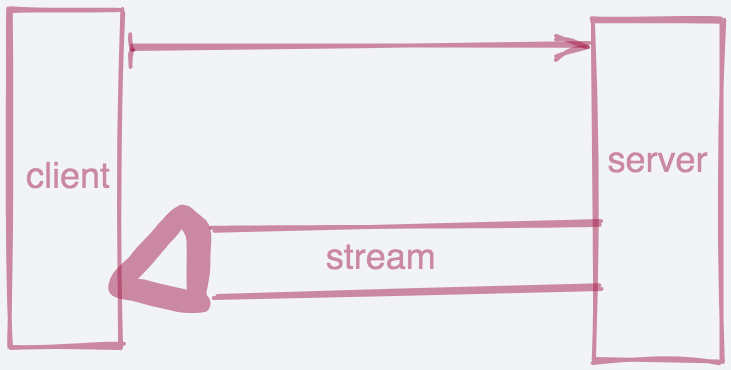

https://www.jianshu.com/p/73c9ed3a4877


# 1、什么是RPC

RPC 代指远程过程调用（Remote Procedure Call），它的调用包含了传输协议和编码（对象序列号）协议等等。允许运行于一台计算机的程序调用另一台计算机的子程序，而开发人员无需额外地为这个交互作用编程


# 2、Protobuf


Protocol Buffers 是一种与语言、平台无关，可扩展的序列化结构化数据的方法，常用于通信协议，数据存储等等。相较于 JSON、XML，它更小、更快、更简单

## 1、语法

```go
syntax ="proto3";
service SearchService{
    rpc Search(SearchRequest) returns (SearchResponse);
}
message SearchRequest{
string query =1;
  int32 page_number =2;
  int32 result_per_page =3;
}
message SearchResponse{
...
}
```

1. 文件的第一行指定您正在使用`proto3`语法：如果不这样做，则协议缓冲区编译器将假定您正在使用[proto2](https://developers.google.com/protocol-buffers/docs/proto)。这必须是文件的第一行非空，非注释行。

2. 分配的字段编号用于标识消息的二进制格式，分配了最好不要修改，如果修改要及时通知使用者
3. 范围1-15的字段编号需要一个字节来编码，包括字段编码和字段类型，16-2047的字段编号需要占用两个字节
4. 最小是1 最大2^29 -1 ，保留字段不能使用 19000-19999

### <font color=red size=5x>分配字段编号</font>

1. 单数，proto3的默认规则
2. repeated 可以重复任意次


### <font color=red size=5x>注释</font>

支持单行注释//

多行注释/**/


### <font color=red size=5x>保留字段reserved</font>

当定义好字段后, 在后续开发中发现某个字段根本没用.

例如 `string userName = 2;` 字段, 这个时候最好不要进行注释或删除.

有可能以后加载相同的旧版本, 这可能会导致数据损坏, 隐私错误等. 确保不会发生这种情况的一种方法是指定要删除的字段为保留字段.

```
message SubscribeReq {
  
  reserved 2;
  
  int32 subReqID = 1;
  string userName = 2;
  string productName = 3;
  string address = 4;
}

或者
message Foo {
  reserved 2, 15, 9 to 11;
  reserved "foo", "bar";
}
```

顾名思义, 就是此字段会被保留可能在以后会使用此字段. 使用关键字 `reserved` 表示要保留字段编号为 `2`.


### <font color=red size=5x>基本类型对照表</font>

| .proto Type | Notes | C++ Type | Java/Kotlin Type[1] | Python Type[3] | Go Type | Ruby Type                      | C# Type    | PHP Type          | Dart Type |
| :---------- | :---- | :------- | :------------------ | :------------- | ------- | :----------------------------- | :--------- | :---------------- | :-------- |
| double      |       | double   | double              | float          | float64 | Float                          | double     | float             | double    |
| float       |       | float    | float               | float          | float32 | Float                          | float      | float             | double    |
| int32       |       | int32    | int                 | int            | int32   | Fixnum or Bignum (as required) | int        | integer           | int       |
| int64       |       | int64    | long                | int/long[4]    | int64   | Bignum                         | long       | integer/string[6] | Int64     |
| uint32      |       | uint32   | int[2]              | int/long[4]    | uint32  | Fixnum or Bignum (as required) | uint       | integer           | int       |
| uint64      |       | uint64   | long[2]             | int/long[4]    | uint64  | Bignum                         | ulong      | integer/string[6] | Int64     |
| sint32      |       | int32    | int                 | int            | int32   | Fixnum or Bignum (as required) | int        | integer           | int       |
| sint64      |       | int64    | long                | int/long[4]    | int64   | Bignum                         | long       | integer/string[6] | Int64     |
| fixed32     |       |          | int[2]              | int/long[4]    | uint32  | Fixnum or Bignum (as required) | uint       | integer           | int       |
| fixed64     |       | uint64   | long[2]             | int/long[4]    | uint64  | Bignum                         | ulong      | integer/string[6] | Int64     |
| sfixed32    |       | int32    | int                 | int            | int32   | Fixnum or Bignum (as required) | int        | integer           | int       |
| sfixed64    |       | int64    | long                | int/long[4]    | int64   | Bignum                         | long       | integer/string[6] | Int64     |
| bool        |       | bool     | boolean             | bool           | bool    | TrueClass/FalseClass           | bool       | boolean           | bool      |
| string      |       |          | String              | str/unicode[5] | string  | String (UTF-8)                 | string     | string            | String    |
| bytes       |       | string   | ByteString          | str            | []byte  | String (ASCII-8BIT)            | ByteString | string            | List      |


### <font color=red size=5x>自定义类型</font>

```go
message SearchResponse {
  repeated Result results = 1;
}

message Result {
  string url = 1;
  string title = 2;
  repeated string snippets = 3;
}
```

Result 为自定义的类型

### <font color=red size=5x>嵌套类型</font>

```go
message SearchResponse {
  message Result {
    string url = 1;
    string title = 2;
    repeated string snippets = 3;
  }
  repeated Result results = 1;
}
```

在其他地方调用

```go
message SomeOtherMessage {
  SearchResponse.Result result = 1;
}
```

深度嵌套

```go
message Outer {                  // Level 0
  message MiddleAA {  // Level 1
    message Inner {   // Level 2
      int64 ival = 1;
      bool  booly = 2;
    }
  }
  message MiddleBB {  // Level 1
    message Inner {   // Level 2
      int32 ival = 1;
      bool  booly = 2;
    }
  }
}
```


### <font color=red size=5x>Any类型</font>

该`Any`消息类型，可以使用邮件作为嵌入式类型，而不必自己.proto定义。一个`Any`含有任意的序列化消息`bytes`，以充当一个全局唯一标识符和解析为消息的类型的URL一起。要使用该`Any`类型，您需要[导入](https://developers.google.com/protocol-buffers/docs/proto3#other) `google/protobuf/any.proto`

```go
import "google/protobuf/any.proto";

message ErrorStatus {
  string message = 1;
  repeated google.protobuf.Any details = 2; //只能使用repeated
}
```

给定消息类型的默认类型URL是`type.googleapis.com/_packagename_._messagename_`。

引入的时候回报错

解决方法：

https://www.cnblogs.com/x-poior/p/9266087.html

直接在当前目录建立层次目录 引入文件内容


https://www.cnblogs.com/ExMan/p/13892736.html

生成pb.go文件


### <font color=red size=5x>enum类型</font>

```go
message SearchRequest {
  string query = 1;
  int32 page_number = 2;
  int32 result_per_page = 3;
  enum Corpus {
    UNIVERSAL = 0;
    WEB = 1;
    IMAGES = 2;
    LOCAL = 3;
    NEWS = 4;
    PRODUCTS = 5;
    VIDEO = 6;
  }
  Corpus corpus = 4;
}
```

`Corpus`枚举的第一个常量映射为零：每个枚举定义**必须**包含一个映射为零的常量作为其第一个元素。这是因为：

- 必须有一个零值，以便我们可以使用0作为数字[默认值](https://developers.google.com/protocol-buffers/docs/proto3#default)。
- 零值必须是第一个元素，以便与[proto2](https://developers.google.com/protocol-buffers/docs/proto)语义兼容，其中第一个枚举值始终是默认值。
- 枚举器常量必须在32位整数范围内。由于`enum`值在电线上使用[varint编码](https://developers.google.com/protocol-buffers/docs/encoding)，因此负值效率不高，因此不建议使用


###  <font color=red size=5x>map类型</font>

```go
message OneOf {
  uint64 Id = 1 ;
  string Title = 2;
  string Content = 3;
}
message Maps {
  map<string,string> dir = 1;
  map<int64,int32> dir2 = 2;
  map<int64,OneOf> dir3 = 3;

}
```

### ==相较 Protobuf，为什么不使用 XML？==

- 更简单
- 数据描述文件只需原来的 1/10 至 1/3
- 解析速度是原来的 20 倍至 100 倍
- 减少了二义性
- 生成了更易使用的数据访问类

# 3、定义服务

```go
service SearchService {
  rpc Search(SearchRequest) returns (SearchResponse);
}
```


# ==-------------------------------==

# 4、安装protoc

### gRPC

生成pb.go的时候需要指定grpc的插件

```
go get -u google.golang.org/grpc
```


### 安装

```
go get -u github.com/golang/protobuf/protoc-gen-go
```

将`Protoc Plugin`的可执行文件从$GOPATH中移动到$GOBIN下

```
mv /usr/local/go/path/bin/protoc-gen-go /usr/local/go/bin/
```


## Protocol Buffers v3

### 安装

```
wget https://github.com/google/protobuf/releases/download/v3.5.1/protobuf-all-3.5.1.zip
unzip protobuf-all-3.5.1.zip
cd protobuf-3.5.1/
./configure
make
make install
```

检查是否安装成功

```
protoc --version
```

如果出现报错

```
protoc: error while loading shared libraries: libprotobuf.so.15: cannot open shared object file: No such file or directory
```

则执行`ldconfig`后，再次运行即可成功

#### 为什么要执行`ldconfig`

我们通过控制台输出的信息可以知道，`Protocol Buffers Libraries`的默认安装路径在`/usr/local/lib`

```
Libraries have been installed in:
   /usr/local/lib

If you ever happen to want to link against installed libraries
in a given directory, LIBDIR, you must either use libtool, and
specify the full pathname of the library, or use the `-LLIBDIR'
flag during linking and do at least one of the following:
   - add LIBDIR to the `LD_LIBRARY_PATH' environment variable
     during execution
   - add LIBDIR to the `LD_RUN_PATH' environment variable
     during linking
   - use the `-Wl,-rpath -Wl,LIBDIR' linker flag
   - have your system administrator add LIBDIR to `/etc/ld.so.conf'

See any operating system documentation about shared libraries for
more information, such as the ld(1) and ld.so(8) manual pages.
```

而我们安装了一个新的动态链接库，`ldconfig`一般在系统启动时运行，所以现在会找不到这个`lib`，因此我们要手动执行`ldconfig`，**让动态链接库为系统所共享，它是一个动态链接库管理命令**，这就是`ldconfig`命令的作用

### protoc使用

我们按照惯例执行`protoc --help`（查看帮助文档），我们抽出几个常用的命令进行讲解

1、`-IPATH, --proto_path=PATH`：指定`import`搜索的目录，可指定多个，如果不指定则默认当前工作目录

2、`--go_out`：生成`golang`源文件

#### 参数

若要将额外的参数传递给插件，可使用从输出目录中分离出来的逗号分隔的参数列表:

```
protoc --go_out=plugins=grpc,import_path=mypackage:. *.proto
```

- `import_prefix=xxx`：将指定前缀添加到所有`import`路径的开头
- `import_path=foo/bar`：如果文件没有声明`go_package`，则用作包。如果它包含斜杠，那么最右边的斜杠将被忽略。
- `plugins=plugin1+plugin2`：指定要加载的子插件列表（我们所下载的repo中唯一的插件是grpc）
- `Mfoo/bar.proto=quux/shme`： `M`参数，指定`.proto`文件编译后的包名（`foo/bar.proto`编译后为包名为`quux/shme`）

#### Grpc支持

如果`proto`文件指定了`RPC`服务，`protoc-gen-go`可以生成与`grpc`相兼容的代码，我们仅需要将`plugins=grpc`参数传递给`--go_out`，就可以达到这个目的

```
protoc --go_out=plugins=grpc:. *.proto
```


# 4、client and server

## server

```go
/**
 * @Author: zhangSan
 * @Description:
 * @File:  serve
 * @Version: 1.0.0
 * @Date: 2021/5/25 上午11:13
 */

package main

import (
	"context"
	"google.golang.org/grpc"
	v11 "grpc/test/src/proto"
	"log"
	"net"
	"os"
)

func main(){
	RunServer(context.Background(),"9001")
}

func RunServer(ctx context.Context, port string) error {
	listen, err := net.Listen("tcp", ":"+port)
	if nil != err {
		return err
	}

	/*
	var (
		opts []grpc.ServerOption
	)

	注册日志，各种时间因素
	opts = append(opts, gRpcServices.RegisterLogInject(logLayout, constant.GRpcLoginInsKey))
	opts = append(opts, grpc.KeepaliveParams(keepalive.ServerParameters{
		MaxConnectionIdle: 15 * time.Second, //client空闲超过该时间，发送一个GOAWAY
		//MaxConnectionAge:      time.Duration(math.MaxInt64), //client最大存活时间
		MaxConnectionAge:      5 * time.Second, //client最大存活时间
		MaxConnectionAgeGrace: 5 * time.Second, //强制关闭连接前缓冲时间，用以完成pending的请求
		Time:                  5 * time.Second, //client空闲该时间侯，发送一个ping
		Timeout:               3 * time.Second, //如果ping该时间内未收到pong，认为连接已断开
	}))
	opts = append(opts, grpc.KeepaliveEnforcementPolicy(keepalive.EnforcementPolicy{
		MinTime:             3 * time.Second, //client两次ping最小间隔，小于该时间中止连接
		PermitWithoutStream: true,            //即使没有活动的stream，也允许keepalive的ping
	}))

	 */
	//sv = grpc.NewServer(opts...)


	server := grpc.NewServer()
	v11.RegisterSayHelloServiceServer(server, NewSayHelloResponseService())
  reflection.Register(server)//注册反射服务
	c := make(chan os.Signal, 1)
	go func() {
		for range c {
			log.Println("shutting down GRPC server...")
			server.GracefulStop()//平滑关闭服务
			<-ctx.Done()
		}
	}()
	log.Println("start gRPC server...,port " + port)
	return server.Serve(listen)

}


type Services struct {

}

func NewSayHelloResponseService()*Services{
	return &Services{}
}


func(s *Services) SayHello(ctx context.Context,req *v11.SayHelloRequest)(resp *v11.SayHelloResponse,err error){
	return &v11.SayHelloResponse{
		Response:             "resp",
	}, err
}
```


实体服务类

```go
package services

import (
	"context"
	v11 "grpc/test/src/proto"
)

type Services struct {

}

func NewSayHelloResponseService()*Services{
	return &Services{}
}


func(s *Services) SayHello(ctx context.Context,req *v11.SayHelloRequest)(resp *v11.SayHelloResponse,err error){
	return &v11.SayHelloResponse{}, err
}
```


## 验证

### 启动 Server

```
go run src/server/serve.go
2021/05/25 16:45:56 start gRPC server...,port 9001
```

### 启动 Client

```
go run src/client/client.go
2021/05/25 16:45:59 resp: resp
```


# 5、stream server client

流式grpc 

- Server-side streaming RPC：服务器端流式 RPC
- Client-side streaming RPC：客户端流式 RPC
- Bidirectional streaming RPC：双向流式 RPC

## 1、proto

```go
syntax = "proto3";
package stream;

service StreamService {
  rpc Eat(EatRequest) returns (stream EatResponse) {} //服务端流式
  rpc Work(stream EatRequest) returns (EatResponse) {}//客户端流式
  rpc Sleep(stream EatRequest) returns (stream EatResponse) {}//双向流

}

message Item{
  string value = 1;
  string value2 = 2;
}

message EatRequest{
  Item req = 1;
}

message EatResponse{
    Item resp = 1;
}

```

## 

## 2、服务端流式

### 客户端代码

```go
/**
 * @Author: zhangsan
 * @Description:
 * @File:  main
 * @Version: 1.0.0
 * @Date: 2021/5/26 下午5:48
 */

package main

import (
	"context"
	"fmt"
	"google.golang.org/grpc"
	pb "grpc/test/src/proto"
	"io"
	"log"
)
const (
	PORT = "9002"
)
func main() {
	conn, err := grpc.Dial(":"+PORT, grpc.WithInsecure())
	if err != nil {
		log.Fatalf("grpc.Dial err: %v", err)
	}
	defer conn.Close()
	client := pb.NewStreamServiceClient(conn)

	err = printEats(client, &pb.PublicRequest{
		Req:                  &pb.Item{
			Value:                "value",
			Value2:               "value1",

		},
	})
	if err != nil {
		log.Fatalf("printEats.err: %v", err)
	}

}

//服务端流式
func printEats(client pb.StreamServiceClient, r *pb.PublicRequest) error {
	var c context.Context

	c = context.WithValue(context.TODO(),"a","b")

	stream,err := client.Eat(c,r)
	if err != nil{
		return err
	}
	//接收server的header信息
	fmt.Println(stream.Header())//map[cc:[dd] content-type:[application/grpc]]

	for {
		resp ,err := stream.Recv()
		if err == io.EOF{
			break
		}
		if err != nil{
			return err
		}
		log.Printf("resp: value1 %s, value1 %s",resp.Resp.Value,resp.Resp.Value2)
	}
	//在一元rpc中header和trailer是一起到达的，在流式中是在接受消息后到达的
	fmt.Println(stream.Trailer())//map[cc1:[dd1]]

	return nil
}
```


### 服务端代码

```go
/**
 * @Author: zhangsan
 * @Description:
 * @File:  main
 * @Version: 1.0.0
 * @Date: 2021/5/26 下午5:32
 */

package main

import (
	"fmt"
	"google.golang.org/grpc"
	"google.golang.org/grpc/metadata"
	pb "grpc/test/src/proto"
	"log"
	"net"
	"time"
)
type StreamService struct{}

const (
	PORT = "9002"
)
func main() {
	server := grpc.NewServer()
	pb.RegisterStreamServiceServer(server, &StreamService{})
	lis, err := net.Listen("tcp", ":"+PORT)
	if err != nil {
		log.Fatalf("net.Listen err: %v", err)
	}
	server.Serve(lis)
}
//服务端流式
func (s *StreamService) Eat(r *pb.PublicRequest, stream pb.StreamService_EatServer) error {
	//设置header信息 sendHeader不可同时用，否则SendHeader会覆盖前一个
	if err := stream.SetHeader(metadata.MD{"cc2":[]string{"dd2"}});nil != err{
		return err
	}
	//设置header信息
	//if err := stream.SendHeader(metadata.MD{"cc":[]string{"dd"}});err != nil{
	//	return err
	//}


	//设置metadata，注意一元和流式的区别
	stream.SetTrailer(metadata.MD{"cc1":[]string{"dd1"}})

	a := stream.Context().Value("a")
	fmt.Println(a)

	for i := 0; i < 10;i++{
		time.Sleep(1 *time.Second)
		err := stream.Send(&pb.PublicResponse{
			Resp:                 &pb.Item{
				Value:                "eat",
				Value2:               "服务端流式",

			},
		})

		if err != nil{
			return err
		}


	}

	return nil
}

func (s *StreamService) Work(stream pb.StreamService_WorkServer) error {
	return nil
}
func (s *StreamService) Sleep(stream pb.StreamService_SleepServer) error {
	return nil
}

```


### 验证

```
 go run src/client/stream_client/main.go
map[cc2:[dd2] content-type:[application/grpc]] <nil>
2021/05/27 10:05:08 resp: value1 eat, value1 服务端流式
2021/05/27 10:05:09 resp: value1 eat, value1 服务端流式
2021/05/27 10:05:10 resp: value1 eat, value1 服务端流式
2021/05/27 10:05:11 resp: value1 eat, value1 服务端流式
2021/05/27 10:05:12 resp: value1 eat, value1 服务端流式
2021/05/27 10:05:13 resp: value1 eat, value1 服务端流式
2021/05/27 10:05:14 resp: value1 eat, value1 服务端流式
2021/05/27 10:05:15 resp: value1 eat, value1 服务端流式
2021/05/27 10:05:16 resp: value1 eat, value1 服务端流式
```

```go
go run src/server/stream_server/main.go
```

### 分析




server

Stream.Send 追后也是调用的SendMsg方法

- 消息体（对象）序列化
- 压缩序列化后的消息体
- 对正在传输的消息体增加5个字节的header
- 判断压缩+序列化后的消息体总字节是否大雨预设的maxSendMessageSize（math。MaxInt32），超出报错
- 写入给流的数据集

```go
//设置header信息 sendHeader不可同时用，否则SendHeader会覆盖前一个
	if err := stream.SetHeader(metadata.MD{"cc2":[]string{"dd2"}});nil != err{
		return err
	}
	//设置header信息
	//if err := stream.SendHeader(metadata.MD{"cc":[]string{"dd"}});err != nil{
	//	return err
	//}


	//设置metadata，注意一元和流式的区别
	stream.SetTrailer(metadata.MD{"cc1":[]string{"dd1"}})
```

1. SetHeader 和 SendHeader ，SendHeader会覆盖之前的setheader信息，尽量只使用一个

2. SetTrailer 和 SetHeader 区别，SetTrailer在一元的时候会和SetHeader一起返回，在流式rpc的时候会在send 和rev之后才会被发送和接收

   

   [setTrailer和setheader区别](https://blog.csdn.net/luo1324574369/article/details/115221853)

   

Client

RecvMsg 会从流中读取完整的 gRPC 消息体，另外通过阅读源码可得知：

（1）RecvMsg 是阻塞等待的

（2）RecvMsg 当流成功/结束（调用了 Close）时，会返回 `io.EOF`

（3）RecvMsg 当流出现任何错误时，流会被中止，错误信息会包含 RPC 错误码。而在 RecvMsg 中可能出现如下错误：

- io.EOF
- io.ErrUnexpectedEOF
- transport.ConnectionError
- google.golang.org/grpc/codes

同时需要注意，默认的 MaxReceiveMessageSize 值为 1024 * 1024 * 4，建议不要超出 4M

1. 在ServerBuilder中，通过SetMaxReceiveMessageSize(int)设置这个最大允许字节长度，因为这里的参数为Int型，所以其最大的字节允许长度也就是*INT_MAX=2147483647* （2G）。
2. 流式的grpc传输4M的大小是可以的，流式传输哈


Server

`SendMsg` 方法，该方法涉及以下过程:

- 消息体（对象）序列化
- 压缩序列化后的消息体
- 对正在传输的消息体增加 5 个字节的 header
- 判断压缩+序列化后的消息体总字节长度是否大于预设的 maxSendMessageSize（预设值为 `math.MaxInt32`），若超出则提示错误
- 写入给流的数据集


## 3、客户端流式

### 客户端代码

```go
package main

import (
	"context"
	"fmt"
	"google.golang.org/grpc"
	pb "grpc/test/src/proto"
	"io"
	"log"
)
const (
	PORT = "9002"
)
func main() {
	conn, err := grpc.Dial(":"+PORT, grpc.WithInsecure())
	if err != nil {
		log.Fatalf("grpc.Dial err: %v", err)
	}
	defer conn.Close()
	client := pb.NewStreamServiceClient(conn)

	err = printWork(client, &pb.PublicRequest{
		Req: &pb.Item{
			Value:                "valueWork",
			Value2:               "value1Work",

		},
	})
	if err != nil {
		log.Fatalf("printWork.err: %v", err)
	}
}

func printWork(client pb.StreamServiceClient, r *pb.PublicRequest) error {
	stream,err := client.Work(context.Background())
	if err != nil{
		return err
	}

	for i := 0 ;i < 6;i++{
		fmt.Println(r)
		err := stream.Send(r)
		if err == io.EOF{
			break
		}
		if err != nil{
			return err
		}
	}

	//注意这个header是设置不了的
	//fmt.Println(stream.Header())

	resp ,err := stream.CloseAndRecv()
	if err != nil{
		return err
	}

	log.Printf("resp: value1 %s, value1 %s",resp.Resp.Value,resp.Resp.Value2)

	//在一元rpc中header和trailer是一起到达的，在流式中是在接受消息后到达的
	fmt.Println(stream.Trailer())//map[cc1:[dd1]]
	return nil
}

```


### 服务端代码

```go
package main

import (
	"fmt"
	"google.golang.org/grpc"
	"google.golang.org/grpc/metadata"
	pb "grpc/test/src/proto"
	"io"
	"log"
	"net"
)
type StreamService struct{}

const (
	PORT = "9002"
)
func main() {

	//设置客户端最大接收值
	//opt := grpc.MaxRecvMsgSize()

	server := grpc.NewServer()
	pb.RegisterStreamServiceServer(server, &StreamService{})
	lis, err := net.Listen("tcp", ":"+PORT)
	if err != nil {
		log.Fatalf("net.Listen err: %v", err)
	}
	server.Serve(lis)
}
//客户端流事rpc
func (s *StreamService) Work(stream pb.StreamService_WorkServer) error {

	//设置header信息 sendHeader不可同时用，否则SendHeader会覆盖前一个
	if err := stream.SetHeader(metadata.MD{"cc2":[]string{"dd2"}});nil != err{
		return err
	}
	//设置header信息
	//if err := stream.SendHeader(metadata.MD{"cc":[]string{"dd"}});err != nil{
	//	return err
	//}


	//设置metadata，注意一元和流式的区别
	stream.SetTrailer(metadata.MD{"cc1":[]string{"dd1"}})

	a := stream.Context().Value("a")
	fmt.Println(a)
	for {
		r ,err := stream.Recv()
		if err == io.EOF{
			return stream.SendAndClose(&pb.PublicResponse{
				Resp:                &pb.Item{
					Value:                "client-stream-server",
					Value2:               "client-stream-server-v2",
				} ,
			})
		}
		if err != nil{
			return err
		}
		log.Printf("stream.Recv value: %s,value2: %s", r.Req.Value, r.Req.Value2)
	}
}

//服务端流式
func (s *StreamService) Eat(r *pb.PublicRequest, stream pb.StreamService_EatServer) error {

	return nil
}

func (s *StreamService) Sleep(stream pb.StreamService_SleepServer) error {
	return nil
}
```


### 验证

```go
-> % go run src/client/client-stream-client/main.go
req:<value:"valueWork" value2:"value1Work" > 
req:<value:"valueWork" value2:"value1Work" > 
req:<value:"valueWork" value2:"value1Work" > 
req:<value:"valueWork" value2:"value1Work" > 
req:<value:"valueWork" value2:"value1Work" > 
req:<value:"valueWork" value2:"value1Work" > 
2021/06/02 13:51:54 resp: value1 client-stream-server, value1 client-stream-server-v2
map[cc1:[dd1]]

-> % go run src/server/client-stream_server/mian.go
<nil>
2021/06/02 13:51:54 stream.Recv value: valueWork,value2: value1Work
2021/06/02 13:51:54 stream.Recv value: valueWork,value2: value1Work
2021/06/02 13:51:54 stream.Recv value: valueWork,value2: value1Work
2021/06/02 13:51:54 stream.Recv value: valueWork,value2: value1Work
2021/06/02 13:51:54 stream.Recv value: valueWork,value2: value1Work
2021/06/02 13:51:54 stream.Recv value: valueWork,value2: value1Work
```


### 分析

客户端流式 RPC，单向流，客户端通过流式发起**多次** RPC 请求给服务端，服务端发起**一次**响应给客户端


1. 服务端是可以设置grpc.MaxRecvMsgSize()的接收大小的 默认是1024*1024*4= 4m大小
还可以设置grpc.MaxSendMsgSize() 发送的大小，默认是int32，超出会报错
2. stream.SendAndClose 当发现client的流关闭之后，需要将最终的结果响应给客户端，同时关闭在另一侧的recv
3. stream.CloseAndRecv 就是和上面的一起使用的


## 4、客户端、服务端流式

### 客户端

```go
package main

import (
	"context"
	"google.golang.org/grpc"
	pb "grpc/test/src/proto"
	"io"
	"log"
)
const (
	PORT = "9002"
)
func main() {
	conn, err := grpc.Dial(":"+PORT, grpc.WithInsecure())
	if err != nil {
		log.Fatalf("grpc.Dial err: %v", err)
	}
	defer conn.Close()
	client := pb.NewStreamServiceClient(conn)

	err = printSleep(client, &pb.PublicRequest{
		Req: &pb.Item{
			Value:                "valueSleep",
			Value2:               "value1Sleep",
		},
	})
	if err != nil {
		log.Fatalf("printSleep.err: %v", err)
	}
}

//双向流
func printSleep(client pb.StreamServiceClient, r *pb.PublicRequest) error {
	stream, err := client.Sleep(context.Background())
	if err != nil {
		return err
	}
	for n := 0; n <= 6; n++ {
		err = stream.Send(r)
		if err != nil {
			return err
		}
		resp, err := stream.Recv()
		if err == io.EOF {
			break
		}
		if err != nil {
			return err
		}
		log.Printf("resp: value1: %s, value2: %s", resp.Resp.Value, resp.Resp.Value2)
	}
	if err = stream.CloseSend();nil != err{
		log.Println(err)
	}
	return nil
}
```


### 服务端

```go
package main

import (
	"google.golang.org/grpc"
	pb "grpc/test/src/proto"
	"io"
	"log"
	"net"
)
type StreamService struct{}

const (
	PORT = "9002"
)
func main() {

	//设置客户端最大接收值
	//opt := grpc.MaxRecvMsgSize()
	//grpc.MaxSendMsgSize()

	server := grpc.NewServer()
	pb.RegisterStreamServiceServer(server, &StreamService{})
	lis, err := net.Listen("tcp", ":"+PORT)
	if err != nil {
		log.Fatalf("net.Listen err: %v", err)
	}
	server.Serve(lis)
}
//客户端流事rpc
func (s *StreamService) Work(stream pb.StreamService_WorkServer) error {
	return nil
}

//服务端流式
func (s *StreamService) Eat(r *pb.PublicRequest, stream pb.StreamService_EatServer) error {

	return nil
}

//双向流
func (s *StreamService) Sleep(stream pb.StreamService_SleepServer) error {
	n := 0
	for {
		err := stream.Send(&pb.PublicResponse{
			Resp: &pb.Item{
				Value:  "gPRC Stream Client: Sleep",
				Value2: "双向stream-value2",
			},
		})
		if err != nil {
			return err
		}
		r, err := stream.Recv()
		if err == io.EOF {
			return nil
		}
		if err != nil {
			return err
		}
		n++
		log.Printf("stream.Recv req.value: %s, pt.value2: %s", r.Req.Value, r.Req.Value2)
	}

}
```


### 验证

```go
-> % go run src/client/clientServer-stream_client/main.go
2021/06/02 14:11:55 resp: value1: gPRC Stream Client: Sleep, value2: 双向stream-value2
2021/06/02 14:11:55 resp: value1: gPRC Stream Client: Sleep, value2: 双向stream-value2
2021/06/02 14:11:55 resp: value1: gPRC Stream Client: Sleep, value2: 双向stream-value2
2021/06/02 14:11:55 resp: value1: gPRC Stream Client: Sleep, value2: 双向stream-value2
2021/06/02 14:11:55 resp: value1: gPRC Stream Client: Sleep, value2: 双向stream-value2
2021/06/02 14:11:55 resp: value1: gPRC Stream Client: Sleep, value2: 双向stream-value2
2021/06/02 14:11:55 resp: value1: gPRC Stream Client: Sleep, value2: 双向stream-value2

-> % go run src/server/clientServer-stream_server/main.go 
2021/06/02 14:11:39 stream.Recv req.value: valueSleep, pt.value2: value1Sleep
2021/06/02 14:11:39 stream.Recv req.value: valueSleep, pt.value2: value1Sleep
2021/06/02 14:11:39 stream.Recv req.value: valueSleep, pt.value2: value1Sleep
2021/06/02 14:11:39 stream.Recv req.value: valueSleep, pt.value2: value1Sleep
2021/06/02 14:11:39 stream.Recv req.value: valueSleep, pt.value2: value1Sleep
2021/06/02 14:11:39 stream.Recv req.value: valueSleep, pt.value2: value1Sleep
2021/06/02 14:11:39 stream.Recv req.value: valueSleep, pt.value2: value1Sleep
2021/06/02 14:11:55 stream.Recv req.value: valueSleep, pt.value2: value1Sleep
2021/06/02 14:11:55 stream.Recv req.value: valueSleep, pt.value2: value1Sleep
2021/06/02 14:11:55 stream.Recv req.value: valueSleep, pt.value2: value1Sleep
2021/06/02 14:11:55 stream.Recv req.value: valueSleep, pt.value2: value1Sleep
2021/06/02 14:11:55 stream.Recv req.value: valueSleep, pt.value2: value1Sleep
2021/06/02 14:11:55 stream.Recv req.value: valueSleep, pt.value2: value1Sleep
2021/06/02 14:11:55 stream.Recv req.value: valueSleep, pt.value2: value1Sleep
```

简单的介绍了几种rpc的流的使用，大家根据需求，合理使用


# 6、Tls证书认证

## 安装证书

私钥

```go
openssl ecparam -genkey -name secp384r1 -out server.key
```

- `openssl genrsa`：生成`RSA`私钥，命令的最后一个参数，将指定生成密钥的位数，如果没有指定，默认512
- `openssl ecparam`：生成`ECC`私钥，命令为椭圆曲线密钥参数生成及操作，本文中`ECC`曲线选择的是`secp384r1`


自签名公钥

```go
openssl req -new -x509 -sha256 -key server.key -out server.pem -days 3650
```

- `openssl req`：生成自签名证书，`-new`指生成证书请求、`-sha256`指使用`sha256`加密、`-key`指定私钥文件、`-x509`指输出证书、`-days 3650`为有效期，此后则输入证书拥有者信息

```go
-> % openssl req -new -x509 -sha256 -key server.key -out server.pem -days 3650
You are about to be asked to enter information that will be incorporated
into your certificate request.
What you are about to enter is what is called a Distinguished Name or a DN.
There are quite a few fields but you can leave some blank
For some fields there will be a default value,
If you enter '.', the field will be left blank.
-----
Country Name (2 letter code) []:
State or Province Name (full name) []:
Locality Name (eg, city) []:
Organization Name (eg, company) []:
Organizational Unit Name (eg, section) []:
Common Name (eg, fully qualified host name) []:test-grpc
Email Address []:
```

## 客户端代码

```go
package main
import (
	"context"
	"fmt"
	"io"
	"log"
	"google.golang.org/grpc"
	"google.golang.org/grpc/credentials"
	pb "grpc/test/src/proto"
)
const PORT = "9002"
func main() {
	c, err := credentials.NewClientTLSFromFile("/Users/zhangsan/Documents/GitHub/grpc-01/code/conf/server.pem", "test-grpc")
	if err != nil {
		log.Fatalf("credentials.NewClientTLSFromFile err: %v", err)
	}
	conn, err := grpc.Dial(":"+PORT, grpc.WithTransportCredentials(c))
	if err != nil {
		log.Fatalf("grpc.Dial err: %v", err)
	}
	defer conn.Close()
	client := pb.NewStreamServiceClient(conn)
	err = printWork(client, &pb.PublicRequest{
		Req: &pb.Item{
			Value:                "valueWork",
			Value2:               "value1Work",

		},
	})
	if err != nil {
		log.Fatalf("printWork.err: %v", err)
	}
}

func printWork(client pb.StreamServiceClient, r *pb.PublicRequest) error {
	stream,err := client.Work(context.Background())
	if err != nil{
		return err
	}

	for i := 0 ;i < 6;i++{
		fmt.Println(r)
		err := stream.Send(r)
		if err == io.EOF{
			break
		}
		if err != nil{
			return err
		}
	}

	//注意这个header是设置不了的
	//fmt.Println(stream.Header())

	resp ,err := stream.CloseAndRecv()
	if err != nil{
		return err
	}

	log.Printf("resp: value1 %s, value1 %s",resp.Resp.Value,resp.Resp.Value2)

	//在一元rpc中header和trailer是一起到达的，在流式中是在接受消息后到达的
	fmt.Println(stream.Trailer())//map[cc1:[dd1]]
	return nil
}
```


## 服务端代码

```go
package main
import (
	"fmt"
	"google.golang.org/grpc/metadata"
	"io"
	"log"
	"net"
	"google.golang.org/grpc"
	"google.golang.org/grpc/credentials"
	pb "grpc/test/src/proto"
)
type StreamService struct{}

const PORT = "9002"
func main() {
	c, err := credentials.NewServerTLSFromFile("/Users/zhangsan/Documents/GitHub/grpc-01/code/conf/server.pem", "/Users/zhangsan/Documents/GitHub/grpc-01/code/conf/server.key")
	if err != nil {
		log.Fatalf("credentials.NewServerTLSFromFile err: %v", err)
	}
	server := grpc.NewServer(grpc.Creds(c))
	pb.RegisterStreamServiceServer(server, &StreamService{})
	lis, err := net.Listen("tcp", ":"+PORT)
	if err != nil {
		log.Fatalf("net.Listen err: %v", err)
	}
	server.Serve(lis)
}

//客户端流rpc
func (s *StreamService) Work(stream pb.StreamService_WorkServer) error {

	//设置header信息 sendHeader不可同时用，否则SendHeader会覆盖前一个
	if err := stream.SetHeader(metadata.MD{"cc2":[]string{"dd2"}});nil != err{
		return err
	}
	//设置header信息
	//if err := stream.SendHeader(metadata.MD{"cc":[]string{"dd"}});err != nil{
	//	return err
	//}


	//设置metadata，注意一元和流式的区别
	stream.SetTrailer(metadata.MD{"cc1":[]string{"dd1"}})

	a := stream.Context().Value("a")
	fmt.Println(a)
	for {
		r ,err := stream.Recv()
		if err == io.EOF{
			return stream.SendAndClose(&pb.PublicResponse{
				Resp:                &pb.Item{
					Value:                "client-stream-server",
					Value2:               "client-stream-server-v2",
				} ,
			})
		}
		if err != nil{
			return err
		}
		log.Printf("stream.Recv value: %s,value2: %s", r.Req.Value, r.Req.Value2)
	}
}

//服务端流式
func (s *StreamService) Eat(r *pb.PublicRequest, stream pb.StreamService_EatServer) error {

	return nil
}

func (s *StreamService) Sleep(stream pb.StreamService_SleepServer) error {
	return nil
}
```


```go
go run src/server/tls-server/main.go
<nil>
2021/06/02 16:06:49 stream.Recv value: valueWork,value2: value1Work
2021/06/02 16:06:49 stream.Recv value: valueWork,value2: value1Work
2021/06/02 16:06:49 stream.Recv value: valueWork,value2: value1Work
2021/06/02 16:06:49 stream.Recv value: valueWork,value2: value1Work
2021/06/02 16:06:49 stream.Recv value: valueWork,value2: value1Work
2021/06/02 16:06:49 stream.Recv value: valueWork,value2: value1Work


-> % go run src/client/tls-client/main.go
req:<value:"valueWork" value2:"value1Work" > 
req:<value:"valueWork" value2:"value1Work" > 
req:<value:"valueWork" value2:"value1Work" > 
req:<value:"valueWork" value2:"value1Work" > 
req:<value:"valueWork" value2:"value1Work" > 
req:<value:"valueWork" value2:"value1Work" > 
2021/06/02 16:08:24 resp: value1 client-stream-server, value1 client-stream-server-v2
map[cc1:[dd1]]
```


# 7、基于CA的TLS认证

## 证书的生成CA

为了保证证书的可靠性和有效性，在这里可引入 CA 颁发的根证书的概念。其遵守 X.509 标准

### 根证书

根证书（root certificate）是属于根证书颁发机构（CA）的公钥证书。我们可以通过验证 CA 的签名从而信任 CA ，任何人都可以得到 CA 的证书（含公钥），用以验证它所签发的证书（客户端、服务端）

它包含的文件如下：

- 公钥
- 密钥

### 生成 Key

```
openssl genrsa -out ca.key 2048
```

### 生成密钥

```
openssl req -new -x509 -days 7200 -key ca.key -out ca.pem
```

#### 填写信息

```
You are about to be asked to enter information that will be incorporated
into your certificate request.
What you are about to enter is what is called a Distinguished Name or a DN.
There are quite a few fields but you can leave some blank
For some fields there will be a default value,
If you enter '.', the field will be left blank.
-----
Country Name (2 letter code) []:
State or Province Name (full name) []:
Locality Name (eg, city) []:
Organization Name (eg, company) []:
Organizational Unit Name (eg, section) []:
Common Name (eg, fully qualified host name) []:test-grpc
Email Address []:
```

### Server

#### 生成 CSR

```
openssl req -new -key server.key -out server.csr
```

##### 填写信息

```
You are about to be asked to enter information that will be incorporated
into your certificate request.
What you are about to enter is what is called a Distinguished Name or a DN.
There are quite a few fields but you can leave some blank
For some fields there will be a default value,
If you enter '.', the field will be left blank.
-----
Country Name (2 letter code) []:
State or Province Name (full name) []:
Locality Name (eg, city) []:
Organization Name (eg, company) []:
Organizational Unit Name (eg, section) []:
Common Name (eg, fully qualified host name) []:test-grpc
Email Address []:

Please enter the following 'extra' attributes
to be sent with your certificate request
A challenge password []:
```

CSR 是 Cerificate Signing Request 的英文缩写，为证书请求文件。主要作用是 CA 会利用 CSR 文件进行签名使得攻击者无法伪装或篡改原有证书

#### 基于 CA 签发

```
openssl x509 -req -sha256 -CA ca.pem -CAkey ca.key -CAcreateserial -days 3650 -in server.csr -out server.pem
```

### Client

### 生成 Key

```
openssl ecparam -genkey -name secp384r1 -out client.key
```

### 生成 CSR

```
openssl req -new -key client.key -out client.csr
```

填写信息

```go
You are about to be asked to enter information that will be incorporated
into your certificate request.
What you are about to enter is what is called a Distinguished Name or a DN.
There are quite a few fields but you can leave some blank
For some fields there will be a default value,
If you enter '.', the field will be left blank.
-----
Country Name (2 letter code) []:
State or Province Name (full name) []:
Locality Name (eg, city) []:
Organization Name (eg, company) []:
Organizational Unit Name (eg, section) []:
Common Name (eg, fully qualified host name) []:test-grpc
Email Address []:

Please enter the following 'extra' attributes
to be sent with your certificate request
A challenge password []:
```


#### 基于 CA 签发

```
openssl x509 -req -sha256 -CA ca.pem -CAkey ca.key -CAcreateserial -days 3650 -in client.csr -out client.pem
```

### 整理目录

至此我们生成了一堆文件，请按照以下目录结构存放：

```
-> % tree
.
├── ca.key
├── ca.pem
├── ca.srl
├── client
│   ├── client.csr
│   ├── client.key
│   └── client.pem
└── server
    ├── server.csr
    ├── server.key
    └── server.pem

2 directories, 9 files
```

另外有一些文件是不应该出现在仓库内，应当保密或删除的。

## 服务端代码

```go
package main
import (
	"crypto/tls"
	"crypto/x509"
	"fmt"
	"google.golang.org/grpc/credentials"
	"google.golang.org/grpc/metadata"
	"io"
	"io/ioutil"
	"log"
	"net"
	"google.golang.org/grpc"
	pb "grpc/test/src/proto"
)
type StreamService struct{}

const PORT = "9002"
func main() {
	cert, err := tls.LoadX509KeyPair("/Users/zhangsan/Documents/GitHub/grpc-01/code/conf/server/server.pem", "/Users/zhangsan/Documents/GitHub/grpc-01/code/conf/server/server.key")
	if err != nil {
		log.Fatalf("credentials.NewServerTLSFromFile err: %v", err)
	}

	certPool := x509.NewCertPool()
	ca, err := ioutil.ReadFile("/Users/zhangsan/Documents/GitHub/grpc-01/code/conf/ca.pem")
	if err != nil {
		log.Fatalf("ioutil.ReadFile err: %v", err)
	}
	if ok := certPool.AppendCertsFromPEM(ca); !ok {
		log.Fatalf("certPool.AppendCertsFromPEM err")
	}
	c := credentials.NewTLS(&tls.Config{
		Certificates: []tls.Certificate{cert},
		ClientAuth:   tls.RequireAndVerifyClientCert,
		ClientCAs:    certPool,
	})

	server := grpc.NewServer(grpc.Creds(c))
	pb.RegisterStreamServiceServer(server, &StreamService{})
	lis, err := net.Listen("tcp", ":"+PORT)
	if err != nil {
		log.Fatalf("net.Listen err: %v", err)
	}
	server.Serve(lis)
}

//客户端流rpc
func (s *StreamService) Work(stream pb.StreamService_WorkServer) error {

	//设置header信息 sendHeader不可同时用，否则SendHeader会覆盖前一个
	if err := stream.SetHeader(metadata.MD{"cc2":[]string{"dd2"}});nil != err{
		return err
	}
	//设置header信息
	//if err := stream.SendHeader(metadata.MD{"cc":[]string{"dd"}});err != nil{
	//	return err
	//}


	//设置metadata，注意一元和流式的区别
	stream.SetTrailer(metadata.MD{"cc1":[]string{"dd1"}})

	a := stream.Context().Value("a")
	fmt.Println(a)
	for {
		r ,err := stream.Recv()
		if err == io.EOF{
			return stream.SendAndClose(&pb.PublicResponse{
				Resp:                &pb.Item{
					Value:                "client-stream-server",
					Value2:               "client-stream-server-v2",
				} ,
			})
		}
		if err != nil{
			return err
		}
		log.Printf("stream.Recv value: %s,value2: %s", r.Req.Value, r.Req.Value2)
	}
}

//服务端流式
func (s *StreamService) Eat(r *pb.PublicRequest, stream pb.StreamService_EatServer) error {

	return nil
}

func (s *StreamService) Sleep(stream pb.StreamService_SleepServer) error {
	return nil
}
```


## 客户端代码

```go
package main
import (
	"context"
	"crypto/tls"
	"crypto/x509"
	"fmt"
	"io"
	"io/ioutil"
	"log"
	"google.golang.org/grpc"
	"google.golang.org/grpc/credentials"
	pb "grpc/test/src/proto"
)
const PORT = "9002"
func main() {
	cert, err := tls.LoadX509KeyPair("/Users/zhangsan/Documents/GitHub/grpc-01/code/conf/client/client.pem", "/Users/zhangsan/Documents/GitHub/grpc-01/code/conf/client/client.key")
	if err != nil {
		log.Fatalf("tls.LoadX509KeyPair err: %v", err)
	}
	certPool := x509.NewCertPool()
	ca, err := ioutil.ReadFile("/Users/zhangsan/Documents/GitHub/grpc-01/code/conf/ca.pem")
	if err != nil {
		log.Fatalf("ioutil.ReadFile err: %v", err)
	}
	if ok := certPool.AppendCertsFromPEM(ca); !ok {
		log.Fatalf("certPool.AppendCertsFromPEM err")
	}
	c := credentials.NewTLS(&tls.Config{
		Certificates: []tls.Certificate{cert},
		ServerName:   "test-grpc",
		RootCAs:      certPool,
	})


	conn, err := grpc.Dial(":"+PORT, grpc.WithTransportCredentials(c))
	if err != nil {
		log.Fatalf("grpc.Dial err: %v", err)
	}
	defer conn.Close()
	client := pb.NewStreamServiceClient(conn)
	err = printWork(client, &pb.PublicRequest{
		Req: &pb.Item{
			Value:                "valueWork",
			Value2:               "value1Work",

		},
	})
	if err != nil {
		log.Fatalf("printWork.err: %v", err)
	}
}

func printWork(client pb.StreamServiceClient, r *pb.PublicRequest) error {
	stream,err := client.Work(context.Background())
	if err != nil{
		return err
	}

	for i := 0 ;i < 6;i++{
		fmt.Println(r)
		err := stream.Send(r)
		if err == io.EOF{
			break
		}
		if err != nil{
			return err
		}
	}

	//注意这个header是设置不了的
	//fmt.Println(stream.Header())

	resp ,err := stream.CloseAndRecv()
	if err != nil{
		return err
	}

	log.Printf("resp: value1 %s, value1 %s",resp.Resp.Value,resp.Resp.Value2)

	//在一元rpc中header和trailer是一起到达的，在流式中是在接受消息后到达的
	fmt.Println(stream.Trailer())//map[cc1:[dd1]]
	return nil
}
```

验证

```go
-> % go run src/client/CA-TLS_client/main.go 
req:<value:"valueWork" value2:"value1Work" > 
req:<value:"valueWork" value2:"value1Work" > 
req:<value:"valueWork" value2:"value1Work" > 
req:<value:"valueWork" value2:"value1Work" > 
req:<value:"valueWork" value2:"value1Work" > 
req:<value:"valueWork" value2:"value1Work" > 
2021/06/02 16:34:22 resp: value1 client-stream-server, value1 client-stream-server-v2
map[cc1:[dd1]]

-> % go run src/server/CA-TLS_server/main.go             
<nil>
2021/06/02 16:34:22 stream.Recv value: valueWork,value2: value1Work
2021/06/02 16:34:22 stream.Recv value: valueWork,value2: value1Work
2021/06/02 16:34:22 stream.Recv value: valueWork,value2: value1Work
2021/06/02 16:34:22 stream.Recv value: valueWork,value2: value1Work
2021/06/02 16:34:22 stream.Recv value: valueWork,value2: value1Work
2021/06/02 16:34:22 stream.Recv value: valueWork,value2: value1Work
```


